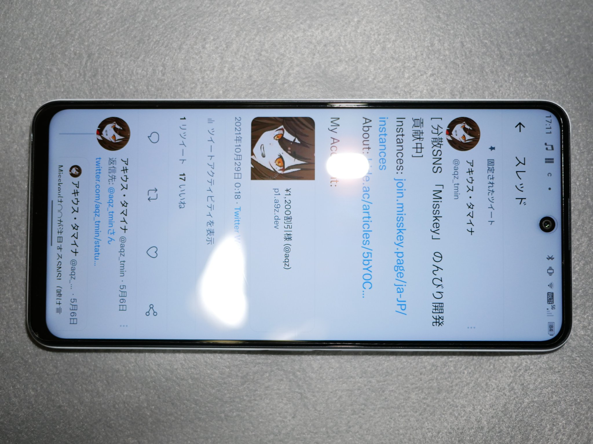
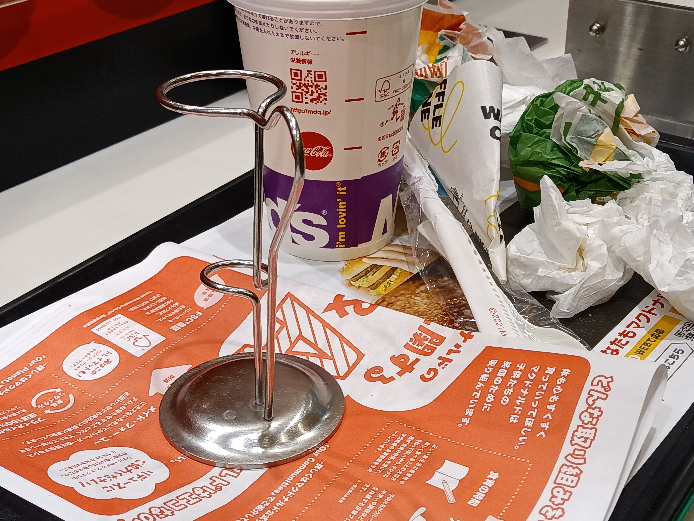

# TONE e22 ざっくりハンズオンレビュー

トーンモバイルが2022年6月に発売した、MediaTek Dimensity 700 / Android 11搭載スマートフォン「TONE e22」のレビューです。

[→ TONE e22 トーンモバイル公式ページ](https://tone.ne.jp/product/tone_e22.html)

定価は32,780円ですが、端末購入と同時に[TONE Labo（無料）](https://tone.ne.jp/labo/)に参加することで21,780円で購入できます。

[おおかたの取り扱い店舗（docomoショップ・カメラのキタムラ）](https://tone.ne.jp/stores.html)に展示機があり、実機を触ることができるようになっています。興味のある方はまずは実機を触ってみることをお勧めします。

## 背面外観・筐体

まずは外観や筐体について見ていきます。

背面は立体感のある反射が特徴的な「ZenWhite」と名付けられた塗装が施されています。  
本体カラーが1色しかなくカラーバリエーションがないのは残念なところで、欲張りを言えば黒ともう1色の3色は欲しいところです。

形状としては、側面は垂直になっており、背面に盛り上がりがあります。個人的には持ちやすい形状だと思います。moto g50 5Gに似ていますが、それより薄いと感じます（数値上では0.36mmだけ薄いようです）。

筐体について気が付いたこととして、指で背面をトントンと弾いたりバイブレーションが作動したりすると、**バネのような反響**が感じられます。これは良いのか悪いのかはわかりませんが、今までにない感触です。

ベンチマークなどで発熱させると、金属製のカメラ部が特に熱くなります。  
（もしかするとカメラ部は筐体フレームが露出している？そんな構造ある？そもそもカメラ部が金属製のスマホを他に知らないぞ。）

カメラ部のフラッシュLEDと小さいカメラ（深度カメラ）の間にあるのは通知LEDです。通知LEDは設定でオフにできます。

## 公式TPUケース
トーンモバイルでは、TONE端末購入時に[「安心パック」オプション](https://tone.ne.jp/options.html#ansinpack)に加入することで、端末保護ケース（TPUケース）を無料でもらうことができます。

安心パック解約のタイミングは特に制約や違約金はなく、特にTPUケースの返却は求められません。  
「安心パック」は加入から3か月間無料なので、契約時には加入することを強くお勧めします。

公式で作られたケースですので、フィット感や穴位置はきっちりしています。経験上、公式以外のTPUケースはサイズが合わないことが予想されるので、公式のものを使うことをお勧めします。  
ただし、背面は通常のTPU素材なものの側面はさらさらしているため、微妙に持ちにくいのが難点です。

## 指紋認証
側面指紋認証です。側面指紋認証しか勝たん。  
ケースを外しておくとかなり敏感に認証が反応してしまいます。ケースをつけることを強くお勧めします。

## ディスプレイ
ディスプレイは、スペックシート上では「6.67インチ FHD+液晶（2400×1080）」以上のことが書かれていません。

TONE e22のディスプレイについて、筆者は次のような感想を持ちました:

1. 斜陽など条件が悪い場面では見えにくいが、低価格帯スマホにしては十分明るい
2. 十分暗くすることができる（Redmi 9Tは一番暗い設定にしてもかなり明るかったので重要）
3. 見る角度を変えても色味が変わることはない
4. 色は、少し白の青みが強いが、通常の使用では十分に色が表現できている
5. ベゼルの狭さは普通

冒頭に述べた通り、[docomoショップやカメラのキタムラといったトーンモバイル取り扱い店舗](https://tone.ne.jp/stores.html)で実機を確認できるため、気になる方はそちらでお試しください。

リフレッシュレートは60Hzです。FPSゲームをしない限りは60Hzで十分だと思っています。

## サウンド
### スピーカー
ステレオスピーカーではありますが、上部は通話用スピーカー穴と兼用となっています。どうしても左右の音量差が気になります。モノラルよりは良いですけどね。

音質はスマートフォンなりの音質という感じです（レビューになっていませんが……）。  
Android 11ですので、イコライザーアプリで自分好みに調整できます。私は低音を上げて使っています。

### Bluetooth オーディオ コーデック

選択可能なBluetooth オーディオ コーデックは次の通りです。

- SBC
- AAC
- aptX
- aptX HD
- LDAC

（aptX AdaptiveやaptX TWS+、LHDCには**非対応**ということです。）

## カメラ
メインの広角カメラが4,800万画素と謳っています。低価格スマートフォンとしては一般的かやや劣ったカメラかと思います。  
特に暗いときのオートフォーカスが遅いと感じます。

「カメラ」アプリのほかに「TONEカメラ」アプリが別にありますが、設定項目が全くありません。静止画か動画かを選ぶのと、位置情報の記録のオンオフが選べるのみです。  
Pixelからカメラアプリを「ぶっこ抜き」したGcam APKは、まともに動きませんでした。

### 静止画

超広角は色が薄く映りますが、低価格スマホとはそういうものです。

### 動画
サンプルはありませんが、動画撮影は貧弱です。  
手ぶれ補正機能はありますが、最小限の補正な上、ソフトウェア処理のため低画質になってしまいます。

1080p30が最高画質です。60fpsでの撮影は不可能。

## バッテリー
バッテリーは4000mAhです。普通に1日持ちます。Androidなので他の端末へのリバース充電は可能です。

### Qi充電
低価格端末なのにQi規格のワイヤレス充電に対応しています。  
無線充電は疑問視されがちな機能ではありますが、たとえば乗用車ではスマホを無線充電できるものがあったりなどするので、あれば便利ではありますね。

## NFC
NFCを搭載しています。FeliCa（おサイフケータイ）は非対応です。

")

楽天モバイル端末と同様、マイナポータル等マイナンバーカードには対応していません（JPKI利用者ソフトは利用可）。  
（……なぜRakuten BIG sだけ対応している？）

さらに、個人的な使い方の話にはなるのですが、Xiaomi 11T Proと重ねると次のような画面が出るのがうざいです。

### 自動修復
NFC機能の活用として、購入時の箱の上に端末をかざすと「自動修正モード」が起動し、

- 機内モードの確認
- インターネット接続の確認(ping?)
- キャッシュ削除
- アカウント設定の確認(?)

が行われます。  
サポートへの電話ボタン（050だがTONE IP電話経由で無料）も表示されます。

## モバイル通信 (LTE/NR)
### 対応バンド
nanoSIM + eSIM のデュアルSIM対応です。DSDV対応だと思います。

対応バンドは、[リリース](https://tone.ne.jp/special_information_e22.html)によれば次の通りです。

- **4G：1/2/3/4/5/8/18/19/41**
- **5G（Sub6）：n77/n78/n79**

また、docomo 5G スタンドアローン(SA)に対応する予定とのことです。

優秀そうに見えて実際優秀だと思いますが、ツッコミどころもあります。

#### NR新周波数帯しか対応していない（SA対応なのに？）
TONE e22のプロモーションにおいては、5G SA対応を大々的に謳っています。  
docomo 5G SAが開始直後かつ数十箇所でしか提供されていない、トーンモバイルSIMで使えるとアナウンスされていない（し実際使えないだろう）ことなど、Softbankと比べると話にならない……というのはまあ置いておいて。

「将来的なことを考えて5G SAに対応」と言うならば、4G周波数帯がほとんど5Gに転用されることを考えて転用周波数帯であるNR n28/n5/n1/n3などに対応してもいいのではないでしょうか。

#### 全キャリアのプラチナバンドに対応
他キャリア端末で外されがちなSoftbankのBand 8に対応しています。Band 18, 19にも対応しているので、全キャリアのプラチナバンドに対応しています。

#### Band 41？42は？
WiMAX2+(KDDI)およびAXGP(Softbank)として知られるBand 41に対応しています。  
Band 41が使えるならばdocomo回線で高速通信に使用するBand 42にも対応できなかったのかなと思います。

#### Band 2/5？
日本では必要ないBand 2/5が入っていますが、海外での使用を想定しているようです。  
確かにTONE for docomoには国際ローミングオプションが存在します。

### 楽天モバイルとの相性
一時期、eSIM側に楽天モバイルを入れてDSDVで使っていたのですが、時折楽天モバイルが圏外になることがありました。

docomoの5G n79と何か関連があるのではと推測したのですが、楽天モバイルをメインで使っているため生活に支障が出ており、検証をしっかりしないまま楽天モバイルを別の端末に移動させてしまいました。  
（0円廃止で、1回線目を検証用にeSIMで契約するなどのようなことが容易にできなくなったのがつらい……）

TONE e22でRakuten UN-LIMITとTONE for docomoをDSDVするのがマズいことだけはお伝えしておきます。

## ベンチマーク・性能
TONE e22は、SoCとしてMediaTek Dimensity 700を搭載しており、6GBのRAMを搭載しています。  
AnTuTuベンチマークの結果は34.7万点でした（AnTuTu v9ベンチマークは30万点が及第点とされています）。

同じDimensity 700を搭載するmoto g50 5Gは28万点でしたので、同じSoCを搭載しているにも関わらず6万点超の差があります。これは主にRAMの違い（4GBと6GB）だと私は推測します。

個人的にDimensity 700に感じる大きな弱点として、720p60～1080p60以上のYouTube動画を2倍速で見るとフレームが飛ばし飛ばしに再生されることが挙げられます。YouTube動画を2倍速で見る方は、この点は注意したほうがいいかと思います。  

## OS
OSはAndroid 11を搭載しています。ランチャー（ホーム画面）以外のUIの大きなカスタマイズは見受けられないので、「素のAndroid 11」と言って差し支えないでしょう。

ただし、トーンモバイルのプリインストールアプリはあります。  
トーンモバイルのアプリは独自の「TONEストア」アプリでインストール・アップデートできます。  
各アプリの機能については後日解説予定です。

特に「動画チケット」「TONEライフログ」「TONEダッシュボード」が自動で立ち上がり通知に常駐しますが、これらは通知をOFFにしたり無効にしたりできます。

`VoLTE`アイコンは見たことがないものになっていますね（このアイコンは安い中華端末に多いらしい！？）。

2022年9月24日時点でAndroid セキュリティ アップデートが2022年2月になっているのが大変気になります。

## 製造元？輸入元？

さて、TONE e22の製造元が少し気になります。  
Rakuten MiniやRakuten HandはTINNO Mobileが製造者であると明かされていますので、それと同様に調べられるのではないかと思いました。  
しかし、輸入業者であるCPSpeedが製造者として表示され、技適もCPSpeedが取得しているようですが、それ以上の情報は得られませんでした。

## 他の端末と比較してみたい
他の端末と比較して、TONE e22はどのような立ち位置になるでしょうか。  
そもそもどのような端末が近いでしょうか？

根強い人気のあるAQUOS senseやAQUOS wishシリーズは6インチ前後ですから、一回り小さいので比較するのは微妙です。

TONE e22に近いと思われるのは、OPPO Reno5 AやOPPO Reno7 Aだと思います。  
moto g52j 5Gはベゼルが太いぶん余分に縦に大きいので微妙に思いました。

特にOPPO Reno5 Aは、現在Y!mobileにMNP（Webは手数料なし）すると1円で購入できるので、とても買いやすい端末です。特に動画性能は段違いでしょうね。  
ただOPPO Reno5 Aは側面が丸いデザインなのが気に入らず、個人的に少し避けていました。OPPO Reno5 Aをきちんと使ってみて比較してみるのはいいかもしれませんね。

OPPO Reno5 Aの話をすれば必然的にMi 11 Lite 5Gが引き合いに出されます。  
Mi 11 Lite 5Gは軽さと薄さ、そしてSoC性能で圧倒的に群を抜いています。

Mi 11 Lite 5GはIIJmioへMNP（手数料あり）すると17,800円、OCNモバイルONEのMNP（手数料あり）で19,740円で購入できるようです。「2万円」を出すならMi 11 Lite 5Gがいいのかもしれません。  
（あっ、OCNでRedmi Note 11 Pro 5Gが23,100円で売ってる…！とか言い出すとキリがないのでやめておきましょう()）

XiaomiやMotorolaを見るとTONE e22の2万という価格はちょっと高いようにも見えてきますが、日本語で手厚いサポートを受けられることやTONE Laboの特典などを考えれば、この端末に2万円を出しても損ではないと考えます。

**ジャパネットはAQUOS sense3とワイモバのセットなんかよりトーンモバイルを売ればいいのに……！**

## 本題？トーンモバイルについて
いかがでしたでしょうか。

トーンモバイルの回線やサービスについての記事は後日書きますので、ぜひそちらもお待ちいただければ幸いです。
