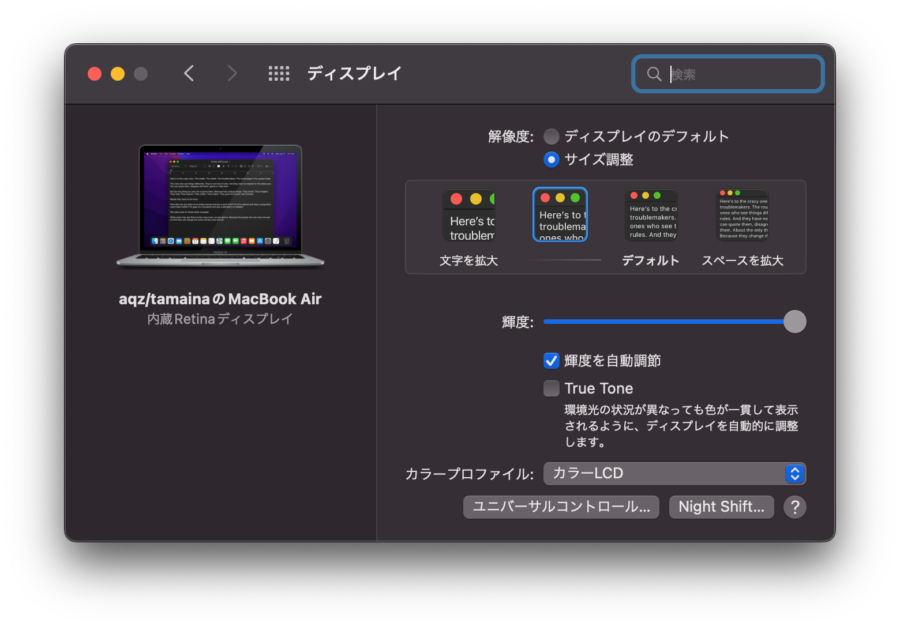
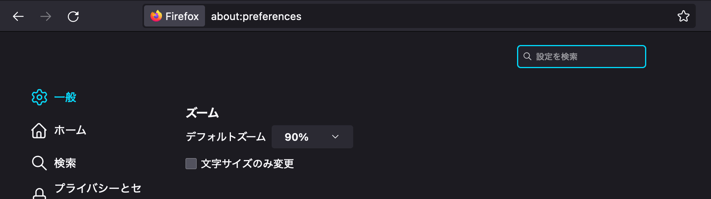
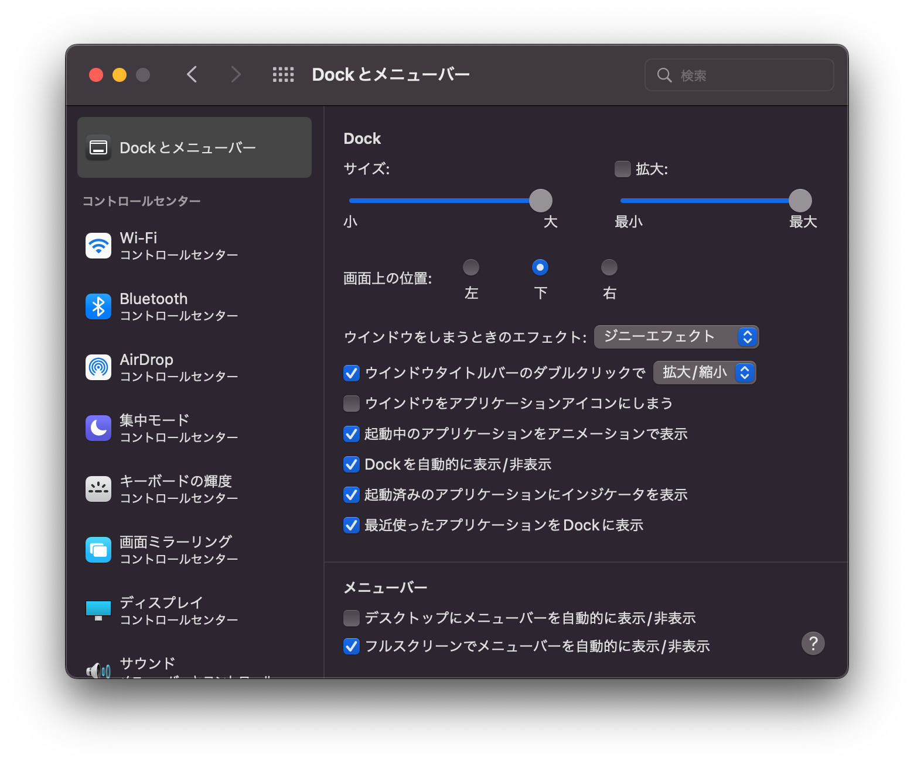
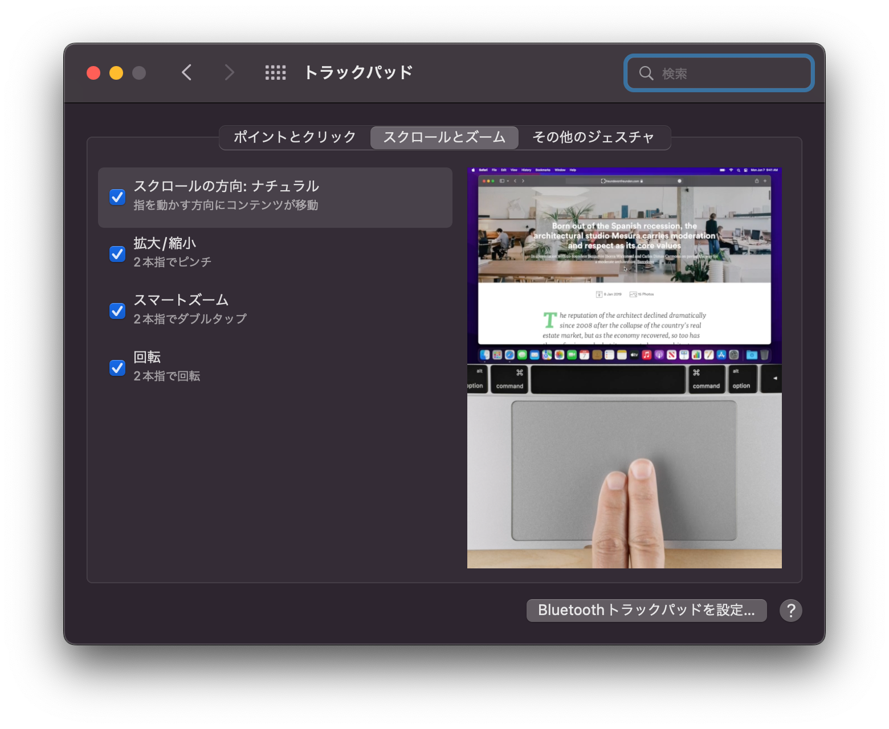
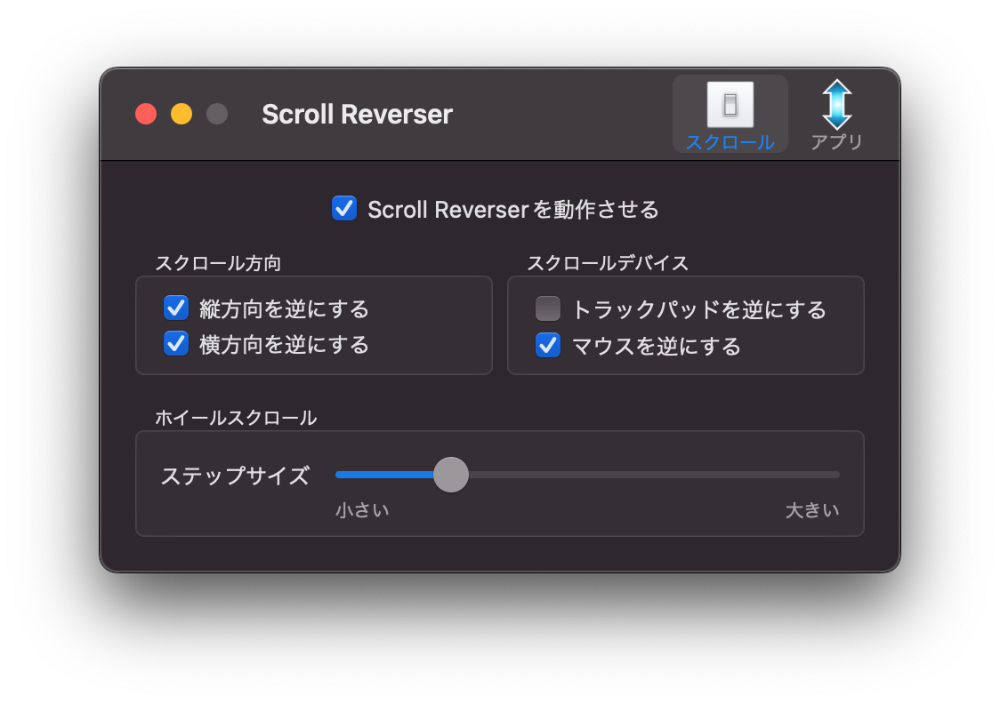
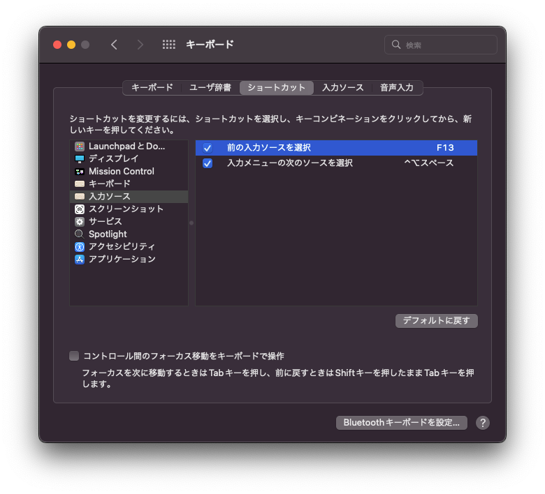
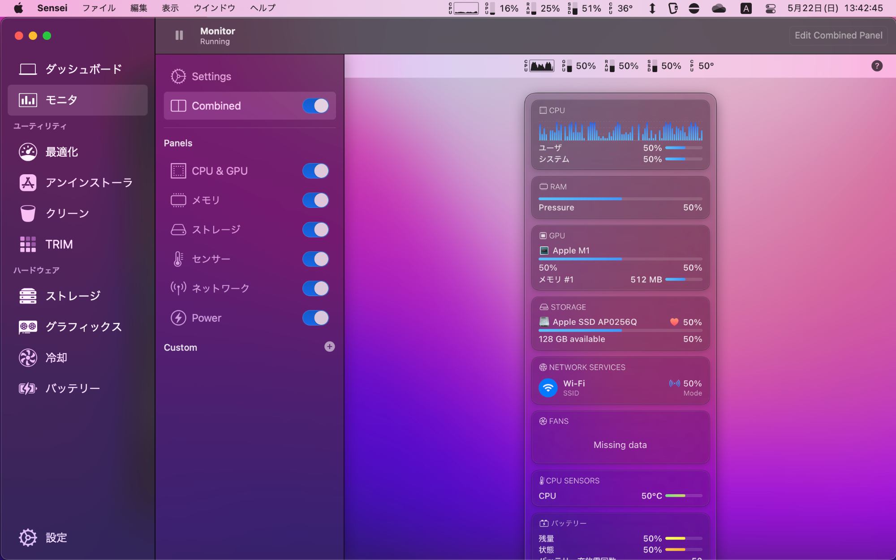
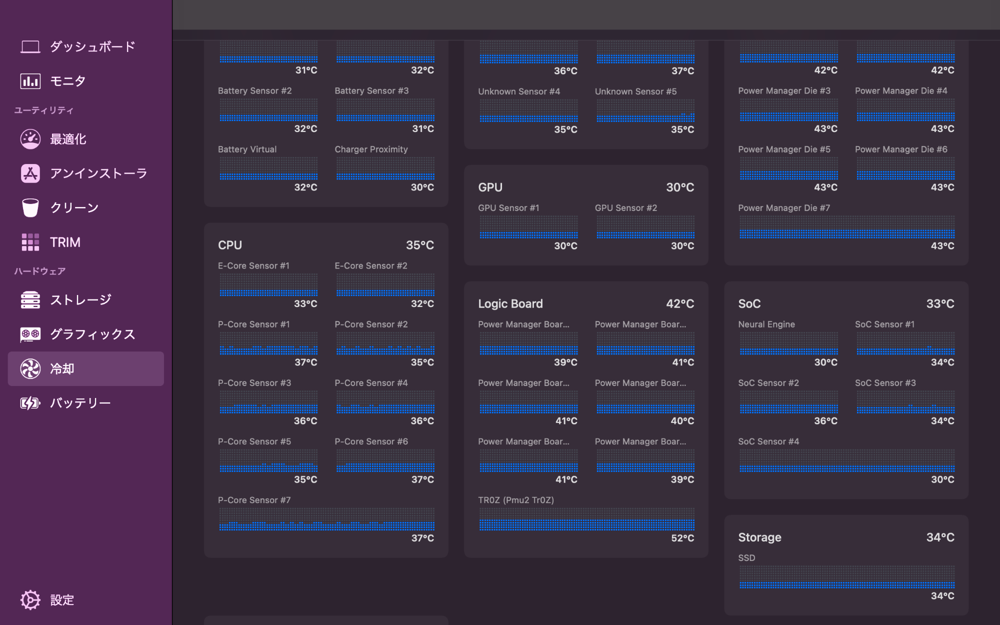

# M1 MacBook Air レビュー #3 macOSを快適に使うために色々設定してみた

個人的なmacOSの設定やアプリについてお話しします。

## UIの文字が小さすぎる

初期設定だと内臓ディスプレイのUIの文字が私には小さすぎたので、システム環境設定のディスプレイ設定で解像度（擬似解像度）を調整しました。\
（みなさんこのサイズで作業しているんですかね？目が疲れてしまわないのでしょうか……）

### Webブラウザの表示がデカすぎる

しかし、疑似解像度を変更するとWebブラウザの表示がやたら大きくなってしまいます。

各ブラウザでデフォルトの倍率を設定できます。

#### Firefox

設定 - 一般 - ズーム のデフォルトズームで設定できます。

#### Safari

環境設定 - Webサイト - ページの拡大/縮小 - これ以外のWebサイトでのデフォルト設定 で設定できます。

#### Edge

設定 - ズームで検索 - ページのズーム で設定できます。

## Dockとメニューバーの設定

よく言われる話ですが、「Dockを自動的に表示/非表示」をオンにしてマウスカーソルを画面下部に寄せた時だけDockを表示するようにします。

また、左のメニューのWi-FiやBluetoothの「メニューバーに表示」を必要なもの以外はオフにしておきます。

（色々別のアプリが表示されてはいますが）メニューバーがスッキリします。

コントロールセンターでアクセスできます。

## スクロールの設定 \[Scroll Reverser]

macOSでは、トラックパッドとマウスのスクロールの方向の設定が一緒に変わってしまいます。\
例えばトラックパッドでナチュラルスクロールを有効に設定すると、マウスの方向も「反転」してしまいます。

[Scroll Reverser for macOS](https://pilotmoon.com/scrollreverser/)を使うと、マウスとトラックパッドのスクロール方向を別々に設定できます。

## キーの役割を変更 \[Karabiner-Elements]

キーボードのキーの役割を変更します。

### 内蔵キーボード

なぜかJISキーボードでは左下に存在するCapsLockをcommandに割り当てました。\
代わりに右のcommandをCapsLockに割り当ててみました。

### 外付けJISキーボード

普通のWindows用JISキーボードを使う設定もご紹介します。

まず、grave\_accent\_and\_tilde=半角全角キー をF13キーとして割り当て、システム環境設定 - キーボード - ショートカット - 入力ソース - 前の入力ソースを選択 でf13を指定します。こうすることで半角全角キーでIMEのオンオフができるようになります。

無変換/変換キーは英数/かなキーとして割り当てます。

command+cやcommand+vをやりやすくするために、Ctrlをcommandに、Windowsキーをcontrolに割り当ててみました。

## Amphetamineでスリープさせないように

[Amphetamine](https://apps.apple.com/jp/app/amphetamine/id937984704)を使うことで、Macをスリープさせないようにできます。

### Amphetamineでも電源なしでクラムシェルモードにすることはできない！？

[Ankerの7-in-1ハブ](https://www.youtube.com/watch?v=bbFAMkrxFF8)で電源なしでクラムシェル（Macの蓋を閉じて外付けディスプレイを使用すること）をしようとしたのですが、Amphetamineを使ってもできませんでした。\
Surface Pro 7ではできるんですけどね。

素直に電源を接続してクラムシェルで使うおうと思います……

## Senseiでいい感じのハードウェア監視

メニューバーにCPU使用率などを表示させたくてアプリを探したのですが、[Sensei](https://sensei.app/)というアプリはUIもいい感じで気に入りました。ググラビリティが低いのと有料なのが難点ですが（14日間試用できます）……

モニタ機能でメニューバーにCPU使用率を表示できます。

各種温度も表示できます。

