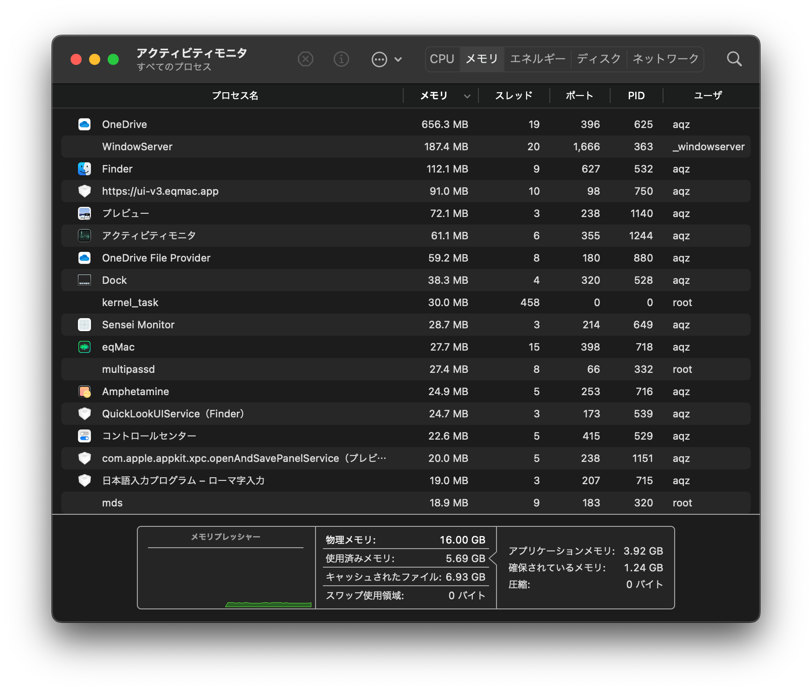
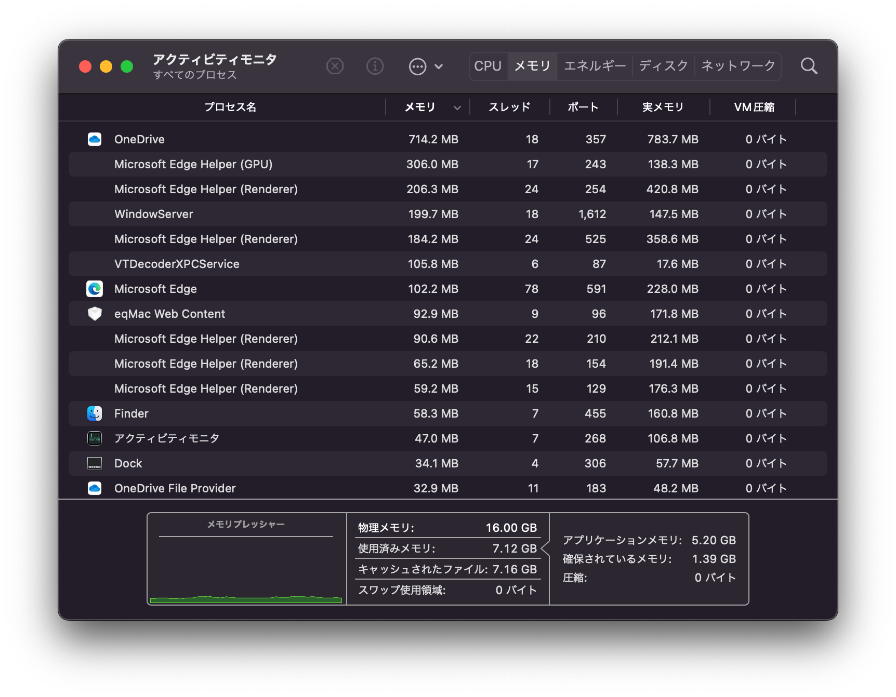
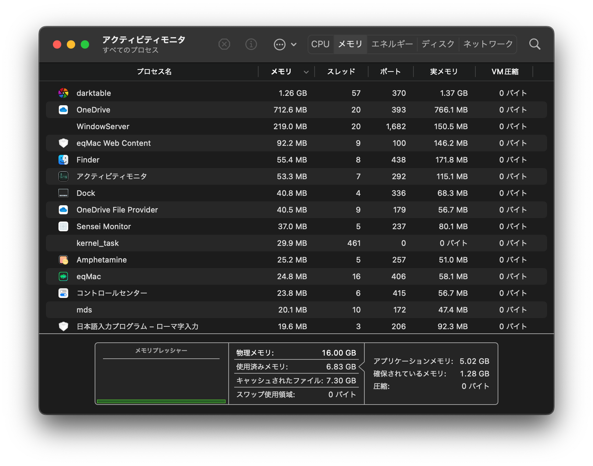
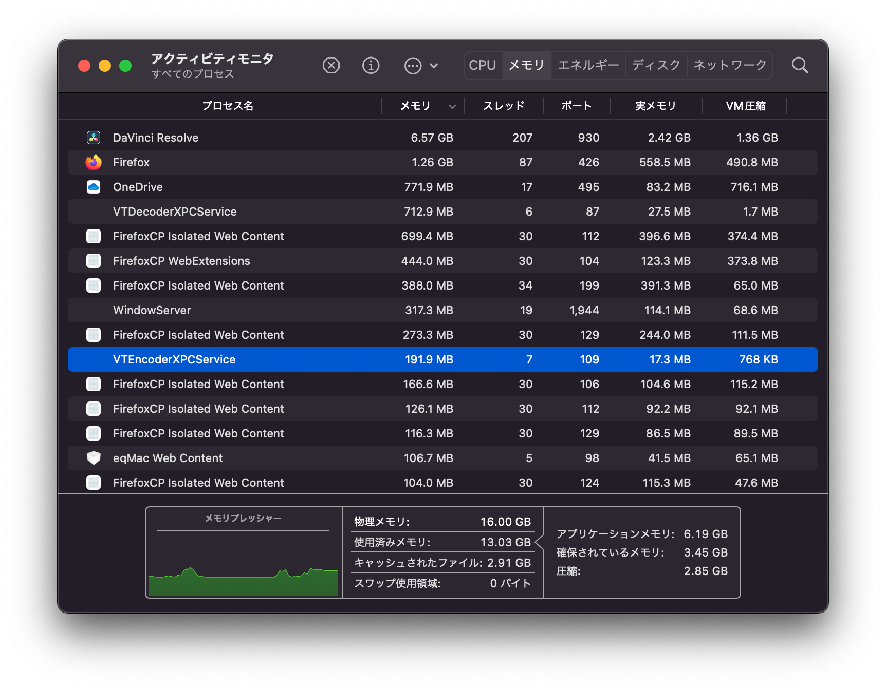
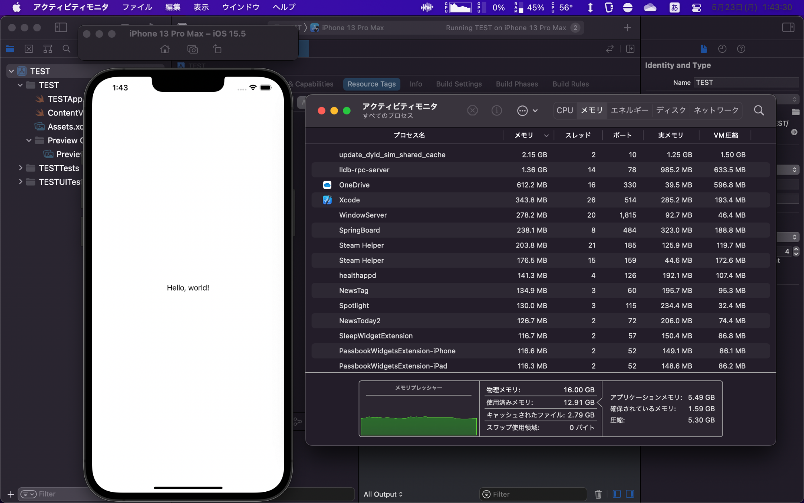
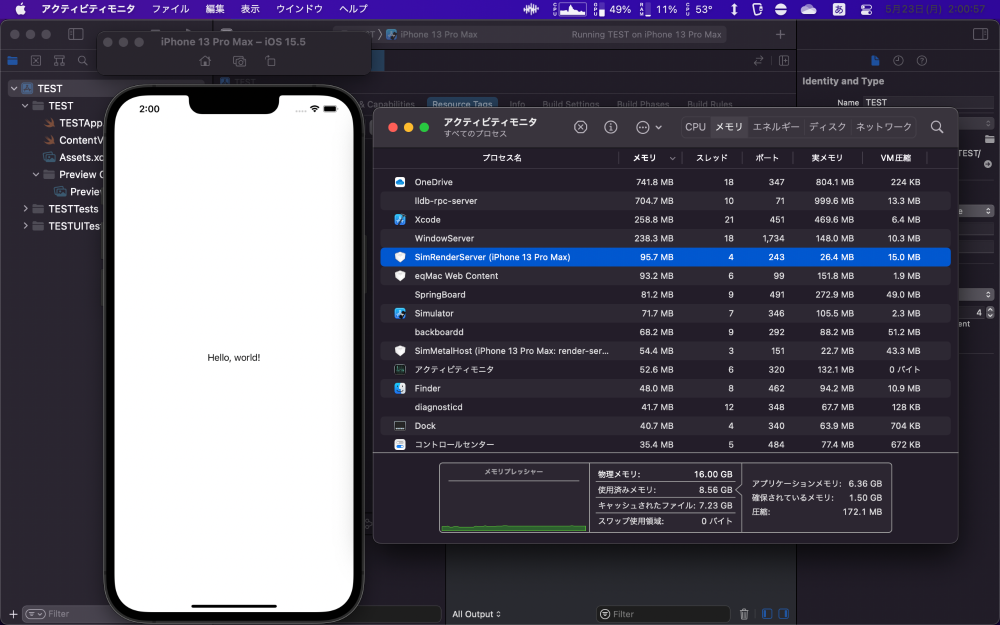
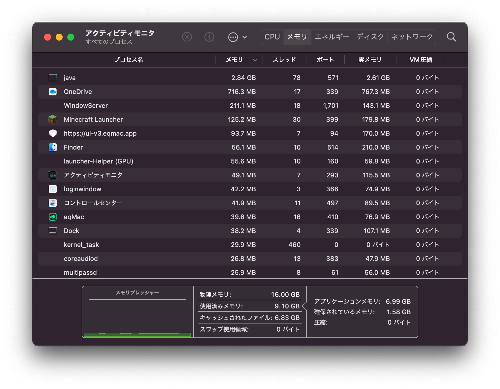

# M1 MacBook Air レビュー #4 メモリは8GBで十分?16GBが必要?

「M1 MacBook Airって、メモリは結局8GBでいいの？16GB必要なの？」という疑問の声がありましたので、M1 MacBook Air(7コアGPU/16GB)でいくつかのアプリケーションを起動した際のアクティビティモニタのスクリーンショットを掲載します。参考にしていただければと思います。

[**#1 開封編**](../05-20%20m1mba-1)  
[**#2 GPU等性能比較編**](../05-21%20m1mba-2)  
[**#3 macOSの設定編**](../05-22%20m1mba-3)  
[**#4 メモリ編**](../05-23%20m1mba-4)  
[**#5 Surface Pro 7と比較編**](../05-24%20m1mba-5)  
[**#6 返品編**](../05-25%20m1mba-6)

## マシン起動時

マシンを起動した時は使用済みメモリが5.69GBになりました。OneDriveがメモリを相当消費しています（200GB保存しているので……）。\
これはWindowsと同じ感じですね。

どのスクリーンショットでもOneDriveが上位に鎮座ましましておられますがご容赦願いたいと思います。

画面の見方としては、下部の[「メモリプレッシャー」](https://support.apple.com/ja-jp/guide/activity-monitor/actmntr34865/10.14/mac/12.0)グラフと「使用済みメモリ」を主に見てください。\
メモリプレッシャーは、メモリ圧縮やスワップなどを総合的に考慮した上でメモリの余裕を示すものです。このグラフが黄や赤になれば、明らかにメモリが不足している状態と言えます。\
使用済みメモリは、スワップを除いてアプリケーションが利用しているメモリ領域を示します。

「キャッシュされたファイル」は、[ファイルの読み取りを高速化](https://twitter.com/hasegaw/status/1494522151658876928)するために確保・使用しているメモリ領域です。

[Macのアクティビティモニタでメモリの使用状況を表示する](https://support.apple.com/ja-jp/guide/activity-monitor/actmntr1004/mac)\
<https://support.apple.com/ja-jp/guide/activity-monitor/actmntr1004/mac>

## ブラウザ

### Safari

SafariでMisskey（デッキUI）を開きYouTubeで1080pの動画を再生したところ、使用済みメモリは7.06GBになりました。プロセスがまとまっていないため見づらいのですが、1.5GB程度消費したということになります。

### Firefox

FirefoxでMisskey（デッキUI）を開きYouTubeで1080pの動画を再生したところ、2GB程度消費し、使用済みメモリは7.63GBになりました。

### Microsoft Edge

FirefoxでMisskey（デッキUI）を開きYouTubeで1080pの動画を再生したところ、1.5GB程度消費し、使用済みメモリは7.12GBになりました。

## Excel

Excelを試してみます。\
恐らく世の中的にはそこそこデータ量があると言われるはずのシートを読み込みましたが、315.9MBの消費に留まりました。

## Darktable(RAW現像ソフト)

Darktableで1600万画素のRAW画像を開いていくつかフィルタをかけたところ、1.26GB消費し、使用済みメモリは6.83GBになりました。

## DaVinci Resolve

DaVinci Resolveで4K30pの14分のプロジェクトを開いてタイムラインを「ぐりぐりした」ところ、6.23GB+αのメモリを消費しました。\
Firefoxを同時に起動していましたが、使用済みメモリは10.82GBになりました。ただメモリプレッシャーには余裕があります。

H.265でエンコードをしたところ、使用済みメモリは13.03GBになりました。\
キャッシュされたファイルの2.91GBを足すと、16GBを全て使い切っていることになります。

### VRAMは？

ところで、VRAMの扱いはどうなっているのでしょうか？

Sensei MonitorでH.265レンダー中のVRAM使用量を確認してみると、1.36GBと表示されています。\
純粋にメモリを使い切っているような表示になっていたことを考えると、VRAM使用量はプロセスのメモリ使用量に内包されているのかもしれません。\
 

## XCode

XCodeでiOSアプリを新規作成した状態では、ほとんどメモリは消費しません。\
筆者にはiOSアプリ開発についての知識が全くないため、本気でXCodeで開発している方は他の資料を当たるようにしてください。もう少し中身のあるアプリだと8GBだとビルドがきついとかの影響はあるのかもしれません。

iPhoneシミュレーターを起動したところ、使用済みメモリが12.91GBになりました。

しかし、もう一度iPhoneシミュレーターを起動した場合、使用済みメモリは8.56GBに落ち着きました。\
シミュレーターを最初に起動した時だけは何か特別なことが起きるのかもしれません。

## Multipass VM

Multipassでバーチャルマシンを起動した時のメモリ消費を見ていきます。

まずは`--mem 2G`(メモリ2GB指定)でマシンを起動します。メモリを全て使うため`/dev/null < $(yes) &`を実行したところ、VMプロセスである`qemu-system-aarch64`のメモリの確保量は3.22GBになりました。\
（業務連絡: Misskey開発は2GBだと若干厳しいので、4GBぐらいにしてください。）

続いて`--mem 6G`のマシンでMisskeyのnpm run devを実行した時の状況です。VS CodeとFirefoxも同時に開いています。VMプロセスのメモリ使用量は6.56GBになり、使用済みメモリは11.69GBになりました。

長く作業すると、メモリ使用量が増えて11.18GBになったことがありました。ただ、使用済みメモリは12.34GBとあまり増えず、メモリプレッシャーにもまだ余裕があります。

## Minecraft

Minecraft (with Optifine)を、Render Distance/Simulation Distanceを共に6チャンク、シェーダーはNoneにしてプレイしたところ、javaは2.84GBを消費し、使用済みメモリは9.67GBになりました。\
Minecraftはグラフィック処理は軽いのですが、意外にもメモリを消費します。

### シェーダー使用時

シェーダーをprojectLUMA v1.32 (Profile: Lite)にすると、プロセスのメモリ使用が5.55GBになり、使用済みメモリが10.50GBになりました。

VRAMは1.08GB使用しています。

ちなみに内蔵ディスプレイでこの描画条件（projectLUMA/Liteプロファイル/6チャンク描画）にすると、フレームレートは35fps前後になります。\
Liteプロファイルですが、画面解像度が高いので質感良くプレイできます。GPUがフルロードになるのは気がかりですが、快適に遊べると言えるでしょう。

## Cities:Skylines MOD多め

Cities:SkylinesでMODを多めに入れてプレイしたところ、プロセスはメモリを15.32GB消費し、使用済みメモリは13.98GBになり、スワップが2.99GBになりました。メモリの圧縮は7.78GBにもなります。

メモリプレッシャーのグラフの高さはまだ余裕がある気もしますが、黄色なのであまり快適ではないということのようです。\
[ベンチマーク記事でもお伝えしました](../05-21%20m1mba-2/)が、Rosetta 2などの兼ね合いからかM1 MacBook AirではCities:Skylinesを快適に遊ぶことはできないのでご注意ください。

メモリを圧縮するにも何かしらの処理が必要なため、圧縮されたメモリを使用するなら処理速度に影響が出てくるはずです。Cities:Skylinesがあまり快適にプレイできないのはメモリ不足のせいなのかも……と思ってCPU使用率を調べたのですが、kernel\_taskなどの使用率は上がっているわけではありませんでした。

メモリ圧縮はCPUに負荷をかけないようです。\
macOSのメモリ圧縮って一体全体どういう技術なんでしょう？Windowsのメモリ圧縮はかなりCPUを使うんですけどね。

VRAM使用量は796MBと表示されていました。\
WindowsでGTX 1660を使用した際はVRAMの6GBを全て使い尽くしていたので、ここら辺の処理は違いがあるのでしょうね。

## それでも16GBをお勧めしたい……！

Cities:Skylinesは異常なので忘れてください。

ブラウザを立ち上げて動画再生をした際の純粋なメモリ使用量が6〜7GBですので、この時点で8GBのマシンであれば圧縮が働いているかと思います。macOSはファイルキャッシュを300MB確保しようとするようなので、8GBをフルに使えるわけではありません。

メモリ圧縮はされるよりされない方が良いかと思うので、高機能な動画/画像編集ソフトをブラウザと同時に快適に使うなら、16GBが良いのではないかと思います。

「OneDriveなんて使ってないし、Firefoxも使わないし、動画編集や画像編集もしないし、macOSはメモリ圧縮が優秀だから8GBでいけるんじゃね？」と思われた方も多いのではないでしょうか。\
しかし私は、できるだけ16GBを買うことをお勧めしたいです。MacBookを長く使いたいなら16GBを使うべきだと言いたいです。

スワップはSSDを酷使するので、Macの寿命を早めます。スワップなんて大した影響はないと言われることもありますが、常にスワップがある状況はさすがにまずいと思います。

せっかくマルチタスクが快適にできるMacBookなのですから、メモリを16GBにして快適に作業できるようにするべきではないでしょうか？\
マルチタスクが不要ならiPadを検討されてみるのも良いと思います。

……こう煽ってしまうのは良くないですね。\
事務作業やWeb会議、執筆作業、Web開発や通常のiOSアプリ開発、簡単な2Dグラフィック制作、Webブラウジングあたりであれば、8GBでも十分と思います。

### One more thing…

真に長く使い続けられるMacBookを買いたいならば、GPU性能が高いM1 Pro/M1 Maxチップを搭載する14インチ/16インチ MacBook Proを選ぶべきです。\
GPU性能が高ければ、表現の幅は圧倒的に広がります。\
（ただし、16インチで良い場合はWindows機の方がコスパがいいはずです。本当にMacにこだわる必要はありますか？）

ちなみに、筆者はDTMをしないのですが、見聞きするところによればDTMには32GBや64GBが必要だそうです。Airは16GBが上限ですから、DTMをするならPro一択ということになるのでしょうかね。詳しくはググってください。

ありきたりで総花的な結論ではありますが、自分の作業内容を見つめ、お財布と相談して決めていただければと思います。\
[Apple Storeなら受け取り後2週間以内は返品が可能](https://www.apple.com/jp/shop/help/returns_refund)ですので、とりあえずエイヤと購入して違うと思ったら取り替える、ということも検討してみてはいかがでしょうか。

## 他のM1 MacBook Air記事

[**#1 開封編**](../05-20%20m1mba-1)  
[**#2 GPU等性能比較編**](../05-21%20m1mba-2)  
[**#3 macOSの設定編**](../05-22%20m1mba-3)  
[**#4 メモリ編**](../05-23%20m1mba-4)  
[**#5 Surface Pro 7と比較編**](../05-24%20m1mba-5)  
[**#6 返品編**](../05-25%20m1mba-6)
