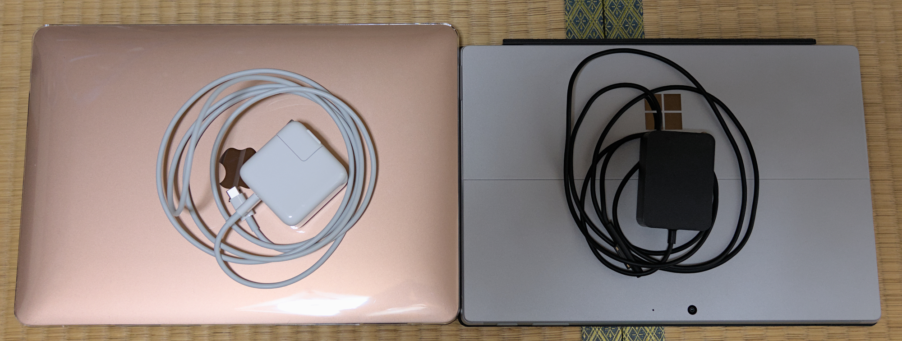

# M1 MacBook Air レビュー #5 Surface Pro 7と対決！

M1 MacBook AirをSurface Pro 7 (i3 4GB)と対決させてみます。\
性能や安定性は当然ながらM1 MacBook Airの方が遥かに優秀ですが、スピーカー音質やカメラ・マイクの性能、サイズとキーボードを比べてみます。

## サイズ比較

写真でサイズを比較してみます。\
MacBookは透明カバーを付けていますがご了承ください。

Surface Proが縦も横も一回り小さい印象です。

充電器は両方とも30Wで、厚み（Macのほうが薄い）を考えると体積としては同じくらいだと思います。

スペックを見れば真っ先にわかることではありますが、画面サイズも写真で比較してみます。\
パースが付いて若干わかりにくいですが、Surface Proのほうが一回り小さいことがわかります。

上下ベゼルは同じくらいでしょうか。

## キーボード・タッチパッド比較

キーボードとタッチパッドを写真で比較してみます。

### M1 MacBook Air JISキーボード

キーボードカバーを取らずに撮ってしまったのですがお許しください。本物はキーの色がもう少し黒色になります。

コントロール系のキーはWindowsユーザーにとって変則的な配置です（Karabiner-Elementsで割り当て変更可能）。**どうしてCapsLockを左下に配置したんですか？？？(電話猫)**

前のモデルから矢印キーの左右の高さが小さくなったということですが、私はどちらでもいいと思っています。\
カバーを付けた方が抵抗があるので打ち心地としては好みです。

### Surface Pro タイプ カバー (JIS・指紋認証機能付き)

至って普通のWindowsのキーボードです。矢印キーがあるため、右側にCtrlがありません。

浮かせて使用すると若干べこべこした感じもありますが、そこまで不快ではありません。

写真はかなり明るめに撮影されています。

### 大きさ比較

キーボード部の面積はほぼ同一で、トラックパッド/タッチパッドの大きさとスピーカーの有無が異なります。

トラックパッド/タッチパッドの大きさの好みは私は特にありません。小さいと移動量が少なくていいのですが、細かい選択がし辛いと感じています。

## 重さ

MacBook Airは重いです。1.29kgです。全然Airじゃないです。もっと軽くしてほしい。\
Surface Proもそこそこ重たいです。775gなのでタブレットとしては重量級です。しかしMacBook Airよりは軽いのですが、タイプカバー(310g)を付けると1085gになります。

私はリュックサックで持ち歩きしているので多少重くても問題ありませんが、軽いに越したことはありません。2台持ちしていると特につらいです（異常ですが）。

## 内臓スピーカー

内臓スピーカーの音質を聞き比べてみます。

聞いた曲: 幽霊楽団　～ Phantom Ensemble / 上海アリス幻樂団 \[Apple Music ロスレス CD品質]\
比較対象のイヤホン: EarFun Air Pro 2 (※こちらは低域がやや強く出ます)

### Surface Pro 7

こもりはなく、自然な感じで聞くことはできます。\
ただ、低域は弱めで深みを感じず、高域の広がりもなく抜け感がありません。チープな印象が拭えません。

最大音量時の音圧は十分だと感じます。

iPad Proのように4スピーカーではなく2スピーカーですが、底面ではなく側面に前を向くように付いているため、縦にして聞いてもあまり違和感は感じません。

### M1 MacBook Air

スピーカーユニット自体が大きいですし、Surface Pro 7より全体的に頑張っている印象があります。\
しかし、本体が共振しているのか「ごわごわもごもご」したような聞こえ方になり、あまり良い印象を受けませんでした。

最大音量時の音圧は十分だと感じます。

### 内臓スピーカー総評

MacBook Airはごわごわ感が気になってしまいます。チープなはずのSurface Pro 7のほうが聞き疲れしないと感じました。

どちらも音楽を楽しむならイヤホンやスピーカーを買い足す必要があると考えます。\
YouTubeの視聴は十分楽しむことができるでしょう。

## フロントカメラとマイク

フロントカメラとマイクの性能を比較します。

フロントカメラおよびマイクをOBS Studioにて、なるべく品質を損ねないように収録しました。\
マイクのテストは2回行います。1回目は純粋な私の声と腹を手で叩く音を収録しました。次に、サーキュレーターを最大にしてノイズのある環境で収録しました。

（YouTubeを埋め込んでいるのですが、動作しないのでリンク先に飛んでください。）

### Surface Pro 7 サーキュレーターなし

<https://youtu.be/yxPKeqkabKY>

### M1 MacBook Air サーキュレーターなし

<https://youtu.be/DBc2JZHhmKo>

### Surface Pro 7 サーキュレーターあり

<https://youtu.be/-MWnhsmBhH8>

### M1 MacBook Air サーキュレーターあり

<https://youtu.be/Sx9K87fxSfQ>

### カメラ評価

M1 MacBook Airのフロントカメラ解像度はHDが上限ですが、Surface Pro 7はFHDで収録できます。そのため、画質はSurface Pro 7の方が優秀です。\
とは言え、Zoomは映像をかなり圧縮してしまうので、元のカメラの画質はあまり関係ないかもしれませんね。

（ここで言うことではないと思いますが、画質の究極を求めるなら、SIGMA fpなどのフルサイズミラーレス一眼の使用を考えるべきです。）

### マイク評価

ノイズがない場合のマイク性能は互角と言ったところでしょうか。というか比較方法が雑すぎて比べられないですかね。MacBookとSurfaceは収録した音量が違いましたので、適宜調整していただければと思います。

しかし、サーキュレーター（ノイズ）ありの場合、Surface Pro 7はかなり音が変化してしまいました。ノイズリダクションが効いているのでしょうか（設定をあまり把握していません）。\
一方、M1 MacBook Airは音質が全く変わりませんでしたが、わずかにサーキュレーターの音が入っています。

（ここで言うことではないと思いますが、ノイズのある環境下では指向性のあるマイクを別途購入するのがベターかと思います。）

## いかがでしたか？

性能もOSも全然違いますが、サイズが近いものが近くにあったので比べてみました。\
 

12.9インチiPad ProにmacOSを突っ込めれば便利なのに……。
