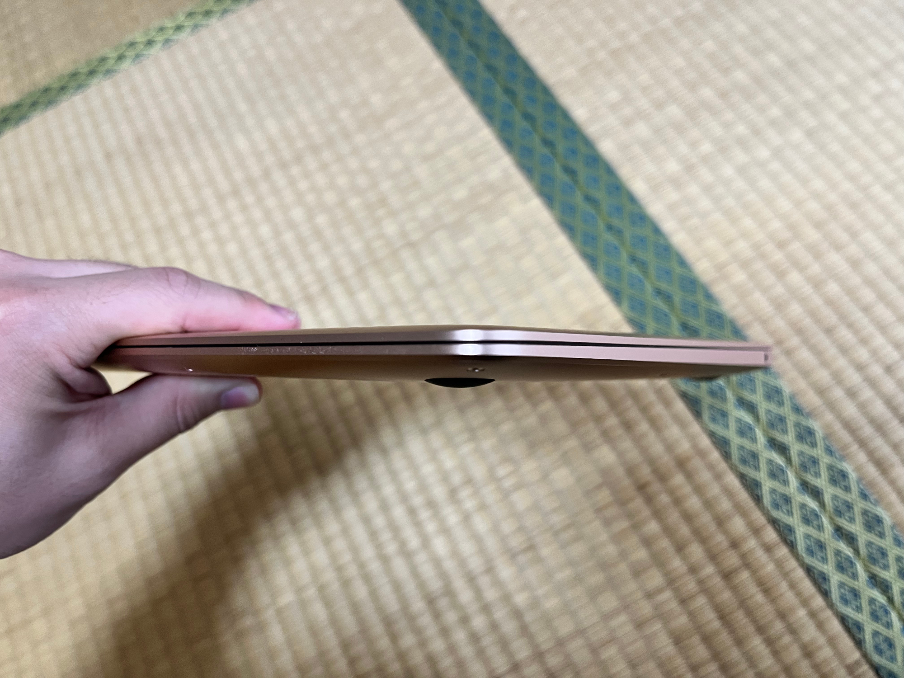
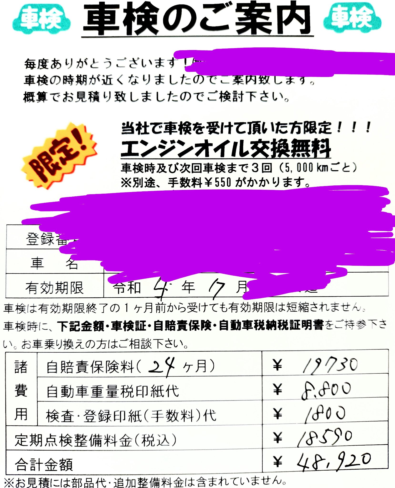

# M1 MacBook Air レビュー #6 返品します。ごめんなさい。

今まで散々ネタにしたM1 MacBook Airですが、返品することにしました。\
昨日5月24日に返品の電話をし、本日発送しました。\
[破産寸前と煽っておいて5000円の投げ銭を頂いた](https://hide.ac/articles/EJQJFviAo)のにも関わらずこのような判断をしたことをお詫び申し上げます。

返品しようと思った経緯や、前回までの記事に書ききれなかった雑感をお話しできればと思います。

[**#1 開封編**](../05-20-m1mba-1)  
[**#2 GPU等性能比較編**](../05-21-m1mba-2)  
[**#3 macOSの設定編**](../05-22-m1mba-3)  
[**#4 メモリ編**](../05-23-m1mba-4)  
[**#5 Surface Pro 7と比較編**](../05-24-m1mba-5)  
[**#6 返品編**](../05-25-m1mba-6)

## 中途半端な性能

返品しようと思った理由の第一の理由は、[M1チップの性能](https://hide.ac/articles/Eav9ZAVVY)が中途半端だと感じたからです。\
中途半端な道具というのは扱いにくいと思いませんか？私はM1 MacBook Airを使ったときにそう感じました。

私にとって必要十分なGPU性能がGTX 1660と考えているのですが、M1のGPU性能はその半分程度です。ブラウジングやWeb開発では過剰ですが、動画編集やゲーム（Minecraft, Cities:Skylines）では不十分と感じました。\
10万円があったらもっと高いものを買うか、割り切ってより安いものを買うべきであると考え、返品しようと思いました。

## デザインと重量について

普通に重たいので、樹脂にするなどしてもう少し軽くしてほしいです（樹脂もそこまで軽いわけではないようですが）。

デザインは（私はそもそもあまり気にしていないのですがしかし）そこまで良いとは思っていません。\
楔形の筐体が**持ちにくい**と感じたのも返品した理由の一つです。\
特に手前側を持った時ですが、鋭い角があるので刺さる感じがしますし、本体が滑りやすいわりに斜めになっているので力をかけにくいと感じます。

14インチ/16インチMacBook Proは、重量ももう少しあり、デザイン性は正直あまりよくないのですが、持ちやすさは上記の欠点が解消されているので持ちやすいと感じました。

ポリカーボネート製の透明なカバーもあるのですが、滑りにくくはなりますが形状は変わりませんし、重量がさらに増えます。完全な解決策ではないと感じました。

## 電池持ちについて

私が使った限り、100%の充電で6時間程度使用できます。できればあと2時間ぐらい動いてほしいと思います。

## M1 Pro搭載14インチMacBook Proがほしい

何回か言っていますが、M1 Pro搭載14インチMacBook Proが欲しいと強く思っています。\
GPUはGTX 1660並みですし、持ちやすいです。サイズは大きくなりますが私のリュックサックには入ることを確認しました（家電量販店でわざわざ入れて確認しました）。

~~[自作PCが売れたら](https://www.mercari.com/jp/items/m15185092296/)MacBook Proを買いた……あっ、車検の案内が……~~\
（いろいろ言いましたがマジで破産してしまうので否応なしにM1 MacBook Airは返品する運命だったかと思います。でも自作PCが売れたらPro買う……の……？というか自作PCを売らないと住民税が厳しいような？）

## Macは割高

Safariのテスト用途という目的がブレッブレですが、Macはコスパが悪いし端末が1つ増えるのでとにかく手を出しにくいです。Mac安くなれ。それかiPhone滅びろ。

## 他のM1 MacBook Air記事

[**#1 開封編**](../05-20-m1mba-1)  
[**#2 GPU等性能比較編**](../05-21-m1mba-2)  
[**#3 macOSの設定編**](../05-22-m1mba-3)  
[**#4 メモリ編**](../05-23-m1mba-4)  
[**#5 Surface Pro 7と比較編**](../05-24-m1mba-5)  
[**#6 返品編**](../05-25-m1mba-6)
