# Leitz Phone 1 [#2] カメラ編　スマホカメラはスマホカメラでした……

Leitz Phone 1のカメラ比較です。より安価に購入できるマイクロフォーサーズ機（LUMIX GX7MK2）と比較するとお勧めできません。

インカメラの話はしません。

## 素性
まずは、Leitz Phone 1のカメラ構成ハードウェアについておさらいです。

「1インチセンサー」とは謳われていますが、Leitz Phone 1は「0.7x（35mm換算19mm）」の準超広角レンズ（iPhoneなどの超広角より狭いのでこう呼びます）のみを搭載しており、これと1インチセンサーがくっついています。ここからデジタルズームで好きな画角で撮影するわけです。  
19mmが超広角としては狭いという声もありますが、私はiPhone 13 miniの超広角（13mm）は広すぎると思っており、19mmぐらいでいいと感じました。

「1倍（35mm換算28mm）」は0.7倍の（1/0.7≒）1.43倍であり、1倍画角だけで他機種と比較するなら「1/1.43インチセンサー搭載」と言えましょう。

約2,020万画素のCMOSセンサーで、アスペクト比は3:2となっています。スマートフォンのセンサーは一般的に4:3なので、異形と言えます。

レンズはF1.9です。かなり明るいと言えるでしょう。ただし絞り羽はありません。

歪みがないのはiPhoneのカメラでも同じでしたね。

なお、このレンズ、**寄れません**。povo2.0のeKYCで何度も失敗しました。調査はしていませんが、近接撮影自体かなり周囲が甘くなってしまうような印象を受けました。というか、絞れないので、近接ではピントが浅いまま撮ることになります。

## 比較対象
Leitz Phone 1（中古10万）と比較するのは、マイクロフォーサーズ機であるLUMIX GX7MK2（中古4万）もしくはLUMIX G100（新品8万、中古7万）と**LEICA DG SUMMILUX 9mm/F1.7 ASPH. H-X09**（新品5.5万）の組み合わせ（10～12万）です。  
若干かさばりますが、面積的にはむしろ小さいLUMIXのほうがコンパクトです。

所持していたのがLUMIXなのと同じLeicaレンズなので比較対象をLUMIXにしましたが、SONY αのZV-E10などのAPS-CボディとE 11mm F1.8 SEL11F18の組み合わせもよさそうです（ちょっと広角過ぎる気はします）。

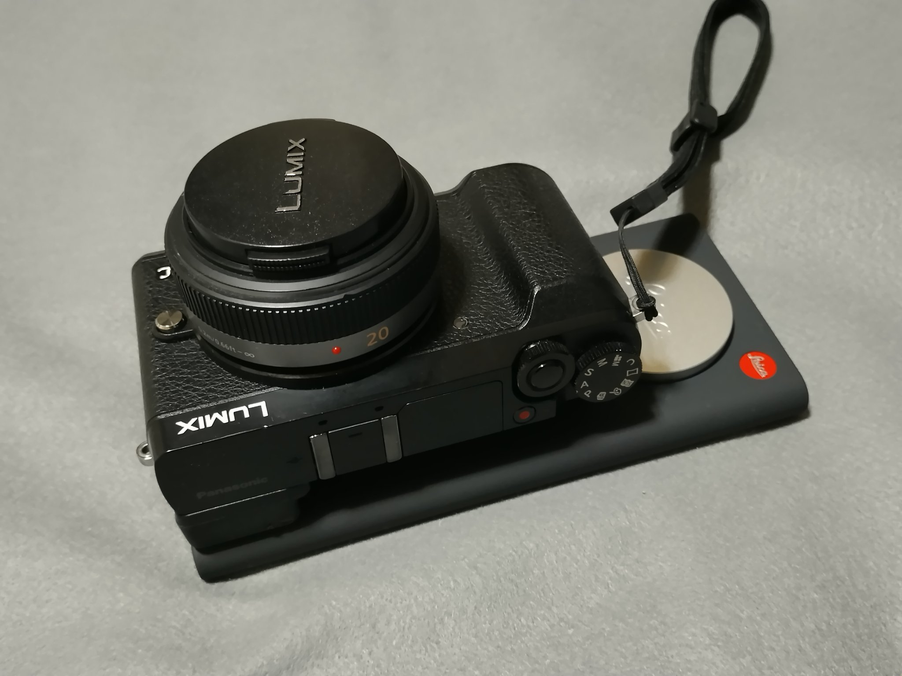

#### LEICA DG SUMMILUX 9mm/F1.7 ASPH. H-X09 の特徴

- ライカ！
- 寄れる！
- 絞れる！

#### LUMIX GX7MK2 の特徴

- 4K30p撮影は時間無制限、1.30倍にクロップ（GX7M3はクロップがもっと大きい…）
- センサーシフト手ぶれ補正
- バッテリー持ちは悪い
- ちょっと重たい

#### LUMIX G100 の特徴
買ったことはないです。

- 軽い！小さい！
- 4K30pは10分制限、手ぶれ補正なしで1.26倍クロップ
- 電子式手ぶれ補正、クロップがより大きい
- バッテリー持ちは多分悪い

## 静止画
静止画は3つのモードがあり、通常のオートモード「写真」、ライカ風のモノクロ写真を楽しめる「LEITZ LOOKS」、ISO・シャッタースピード・フォーカスなどを設定できる「マニュアル写真」があります。

いつしかのアップデートで、AQUOS R7と同じようにズームを無段階で調節できるようになりました（初期は0.7x, 1x, 2x以上？で固定だった）。

「マニュアル写真」モードでのみRAW画像（dng）を保存できます。Rakuten Hand 5Gは通常モードでRAW保存できる（逆になぜかマニュアル撮影ではRAWを保存してくれない）のでこの仕様はいまいちですね。

「写真」「LEITZ LOOKS」およびマニュアル写真でJPEGのみ記録にすると、HDRを有効にできます。「明るさ強調」を有効にするとiPhoneに近くなる感じでしょうか？

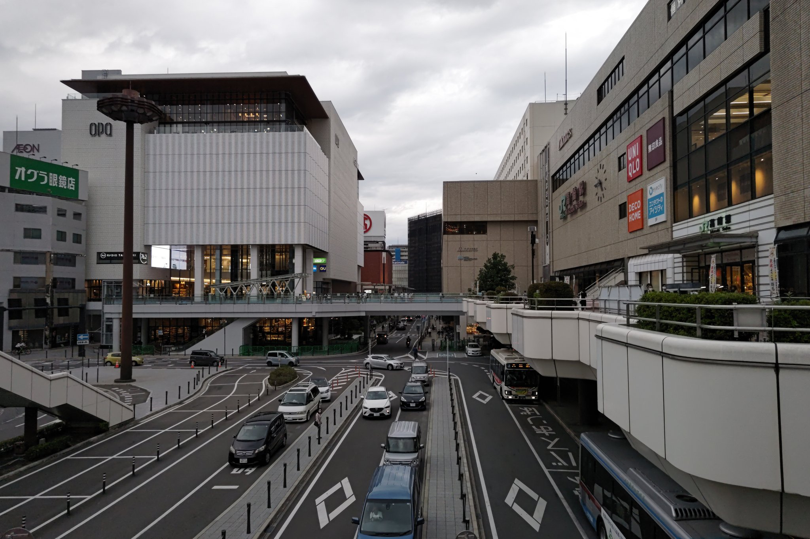

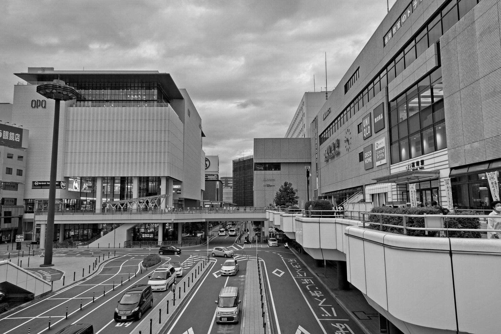

### 夜間は…
昼間は2万円のスマホでもそこそこ撮れるので、夜間に1インチの本領を発揮していただきましょう。

しかし、夜景モードは期待できません。トロトロかブレブレの写真が撮れます。

マニュアル撮影モードで撮ってみると幸せになれるかもしれません。  
[下の画像のRAW画像はこちら（DSC_0069.dng 38.6MB）](DSC_0069.dng)

JPEGのEXIFにはISO-2486と記録されているのにRAWはISO-1125となっているのはどうしてなんでしょうね？

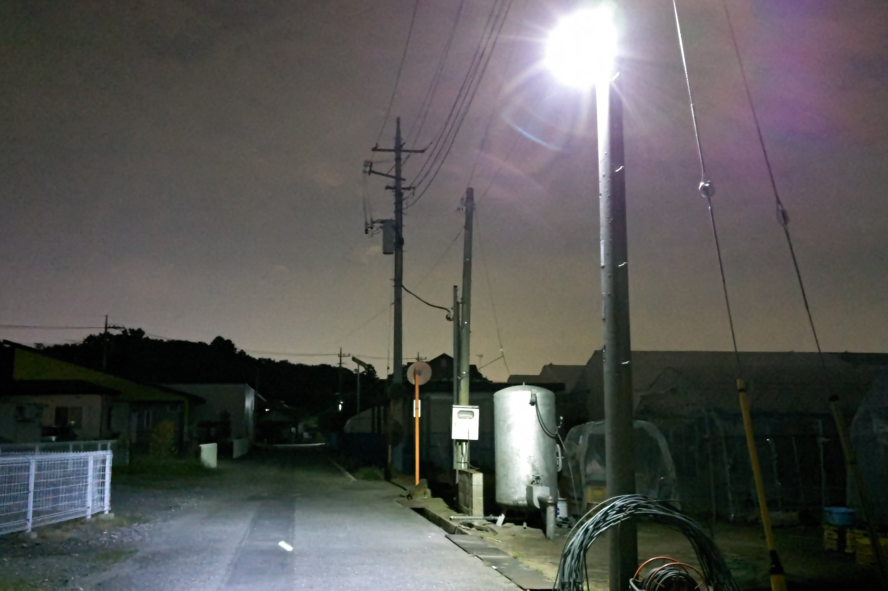

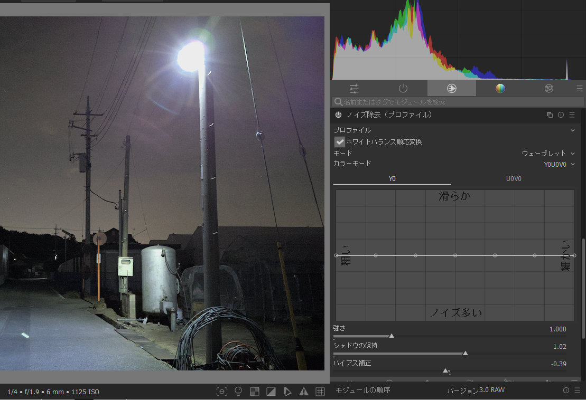

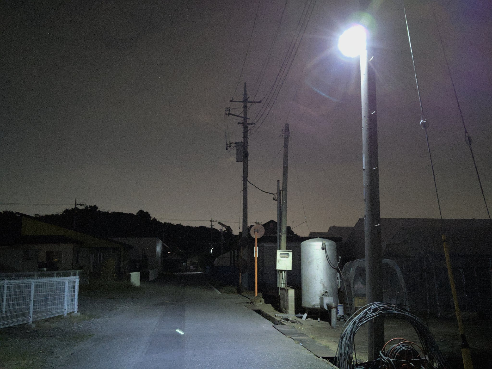

ところで、RAW画像の左下を拡大するとこのようにノイズが白い点になって見えるのですが……

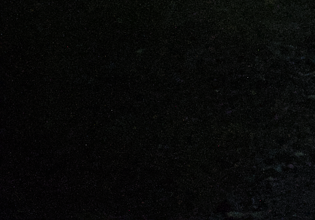

長時間ノイズ？1/4sですよ？  
長時間ノイズならダーク減算すればよさそうですが、スマホカメラでいちいちそんなことやってられないです。

さて、LUMIX GX7MK2 + LUMIX G 20mm/F1.7で撮るとこんな感じにできます（darktableで現像しました）。  
街灯のフレアは少ないのですが、盛大に白飛びしてしまっています（レンズの特性によるところも大きいのですが）。ノイズやディティールはマイクロフォーサーズの方が圧倒的に優れています。

Leitz Phone 1のセンサーは**ノイズが多すぎる**という感想を持ちました。もしかしたら熱ノイズが酷いのかもしれません。

## 動画
動画はどうでしょうか。  
やはり0.7倍をフルに使ったダイナミックな撮影が楽しめます……**30fpsの時だけね！**

とりあえず特徴を以下に挙げます。

👍ジンバルいらずの手ぶれ補正（光学式ではないので、夜間は像がびよんびよんします）  
👍ゆがみのない19mm超広角撮影  
❓1080p60, 4K60pではクロップ率が大きくなる  
👎ISO50でも暗部のノイズが気になる  
👎マニュアルビデオモードでもSS（シャッタースピード）とフォーカスが設定できない  
👎MFできないのにAF検査時のフォーカス移動が気になる。フォーカスブリージングもひどい (0:09 など)  
👎マニュアルビデオモード撮影中にISOなどのパラメータが変更できない
👎発熱がひどく、ケースなしで最大10分程度しか連続して撮影できない

個人的な感想としては「ちょっとないかなー」といったところです。ミラーレス一眼の代わりにはなりません。18万円するのに……。

サンプルの動画をご覧ください。0.7倍で、コントラストを減らしてLog風味に撮影しました。

<embed-youtube video-id="Gcmv0_ihyng"></embed-youtube>

### 画角比較
手ぶれ補正のあり・なし、30フレーム・60フレームのそれぞれの場合での画角変化をご確認ください。  
なお、4KもFHDも変化はなさそうです。

4K60pは特に大きくクロップされます。手ぶれ補正でもそれなりにクロップされます。  
GX7MK2などのLUMIX廉価機種では4Kはクロップがありますので、それとはどっこいといった感じかと思います。

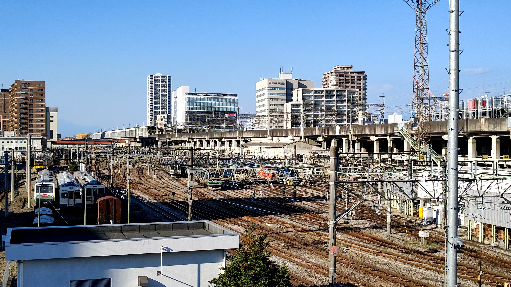

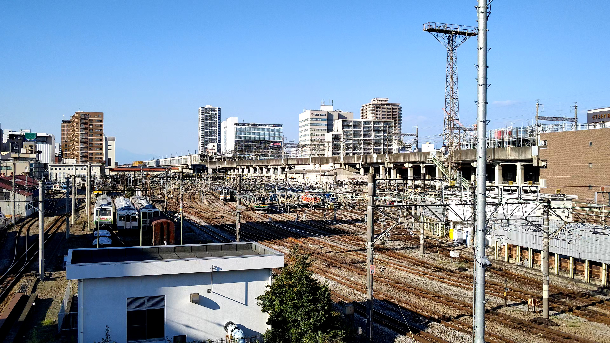

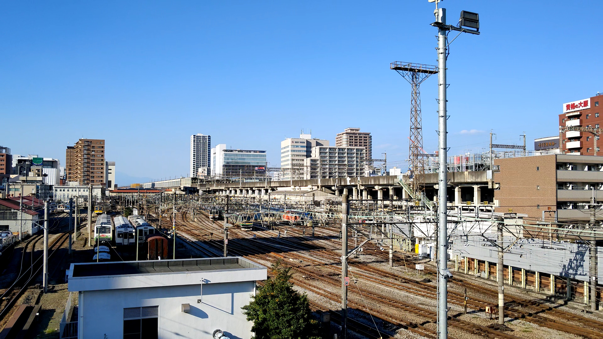

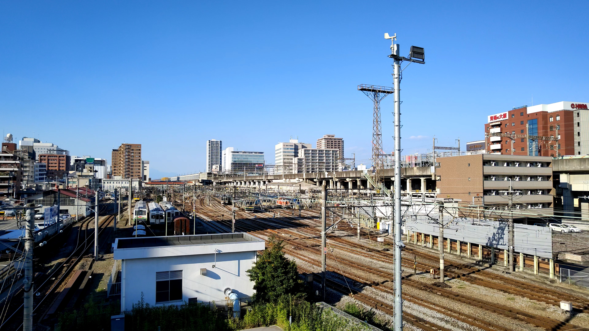

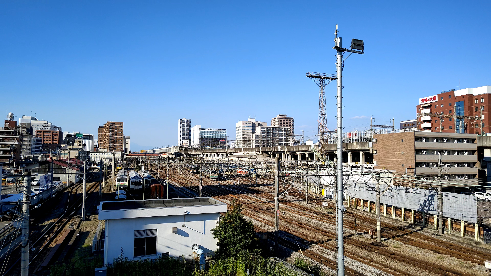

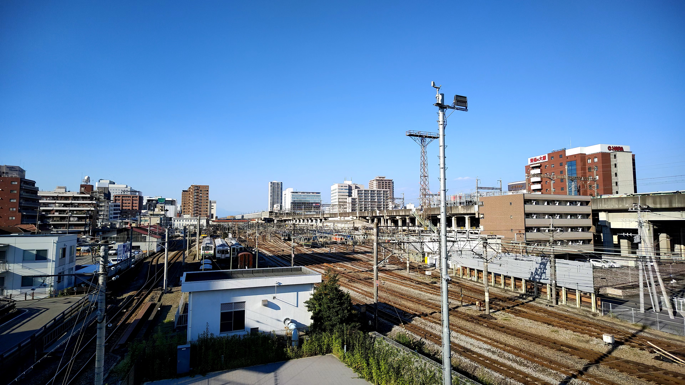

## 結論
スマホカメラはスマホカメラ。
