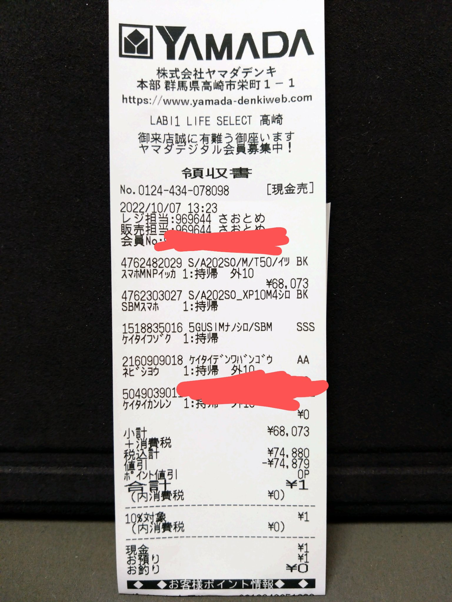
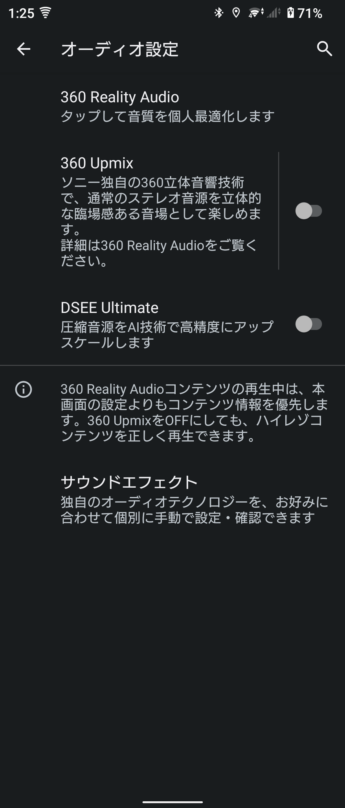
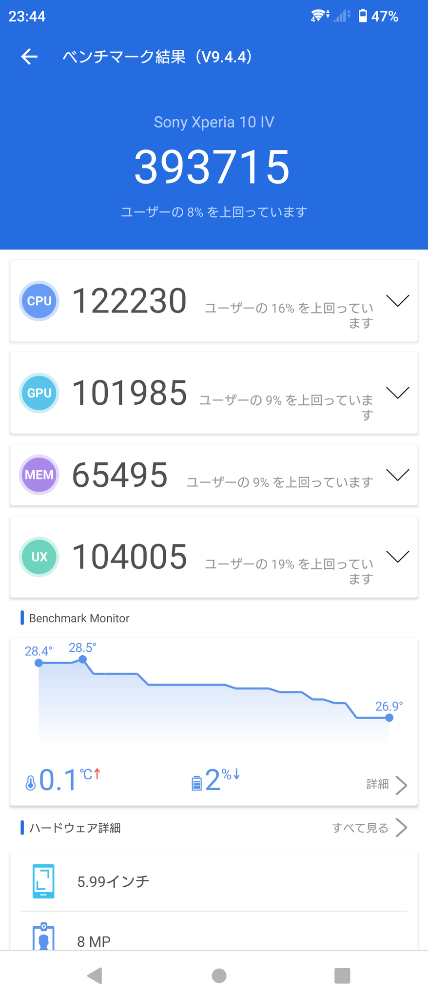
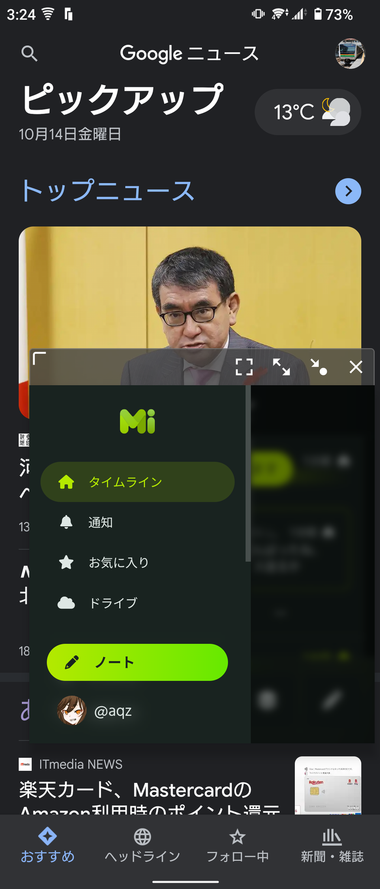

# Xperia 10 IV ざっくりハンズオンレビュー
Xperia 10 IVがSoftbankで一括1円なのは前から知っていたのですが、この度、機会があったため購入しました。

[**Xperia 10 IV Softbank版 スペックシート**](https://xperia.sony.jp/xperia/xperia10m4/spec_softbank.html)

## 開封・付属品

## 背面外観・筐体・サイズ感

まずは外観や筐体・サイズ感について見ていきます。  
今回はブラックを購入しました。

カラーは「ブラック」「ホワイト」「ミント」「ラベンダー」から選択できますが、Softbankではラベンダーの取り扱いがありません。

Xperiaらしい21:9の縦長のディスプレイと筐体が特徴的です。  
ディスプレイサイズは約6.0インチだそうです。ノッチやパンチホールではないのもXperiaの特長ですね。個人的にはこれでも良いと感じます。

形状としては、側面は垂直になっており、背面も平らです。

筐体について気が付いたこととして、指で背面をトントンと弾いたりバイブレーションが作動したりすると、**バネのような反響**が感じられます。TONE e22と似た感じです。

背面パネルはフロスト仕上げとなっています。素材がガラスであるとのメディアの記事を見かけますが、本当にガラスなのか疑問に感じました。[説明書の材質一覧](https://www.au.com/online-manual/sog07/sog07_01/m_01_00_02.html)を見ると`外装ケース（…背面カバー）ポリカーボネート樹脂`と書いてあるため、ポリカーボネート樹脂なのではないかと思います。  
外装がどのような素材であっても鍵やアスファルトで傷ついたり壊れたりしやすいことは変わらないので、保護ケースは付けましょう。どのスマホでもそうですが。

## 他機種との比較
ミドルレンジのスマートフォンは、特に競合製品が多いため、他の機種とも比較してみます。

Xperia 10 IVは「幅約67mmのスリムなハンドフィットサイズ」とのことですので、まずは小さいスマホとサイズ感を比べてみます。  
左から「iPhone SE (2020年 第2世代)」「iPhone 13 mini」「Xperia 10 IV」「Rakuten Hand 5G」を並べてみました。

**厚さ:** 7.3mm, 7.65mm, 約8.3mm, 約9.5mm  
**幅:** 67.3mm, 64.2mm, 約67mm, 約63mm  
**重さ:** 148g(2)→144g(3), 140g, 161g, 134g

薄いのはiPhone SEですが、重さはiPhone 13 miniが一番軽くなっています。  
総合的なコンパクトさで圧勝しているのはRakuten Hand 5Gだと感じます。私はiPhone 13 miniからRakuten Hand 5Gに乗り換えました。

こうして数字を見ると、Xperia 10 IVはこれらの端末と並べて考えるものではないなという感じもします。  
Rakuten Hand 5Gとスペックが似ているのはXperia Ace IIIですが、こちらは幅69mm・厚さ8.9mmと普通のサイズなのでやはり別物です。

6万円前後のミドルレンジというと、「SAMSUNG Galaxy A52 5G」「Google Pixel 6a」「HTC Desire 22 pro」「Nothing Phone (1)」「motorola edge 20」「Xiaomi 11T」というような選択肢も考えられます。  
「OPPO Reno5 A」「OPPO Reno7 A」「Galaxy M23 5G」はミドルレンジの性能を持っていますが、とくにReno5 AはY! mobileが投げ売りしているため相当安価に購入できます。「SHARP AQUOS sense7」の価格は不明です。

この中でXperia 10 IVと同様に「コンパクト」と言って良さそうなのは、6.1インチ・厚さ8.0mm・幅70mm・重さ158gのAQUOS sense7のみです。  
カメラ性能もこちらの方が良いはずなので、個人的にはXperia 10 IVよりAQUOS sense7を選びたくなってきます。  
Pixel 6aも6.1インチですが、重さが178gとやたら重たいのが気になります。

重さだけで言えば「Mi 11 Lite 5G」は159g、「motorola edge 20」は163gと、6.5インチを超えるスマホなのにもかかわらず異常に軽量です。Xperia 10 IVよりはスタミナが若干犠牲になっている気がしますが、こちらも検討されてみてはいかがでしょうか。Mi 11 Lite 5Gは入手性が悪くなってきているようです。

価格を考えず、ハイエンドでコンパクトな機種も見ていきます。  
まずは上位機種である「Xperia 5 IV」。サイズ感は10 IVと同程度、重量は172gと重たいですが**Pixel 6aよりは軽いのですよね**。  
「Zenfone 9」「Galaxy S22」もコンパクトハイエンドであり、Xperia 5 IVより軽量ですが、スタミナはXperia 5 IVよりも心配です。  
厚さと重量と価格を考えなければ「Galaxy Z Fold4」もコンパクトサイズに収まります。

ところで、iPhone 12 miniは厚さ7.4mm・重さ133gだったので、実は13 miniは厚く重たくなっています。スタミナを考えなければ12 miniを今から購入するのもアリかもしれません。

## 防水・防塵・耐衝撃
防水・防塵はIPX5/IPX8/IP6X、耐衝撃性は仕様として存在しません。

ちなみにRakuten Hand 5GはIP68です。**シャワー中の画面操作はXperia 10 IVが圧倒的に快適だと感じました。**

## 指紋認証
側面指紋認証です。

側面指紋認証しか勝たん……と思っていた時期が私にもあったのですが、Xperia 10 IVはあまり感度がよくない印象です。  
Rakuten Hand 5Gの画面内指紋認証と同じぐらいには遅く感じます。

ちなみに、Androidにありがちな顔認証機能は一切ありません。

## ディスプレイ
ディスプレイは、スペックシート上で「約6.0インチ/有機EL　トリルミナス®ディスプレイ　for mobile/Full HD+：1080×2520」と謳われています。  
6万円のスマホに期待されるような平凡なディスプレイかと思います。

日中はRakuten Hand 5Gよりは見やすいと感じましたが、Rakuten Hand 5Gは2万円のスマホなので大目に見る必要がありそうです。

リフレッシュレートが60Hzであることが残念がられることもありますが、個人的には90Hzや120Hzは不要なので気にしていません。

## サウンド
Xperia 10 IVは、イヤホンジャックを搭載しています。  
AQUOS sense7はイヤホンジャックがあります。Rakuten Handは、初代にはあったのに5Gではなぜかオミットされてしまいました。

### スピーカー
モノラルスピーカーです。この価格でステレオではないのは残念ですね。前面に向いているスピーカーは特徴的ですが、音質もかなり微妙です。  
スピーカー音質はRakuten Hand 5Gのほうが良いです。Rakuten Hand 5Gって実はスピーカー音質わりと良いんですよ？

当然、Dolby Atmos対応を謳うAndroid機やiPhoneには負けています。iPhoneは異常なので、スピーカー音質を求めるならiPhoneを買ってください。  
Pixel 6aについては情報が手元にありません。

### 独自機能
Appleに対抗してなのか、SONYには臨場感豊かな音場を実現する「360 Reality Audio」というも技術があり、Xperia 10 IVも対応しています。ただ、対応するサービスや音源に縁がないため試していません。  
通常の音源を360 Reality Audioに対応させる「360 Upmix」という機能もあるようですが、音質が悪くなったとしか感じませんでした。

圧縮音源をハイレゾに“拡張”する「DSEE Ultimate」という機能もあります。私はAAC接続以下のイヤホンしか持ち合わせていませんので恩恵に与ることはできません。そもそもロスレスCD音質以上の音を聞き分けられるかどうか怪しいですが……。

ところで、Xperia 10 IVでは、Apple Musicのイコライザを開こうとするとXperiaのオーディオ設定が開く仕様のようです。

（オーディオ沼にちょっと足を踏み入れたい気もしているのですが、M1 Pro 14インチ MacBook Proを買う予定があるため今は無理です。でもBose QuietComfort Earbuds IIってAACなんだよな……。）

### Bluetooth オーディオ コーデック
Bluetoothバージョンはv5.1です。

コーデックは標準的なSBC, AAC, aptXには対応しています。  
SONY製の規格であるLDACにももちろん対応しています。  
aptX HD, aptX Adaptiveについては、[Softbankの仕様表](https://www.softbank.jp/mobile/products/smartphone/xperia10m4/)には対応が記載されていました。

（余談ですが、Rakuten Hand 5GはLDACには対応していますが、aptX HD/Adaptiveには対応していません。）

## カメラ
超広角=35mm換算16mm/F2.2および望遠=同54mm/F2.2が1/4型800万画素、広角=同27mm/F1.8が1/2.8型1200万画素の3眼構成です。

広角カメラの写真の画質については、まあ及第点だとは思います。センサーのダイナミックレンジをもうちょっと使ってくれたらいいなという感じはあります。
光学手ぶれ補正がありますが、私がマイクロフォーサーズ機に慣れてしまっているためか、効いている感じがありません。  

オートフォーカスは期待できません。上位機種ではオートフォーカス性能の良さが謳われていますが、この機種のオートフォーカスは微妙です。

超広角については……超広角です。私は真面目に使わないので評価できません。レンズ補正で「画質有線」「歪み補正優先」が選べます。  
望遠については、メインを4800万画素にすれば要らないよね、という程度の画質です。やっぱりもう少しセンサーのダイナミックレンジを活用してほしい感じがあります。  
デフォルトのカメラアプリではRAWは保存できません。Lightroomアプリでdngを撮影できますが、広角カメラしか選択できません。

動画については、4K動画は撮影できません（SoCの制約と言われています）し、FHD動画の画質も微妙です。  
しかし、手ぶれ補正があるのは素直にありがたいです。「緊急で動画を回す」用途にはいいかもしれません。

とにかく、**カメラはiPhone SE (第2,3世代)には敵いません。** カメラを重視する方はiPhone SEを買ってください。  
なお、iPhone 13 miniやiPhone 12 Pro Maxはゴーストが多すぎるため当ブログでは失格扱いとなっております。

（Rakuten Hand 5Gのカメラは扱い方がよくわかっていませんが、暗所にとにかく弱いことだけはわかっています。手ぶれ補正はありません。そもそも暗所で真面目に撮りたければマイクロフォーサーズを取り出すしなぁ……。）

## バッテリー・充電
バッテリーは5000mAhです。  
スタミナは相当ある印象を受けました。いや、相当あるなんてもんじゃないです。**伊達じゃないスタミナ**です。

一番最初のキャッチコピーからして<b>「Xperiaの新スタンダードは　大容量バッテリー搭載なのに軽い！」</b><b>「大容量バッテリー搭載、なのに世界最軽量*　楽しさ広がる毎日へ</b> (*2022年5月11日現在、5000mAh以上のバッテリーを搭載する5G対応スマートフォンとして世界最軽量。ソニー調べ。)<b>」</b>ですからね。  
バッテリーの大きさももちろんですが、SoCのワッパのよさもスタミナの良さに寄与していそうです。

Xperia 10 IVの市場での感想として「充電が遅い」という声が聞かれます。確かにスペック表では充電時間150分と他機種に比べ遅い値となっています。私は寝ている間に充電しているので気にしたことがありません（Xiaomiの120W充電を体験したためそれ以外を目糞鼻糞だと思っている節もあります）。  

さらに、「バッテリーの負荷を軽減する「いたわり充電」とXperia独自の「充電最適化技術」により、3年使っても劣化しにくい長持ちバッテリーを実現。」とのことです。スペック表にPD-PPS規格に対応との記載がありますが、関連があるかはわかりません。

なお、ワイヤレス充電は非対応です。

## おサイフケータイ・FeliCa
国内メーカーのスマホですので、当然ながらおサイフケータイに対応しており、マイナンバーカード関連もしっかり対応しています（Rakuten Handはマイナポイント等ができません）。

ただ、背面の印刷が通常のNFCマークなのは寂しい……というかおサイフケータイマークが必須ではないことにちょっと驚いています。

## モバイル通信 (LTE/NR)
### 対応バンド
nanoSIM + eSIMのデュアルSIM対応です。DSDV対応かどうかはわかりませんが、DSDSぐらいには対応していそうです。  
docomo版はeSIMに非対応でシングルSIMとなっているとのことです。

Softbank版の対応バンドは次の通りです。

- **4G: 1/3/4/8/12/18/19/41/42**
- **5G（Sub6）：n3/n28/n77/n78**

docomo・auのプラチナバンドにも対応していますので、4社すべてで使えると言えます。

### 5G SA
Softbank 5G SAに対応しています。5G SAには速度的なメリットはありませんが、CellmapperでgNBが取得でき、基地局収集ができます。

Cellmapperでの基地局収集用に使用していたmoto g50 5Gは近く売却予定です。

## ベンチマーク・性能
Xperia 10 IVは、SoCとしてQualcomm Snapdragon 695 5Gを搭載し、6GBのRAMを搭載しています。  
AnTuTuベンチマークの結果は39万点でした（AnTuTu v9ベンチマークは30万点が及第点とされています）。

Rakuten Hand 5G(Snapdragon 480 5G)は29万点、Dimensity 700搭載端末は30万点前後ですので、それよりはスペックが良いかと思います。  
30万点前後の端末と比べて「サクサク感」に大きな違いは感じられません。ゲーム性能が少しは良いのかもしれませんが、個人的にゲームをしないので評価はここではやめておきます。  
Rakuten Hand 5GはRAM4GBですので、安定感に関しては6GBのXperia 10 IVに分があります。

**スペックを気にするなら、やっぱりiPhoneかPixel 6aを買いましょう。** iPhone SE2 (A13 Bionic RAM3GB)で59万点、iPhone SE3 (A15 Bionic RAM4GB)で79万点、Pixel 6aは68万点です。

## Wi-Fi
Wi-FiはWi-Fi 5までの対応です。Wi-Fi 6には対応していません。これもちょっと微妙なポイントです。

## Wi-Fiテザリング
- **WPA3-Personal**に**対応**
- **中継**に**非対応**
- Wi-Fi 5 (IEEE802.11ac)に対応？（テザリングオプション未加入のため確認できず）  
  5GHz帯の使用を優先するか2.4GHz帯のみ使用するかの設定があります。  

## OS
OSはAndroid 12を搭載しています。  
（Rakuten Hand 5GはAndroid 11で、バージョンアップ予定もありません。）

Softbank版でしたので、プリインストールアプリは相変わらず山盛りです。

Xperiaの21:9画面の端末では、縦長な画面を生かした「ウィンドウマネージャー」が利用でき、アプリをポップアップ表示もしくは画面分割表示できます。  
画面上に常時表示される[サイドセンスバー](https://xperia.sony.jp/myxperia/howtoxperia/basic/function36.html)がマルチタスク機能を呼び出すときにわりと便利に感じたのですが、ゲームをメインで使われている方からは邪魔という声があるとのことです。

画面分割表示では、無段階で分割の割合を調整できます（片方のアプリが極端に小さくならないようストップはかかります）。

Xiaomi端末(MIUI)やOPPO端末(ColorOS)、Galaxy端末にもフローティングウィンドウ（ポップアップ表示）機能は存在しますね。  
また、Motorola端末では左端→右端→左端の往復スワイプ（「スワイプで分割」設定）、ColorOSでは3本指で上へスワイプして画面分割を呼び出すといったジェスチャー機能があり、これもマルチタスク機能として便利でした。  
Motorolaの分割画面は1:3/1:1/3:1の3段階での調節、ColorOSは無段階での調節ができます。

## 総評
Xperia 10 IVは、サイズ感・重量感・スタミナが揃う、唯一無二の機種です。スタミナを省略するとRakuten Hand 5Gが最強であり~~、私はスタミナがそこまで必要ないためRakuten Hand 5Gをメインに据え続けることとします。~~  
と言っていましたが、そこまでコンパクトである必要がないと感じてきたため快適でアップグレードもあるXperia 10 IVを使うことにしました。

スタミナ以外の性能ではiPhone SE3に惨敗してると思います。カメラで超広角と望遠が必要だとか、21:9の画面でマルチタスクをしたい場合はXperia 10 IVという選択肢があり得るかもしれません。  
Pixel 6aも良いとは思いますが、重たいのが気になります。

Xperia 10 IVはSoCであるSnapdragon 695 5Gのゲーム性能やISP（画像処理）性能が低く足枷となり、お勧めしにくい機種になっていると感じました。

特に国内のAndroidミドルレンジは軒並みSnapdragon 695 5Gを搭載しており、同様にお勧めしにくくなっています。  
他のSoCから選択するとすれば、同価格帯では「Pixel 6a (Google Tensor)」「Galaxy A52 5G (750G)」「motorola edge 20 (778G)」「Nothing Phone (1) (778G+)」「Xiaomi 11T (Dimensity 1200 Ultra)」あたりが候補に残ります。  
「OPPO Reno5 A (765G)」でもいいとは思いますが、1世代前の機種を選ぶのは何か敗北感を感じます

ちなみに、AnTuTuスコアの順位は、`480 = Dimensity 700 = 720G < 695 = 765G = 750G < 778G < 778G+ < Dimensity 1200 Ultra < Google Tensor < 888 = A15 Bionic`という感じだそうです。

Xperiaに全く関係のない話ですが、Nothing Phone (1)は背面の奇抜さやiPhoneに大変似ていることだけが記憶に残っていましたが、性能面でもわりとコスパが高いことを知りました。  
Xiaomiは安定のコスパですが、Dimensityはアプリの互換性がまだ気になります。

## 結論
Pixel 6aってなんであんなに重たいんでしょう？どうしてXperia 5 IVより重いのですか？
