# Pixel 7（即povoレンタル1円）超適当ハンズオンレビュー 1.開封と写真

## 購入
2022年2月18日にauからiPhone 13 miniをレンタル1円で購入しました。

翌日povo 2.0に転出したため、おそらく総合ブラック入りだったはず（調べていないので不明）ですが、インターネットの情報によると1年で喪明け（ブラックから外れて契約可能になる）とのこと。  
そこで、1年経過した昨日2月20日にいつものヤマダ電機に赴きました。

審査に若干時間がかかってドキドキしましたが、無事Pixel 7をレンタル1円で購入することができました。

店員さんによると、Pixel 6aはレンタル1円で1万円分の商品券もしくは一括9800円と案内されましたが、個人的にはデザインが好きではありません。

なお今回はALL STATパックで契約し、また即povoへプラン変更しました。来年は契約できるかな？  
（ALL STARパックの間にYouTube Premiumのサブスクリプションを追加したり原神のダウンロード(20GB)をしたりしました。）

ちなみに、[レシート de Pontaのアンケートに回答すると7,080ポイントがもらえるキャンペーン](https://ponta-receipt.jp/article/14300?utm_source=newsletter&utm_medium=email&utm_campaign=Gcampaign14300&utm_id=Gcampaign14300)が行われています。auで購入された方は、必ず応募しましょう。

また、[レンタル実質1円施策はau Online Shopでも行われています。](https://www.au.com/mobile/campaign/ols_sale2023/)レンタル1円施策を行っているショップを探すのが面倒な方や、オンラインで完結させたい方はこちらもおすすめです。

ただし、店舗とは異なり、こちらはau PAY 残高還元によって実質1円になる施策となっています。また、docomoやSoftbankとは違い、auではオンラインショップでも契約手数料3,300円が発生します。

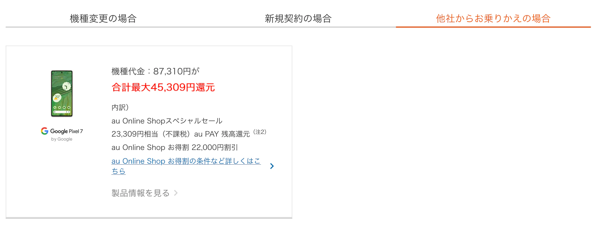

## 開封

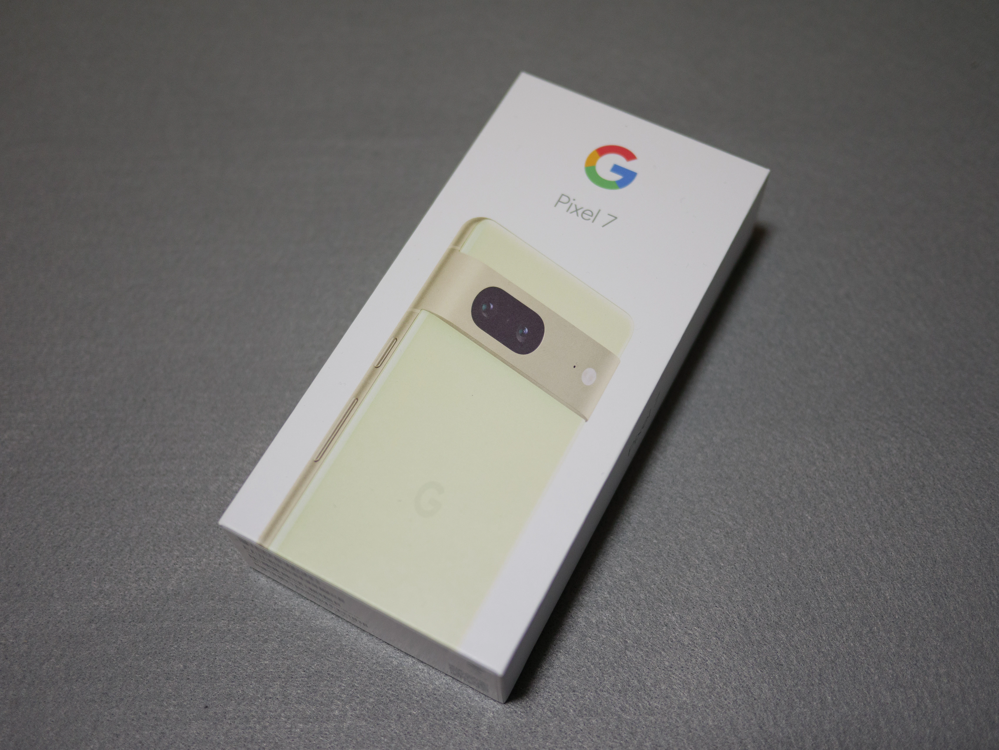

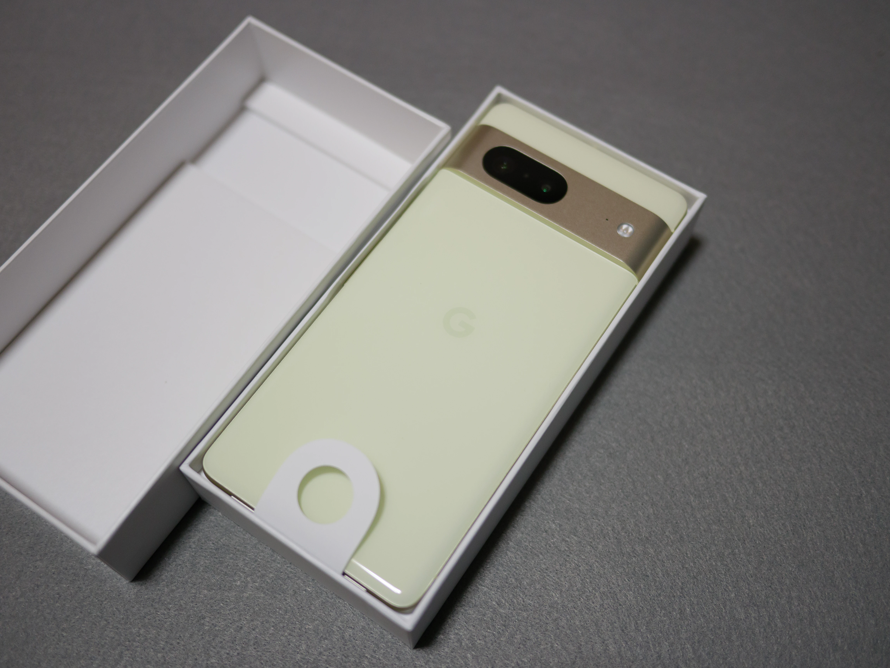

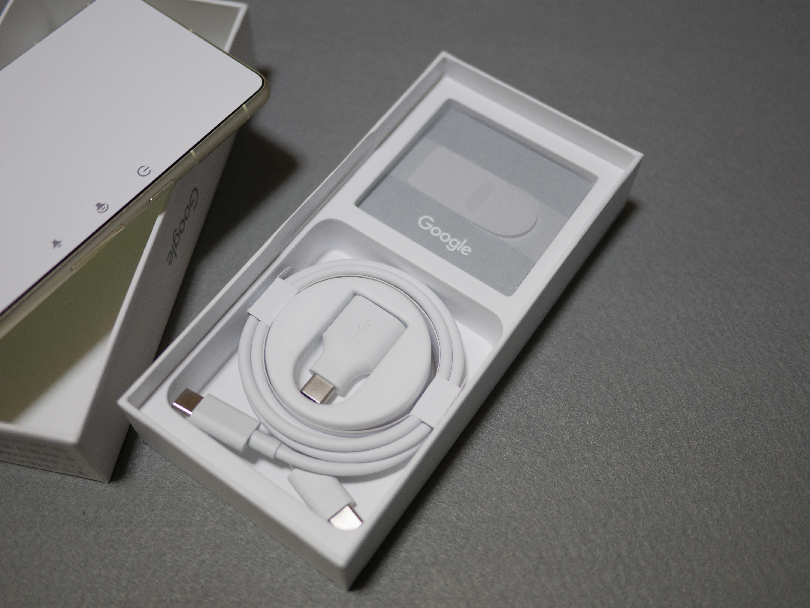

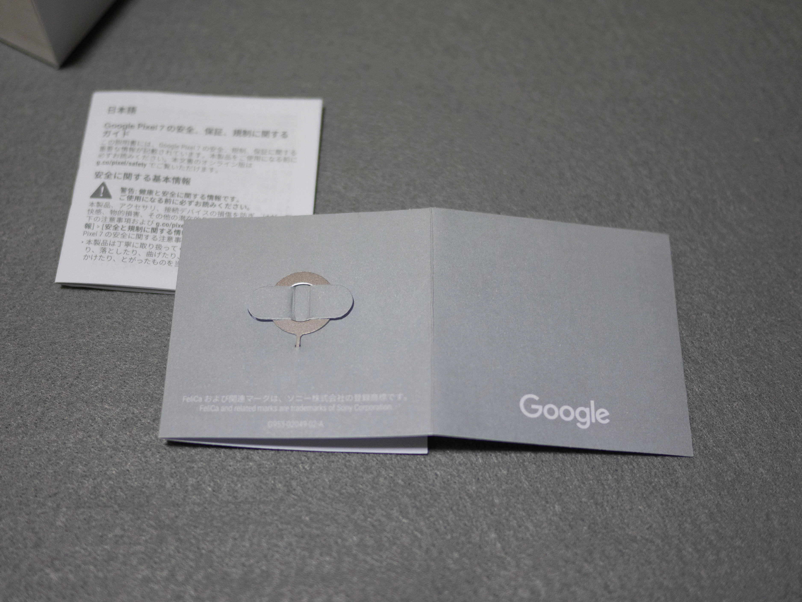

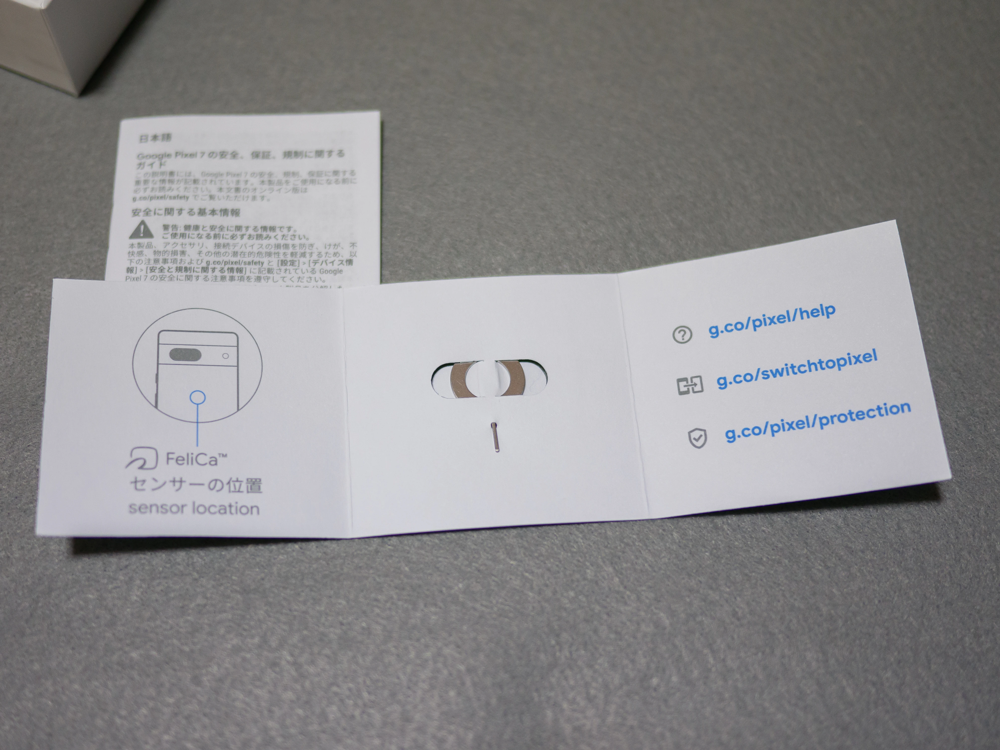

## 外観
今回は、レモングラス（イエロー）を購入しました。

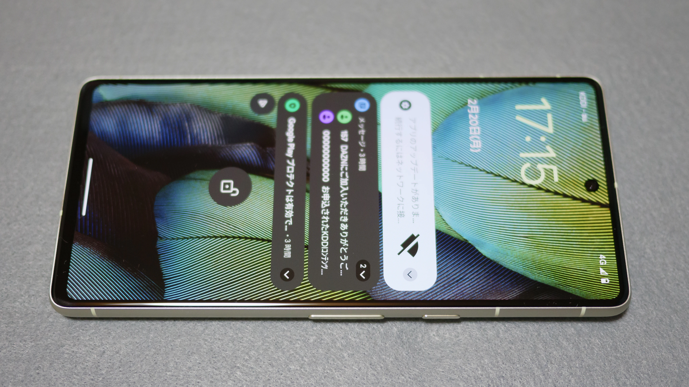

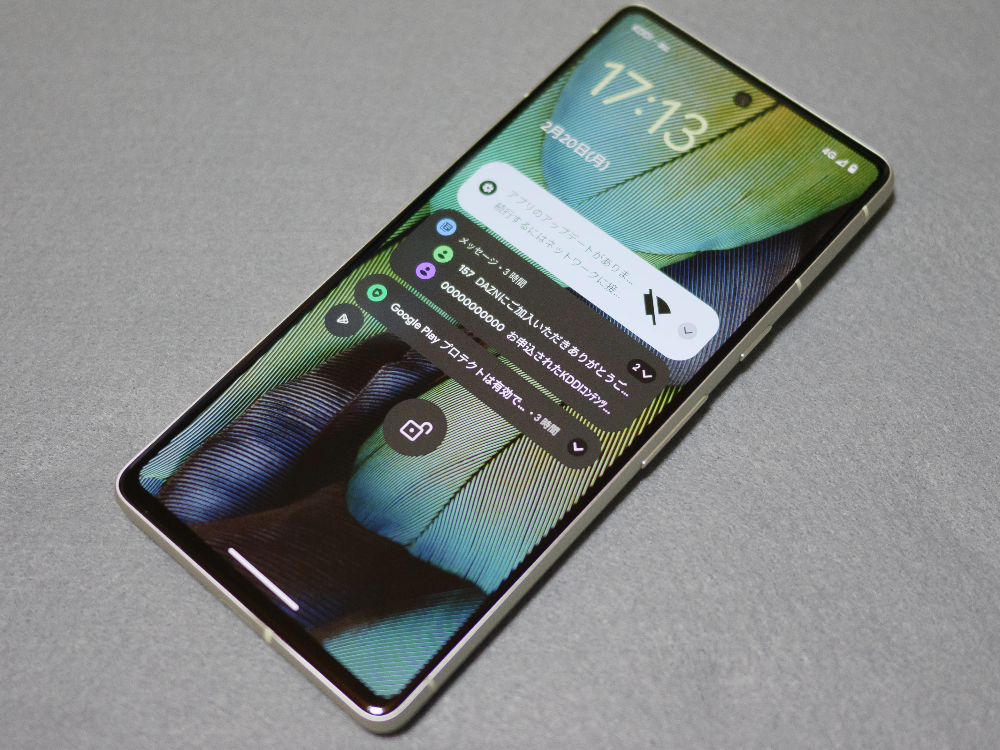

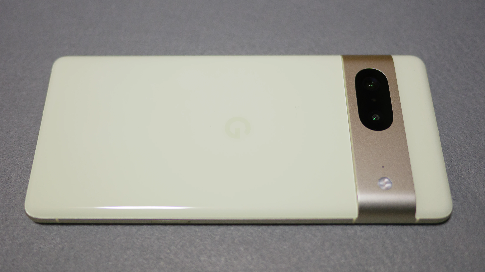

## カメラ？
とりあえずMcCafeのオレオクッキー バニラフラッペ Mがあったので、撮ってみました。

Pixel 7でポートレートモードを選択すると、標準で1.3倍の倍率で開きます。ポートレートというのだから、35mm換算50mm程度でしょうか。なお、ポートレートモードはさらに2倍まで拡大できますが、画質の劣化が激しいため、個人的には1.3倍でいいかなという感じです。

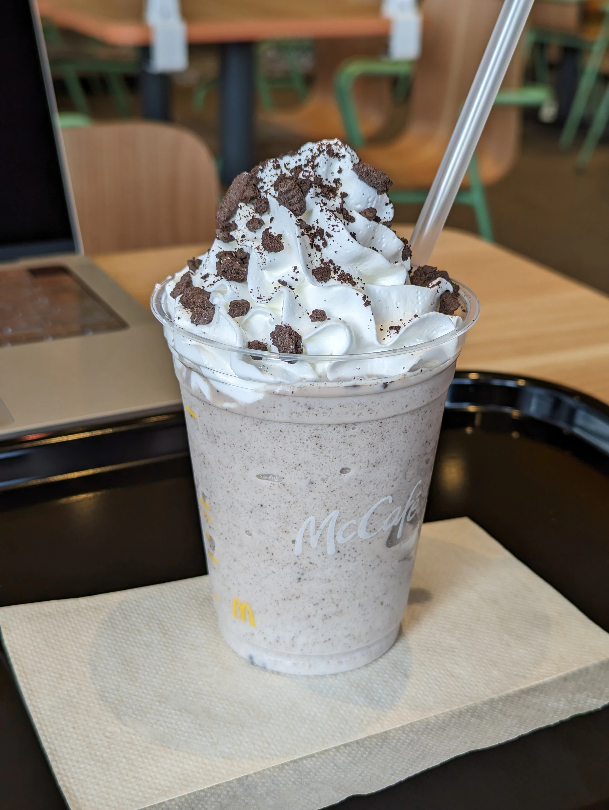

ポートレートモードの1.3xは、標準の2xと同じ画角です（この写真では位置が異なり分かりにくいですが…）。

そして、標準1倍はこんな感じ。

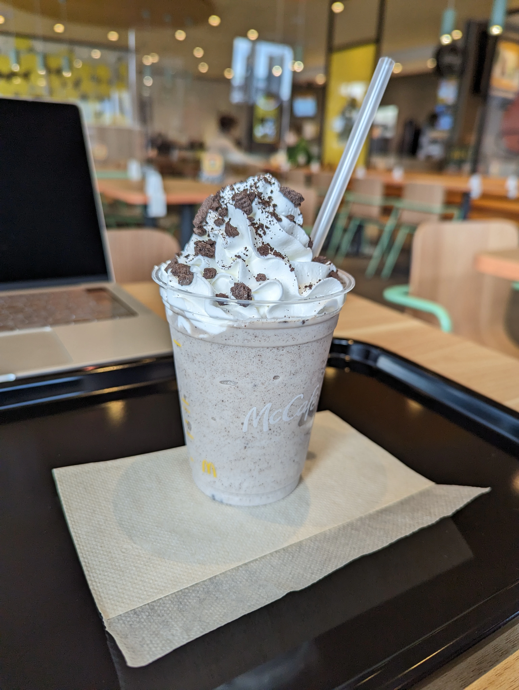

ライバルのiPhone 13 miniでも撮ってみました。  
ポートレートモードで撮ったつもりですが、うまく物体を認識してくれませんでした。そして、iPhoneのポートレートモードは倍率を上げることができないのですね。わかってないなぁとしか言いようがありません。

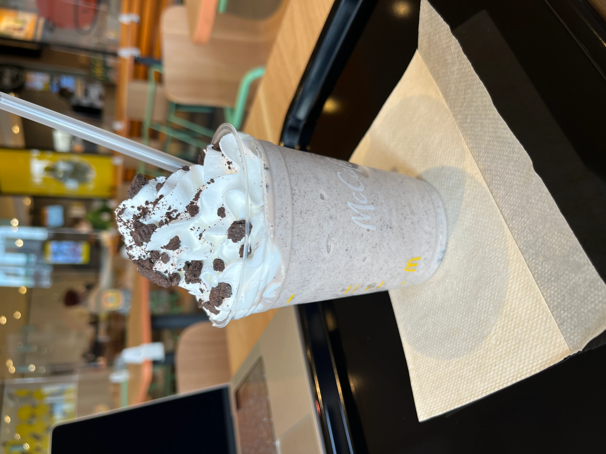

いつものMFTミラーレスでも撮ってみました。JPEG撮って出しです。

")

## いかがでしたか？
時間的制約により、今回はここまでです。ベンチマークや設定などの話もしたいので、もう少しだけ続きます。
