# Pixel 7 超適当ハンズオンレビュー #2 使用感/ベンチマーク/独自機能

Google謹製スマートフォンのフラッグシップPixel 7をざっくり紹介。独自機能、使用感やベンチマークなど。

[**#1 開封と静止画撮影編**](../02-01-pixel-7-1)

正確な情報については公式の仕様表をご覧ください。  
https://store.google.com/jp/product/pixel_7_specs?hl=ja

## 背面外観・筐体
今回選んだ本体色はレモングラス（イエロー）です。

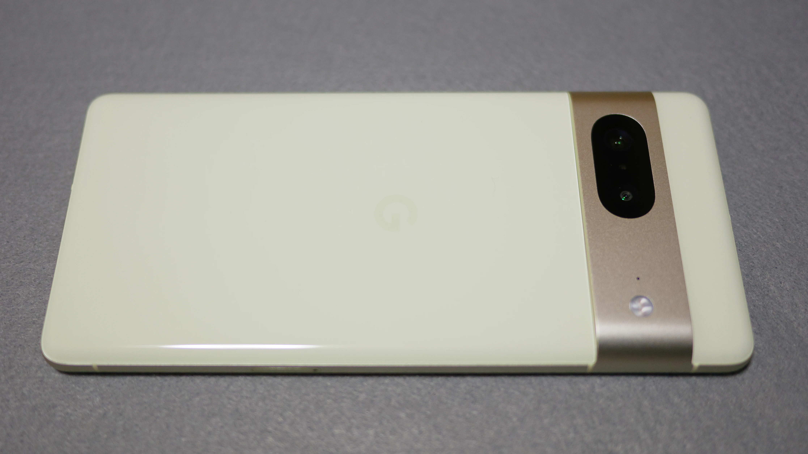

アルミ製で高級感があるのはいいのですが（iPhoneよりいいと思います）、ディスプレイ境界のアルミフレームの縁や、カメラバーの角が指に引っかかって少々不快な感じがします。  
（それにしてもPixel 6,6aの黒いカメラバーは最悪のデザインでした。）

200gに迫る重さが気になります。iPhone 14は172gですからダイエットが必要です。

## 防水・防塵
防水・防塵はIP68です。

## 生体認証
画面内指紋認証です。あまり評判が良くないようですが、個人的にはかなりサクサクに感じます。通りにくくなった場合は指を拭くと通りやすくなります。  
しかし……Leitz Phone 1の画面内指紋認証は忘れ難いですね。でもなんだかんだ言っても側面指紋認証派であることは揺るぎませんよ！

保護フィルム選びには注意が必要だそうですが、家電量販店で購入したラスタバナナのフィルムは大丈夫でした。

顔認証も搭載されましたが、Face IDやWindows Helloのように立体的に認識する方式ではなく、単一のカメラによるものです。明るければそれなりの速度でロックが解除されます。

## ディスプレイ
ディスプレイは、6.3インチのFHD+ OLEDで、前面カメラはパンチホールです。  
90Hz表示に対応しています。個人的な感覚ではありますが、Pixel 7においては、60Hzと90Hzは違いを顕著に感じられました。

日中の視認性はなかなかいい感じです。

ディスプレイ設定に　「画面保護シートモード」というタッチ感度を敏感にする項目がありましたが、何か過去に問題があったのでしょうか……。

## サウンド
イヤホンジャック非搭載です。

### スピーカー
ステレオスピーカーです。よく酷評されるらしいですが、Xperia 10 IVからすればマシだと思います。

上部は通話スピーカーと穴が兼用で、上部と下部では音質が異なります。iPhoneもそんな感じですし、音質はそこそこでいいので安くして欲しいというのが個人的な意見です。  
（スマートデバイスの音質については11インチiPad Proや14インチMacBook Proでも納得していないので、そもそも期待していません。）

### Bluetooth オーディオ コーデック
Bluetoothバージョンはv5.2です。

コーデックは仕様表に記載がありませんでしたが、開発者向け設定でリストに挙がっているのは、SBC, AAC, aptX, aptX HD, LDAC, LC3, Opusとなっています。  

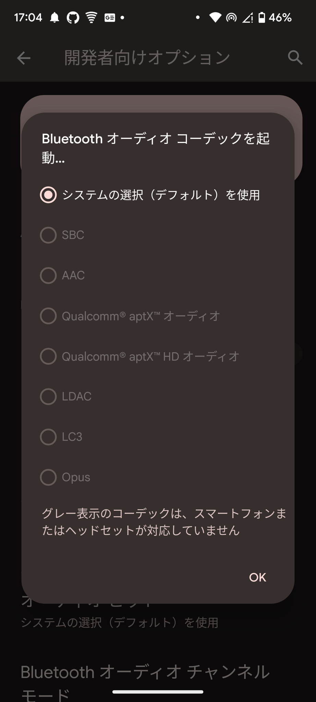

Bluetoothの次世代規格LE Audioについては、開発者設定では有効化できる状態になっています。実際に接続できるかは不明です。

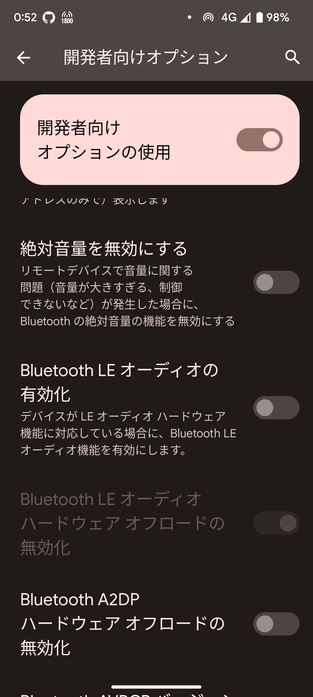

## カメラ
`50MP Octa PD Quad Bayer 広角カメラ`および`12MP 超広角カメラ`を搭載しています。

[#1](../02-01-pixel-7-1)で静止画の成果物をお見せしましたが、もう少し補足します。

広角カメラが50MPと謳っていますが、50MPで撮影することはできません。  
1倍ではクアッドベイヤーモードでのみ撮影でき、12MPの画像を得られます。2倍に拡大すると、クアッドベイヤーが解除され、中央の12MPを切り取った画像を得られます。

Pixel 7のカメラには「超広角」「広角1倍」「広角2倍」という3つのカメラが存在すると捉えるとわかりやすいかと思います。  
（ちなみに、Lightroomアプリで撮影を試みましたが、超広角も2倍モードも選択できませんでした。）

動画は4k60pまで対応で、4k60pでもカメラがシームレスに切り替わります（iPhone 13はできない）。  
30fpsでは、10bit HDRおよび音声拡張機能を利用できます。  
FHDでは「fps: 自動」を選択できます。24fpsで撮影するには、カメラアプリのモードを「シネマティック」に変更します。ただし、シネマティック撮影はFHDのみ対応です。

広角カメラはセンサーシフト式手ぶれ補正を採用しており、カメラを起動しない状態で端末を横方向に振るとかすかにセンサーがカタカタ動く音を聞くことができます（iPhone 13 miniはそんな音はしません）。

動画の手ぶれ補正モードは、いくつかの中から選択できます。フラッグシップですので、標準でもiPhone並みに効きます。

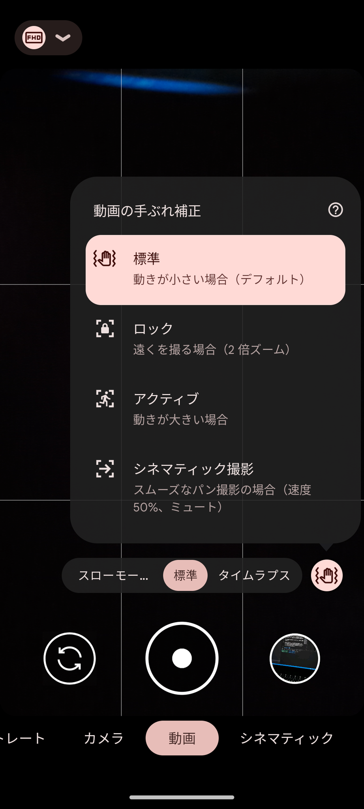

カメラの各機能の性能についてはiPhone並みかそれ以上の性能を持っていますが、発熱が酷く、iPhoneのように長時間の録画はできません。

## バッテリー・充電
バッテリーは4355mAhです。5000mAh搭載機種などに比べるとスタミナは劣ります。  

20W(Proは23W)までのPD充電に対応しています。  
[アダプティブ充電](https://support.google.com/pixelphone/answer/7106961?hl=ja)として急速充電をやめて電池寿命を長持ちさせる機能があります。

Qi規格の急速ワイヤレス充電(20W/Proは23W)にも対応しています。

Pixel 5から搭載している[**バッテリーシェア（Qi逆充電）**](https://support.google.com/pixelphone/answer/10107702?hl=ja)機能を今回も搭載しています（急速充電対応かは不明）。Pixel Watchが充電できないことで話題になっていましたね。

## おサイフケータイ・FeliCa
おサイフケータイ・FeliCaに対応していますが、FeliCaマークはありません。

## モバイル通信 (LTE/NR)
Rakuten Hand 5Gや近年のiPhoneでは可能なデュアルeSIMは、現状対応していませんが、近いうちに対応すると噂されています。

### 対応バンド
LTE/NRの対応バンドは仕様表をご確認ください。

LTEは、Softbankおよびauにはほぼ対応しています（Band 11は非対応）。また、5Gは、無印はSub 6、Proはミリ波に対応。Softbank 5G SAは、キャリア側は現状非対応となっています。

n79に対応していないためdocomoが苦手とは言われていますが、プラチナバンドであるBand 19には対応しているため、実際にはdocomoでも問題なく使用できるでしょう。

## ベンチマーク・性能
Pixel 7は、SoCとして独自開発のGoogle Tensor G2を搭載し、8GBのRAMを搭載しています。  
AnTuTuベンチマークの結果は80万点でした（AnTuTu v9ベンチマークは30万点が及第点とされています）。

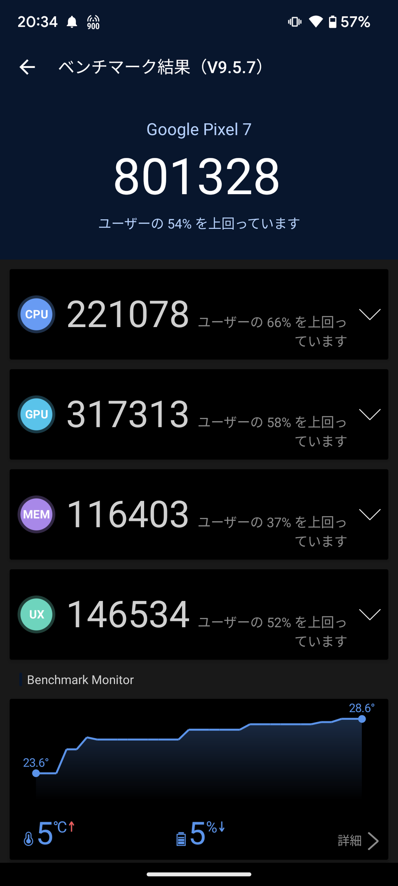

## Wi-Fi
Wi-Fi 6対応です。

## Wi-Fiアクセスポイント（Wi-Fiテザリング）
- **WPA3-Personal**に**対応**
- **中継**に**対応**
- テザリングで利用できるのは2.4GHz帯のみ

最大接続数制限は不明ですが、6台同時接続は動作確認できました。  
iPhoneは5台が上限ですので、Pixel 7の方が優れています。

## OS
OSはAndroid 13です。  
見た目はまさに「素のAndroid」ですが、カメラは独自のアプリですし、そこそこの独自機能が搭載されています。

##　独自機能
Pixelの独自機能をすべて把握していませんが、個人的に気になったものをまとめます。

### この曲なに？
「この曲なに？」という、Shazamのような機能が標準搭載されています。  
Pixel 4から利用できる機能ですが、Pixelの独自機能の中でも特にユニークに感じました。

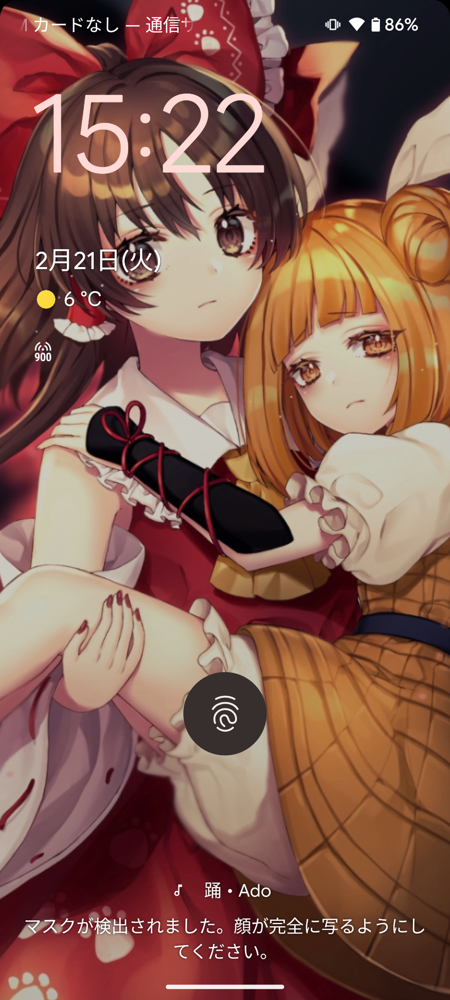

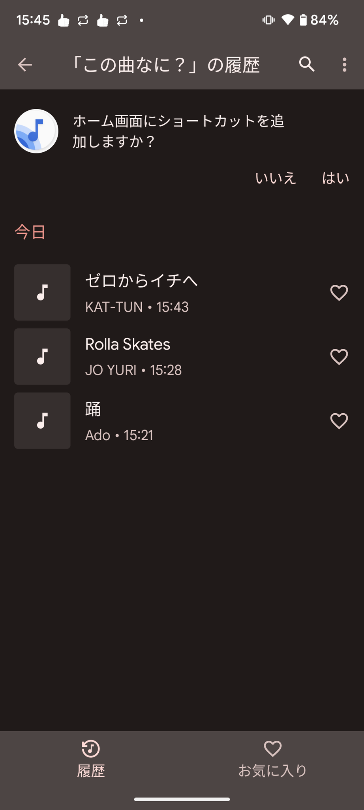

### ゲームダッシュボード
Pixelにもゲームダッシュボードがあります。  
フローティングボタンを有効化することで、ゲームダッシュボードをゲーム中に簡単に呼び出せます。

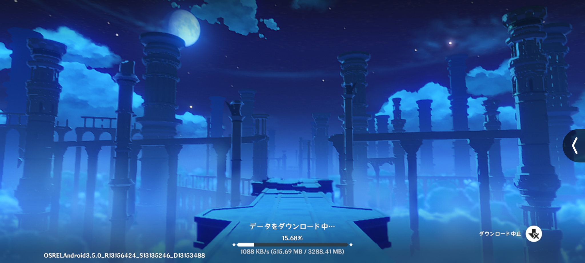

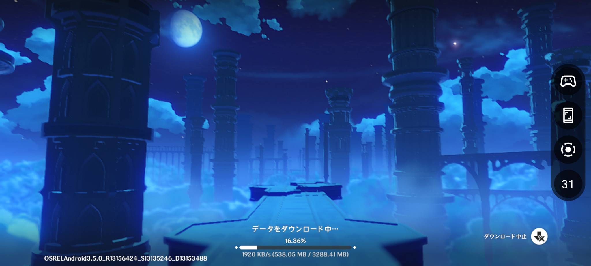

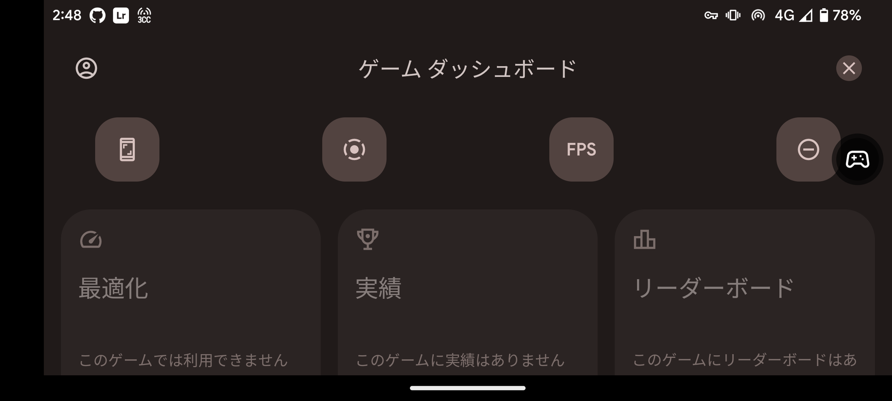

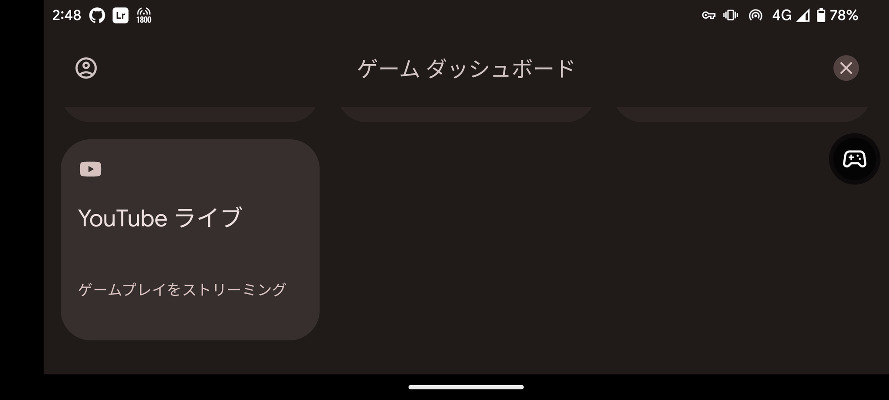

[YouTube配信は要件を満たしている必要があります。](https://support.google.com/youtube/answer/9228390?hl=ja&co=GENIE.Platform%3DAndroid)

## 雑感
フラッグシップモデルとしてとても良いと思います……特にデザインがPixel 6と比べてかなり垢抜けてとても良くなっています。2代目の独自チップとなり、安定性なども向上したと聞きます。確かに、発熱に起因するもの以外の不具合に遭遇したことはありません。

カメラやAI機能はiPhoneと肩を並べます。できることとできないことがそれぞれ違いますが、切磋琢磨してより便利になってほしいですね。

しかし、AppleがAIをいくら頑張ったとしても、iPhoneは私のメイン機種になり得ません。なぜなら、AndroidはMicrosoft Launcherなどの任意のランチャーアプリを利用できるためです。アプリアイコンを任意の位置に配置できないのはあり得ません。

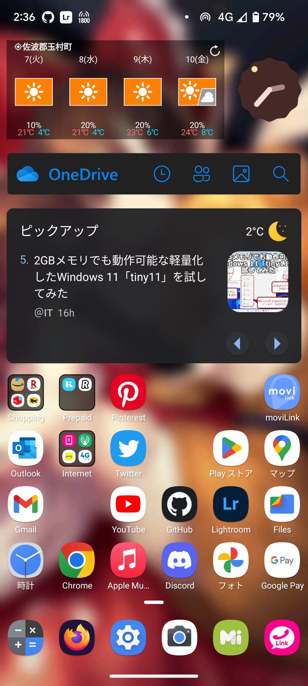

さらなる理由として、iOSはIMEもAndroid Gboardと比較して劣っていると感じます。

iPhoneと対比しましたが、私のメインスマホであるXperia 10 IVがPixel 7に置き換わるわけでもありません。  
大きな理由はサイズと重量です。私は、スマートフォンにとって、軽さこそ絶対的な正義だと考えています。サイズは、現状の市況の中では小さいとすら言えるサイズではあるものの、より横幅の狭いXperia 10 IVのスリムさは魅力です。

個人的な「スマートフォン」の主な用途はMisskey、財布、そして通話とテザリング（楽天モバイル）ですので、多少非力でも問題ありません。  
（※現状の運用としては、Xperia 10 IVはテザリングが微妙なので、Pixel 7をテザリング・通話用として持ち歩いています）

ゲームと動画視聴、簡単なクリエイティブな作業はタブレットで行うべきだと思っています。  
そういえばPixel Tabletなるものが出るらしいですね。Tensor G2はApple M1より非力ですが、iPad 第10世代のA14 Bionicよりは高性能とのことです。GoogleはChromebookをAndroidタブレットの後釜にしたかったのかもしれませんが、ゲームやクリエイティブ作業に向いているチップを搭載した機種はほとんどありません。Pixel TabletがiPadと同じように使えるAndroidタブレットとなることに……ちょっとだけ期待しておくことにします。
