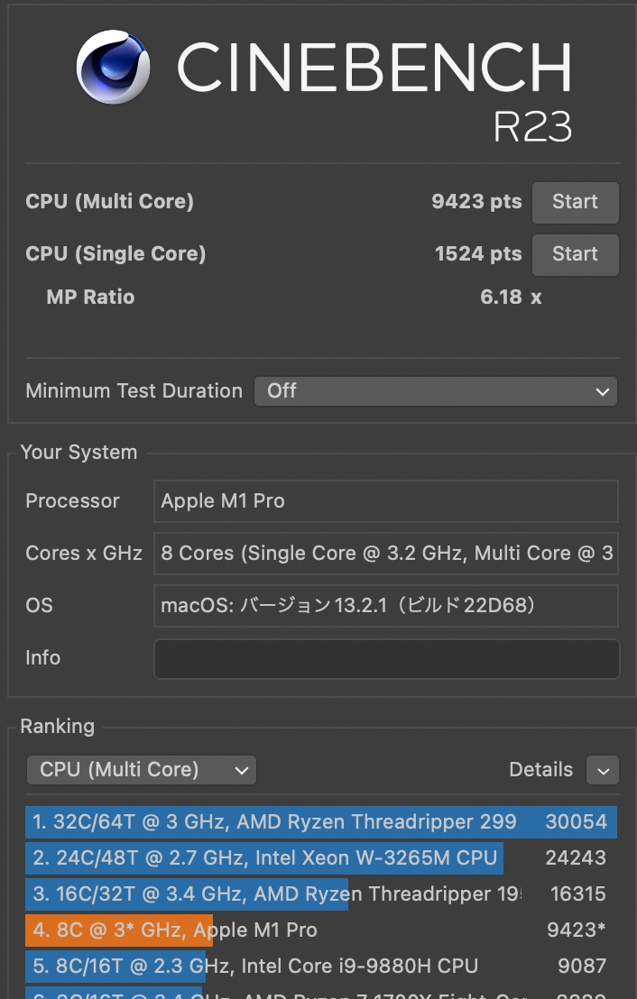
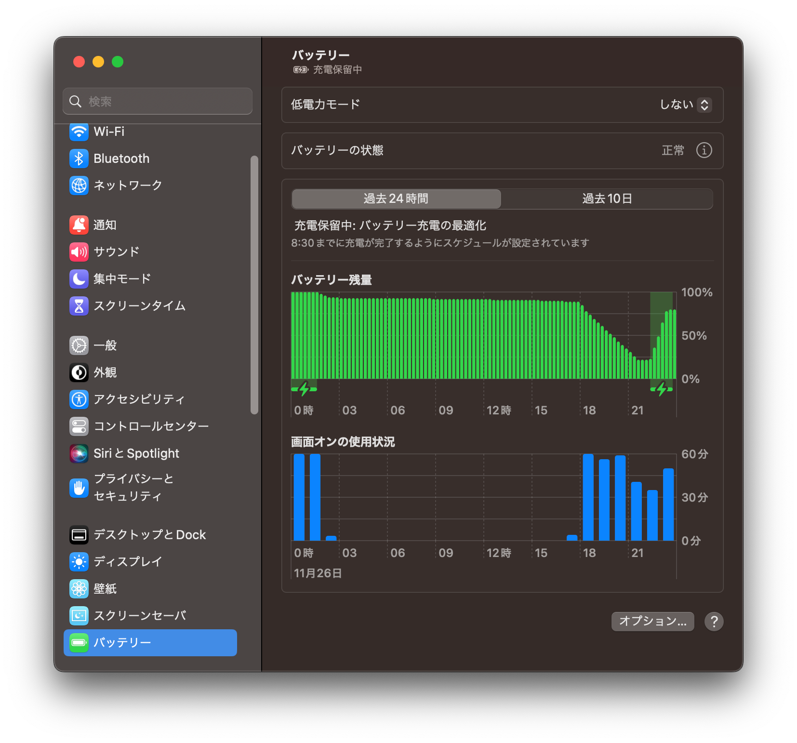
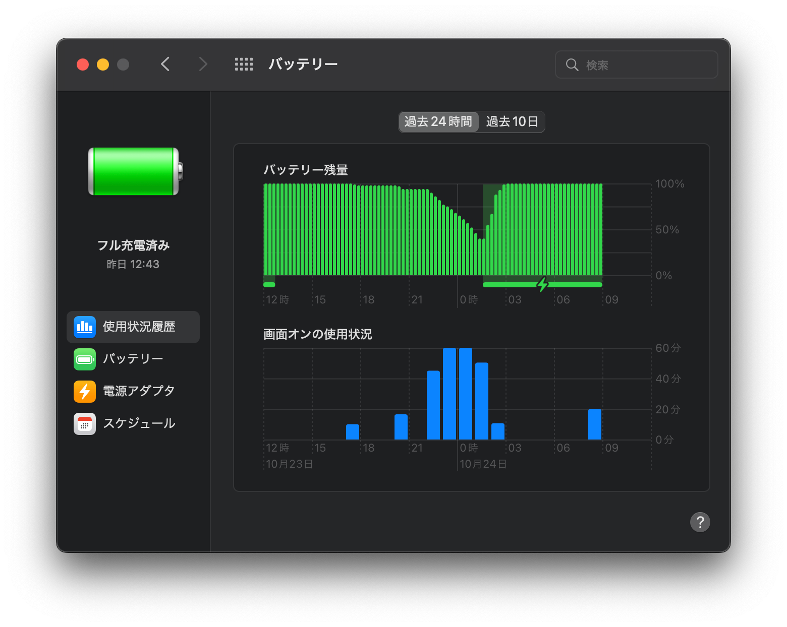
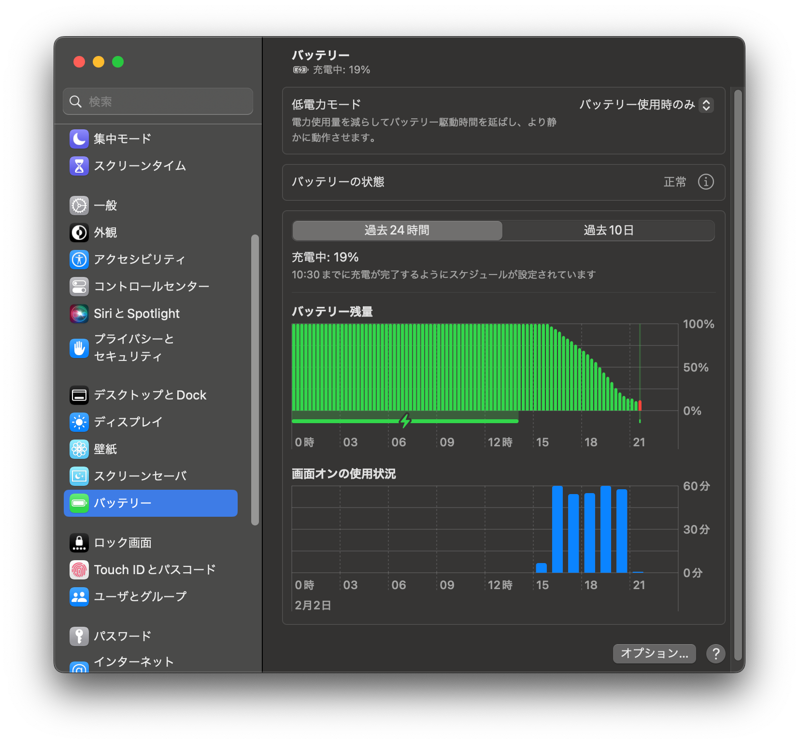

# 14インチMacBook Pro (M1 Pro) #2 ベンチマーク/使用感

開封編のすぐあとにベンチマーク記事を出そうと思っていましたが、5ヶ月も間が空いてしまいました。  
ベンチマークをまとめて、使用感についても述べていければと思います。

前→ [#1 開封編](../../2022/10-28-14m1prombp-1)

## 今回使用するモデルについて
2021年版M1 Pro搭載14インチ MacBook Proのうち、一番下のスペックを使用します。

- 8コアCPU (2E6H8T)
- 14コアGPU
- RAM 16GB
- SSD 512GB
- macOS Ventura 13.2.1

## CPU性能
Cinebench R23でベンチマークを測定しました。

マルチコアは9500pts前後、シングルコアは1524ptsとなりました。

[M1 MacBook Air](../../2022/05-21-m1mba-2)はマルチ6749・シングル1494となっていました。  
CPU性能だけで言えば、M1 Proのコスパは悪いと思います。

## GPU: DaVinci Resolve スタビライズ

GPU性能の検証があまりなかったため、GPU性能が試されると想定した2つのクリエイティブ処理と2つのゲーム性能比較を行いました。

まずはDaVinci Resolveのスタビライズ解析処理にかかる時間を計測します。12秒の4K動画と1分半の4K動画のスタビライズ解析を比較します。\
使用したバージョンはDaVinci Resolve 17.4.6及びDaVinci Resolve 18.1.3 BUILD 8です。

### [12秒の動画](https://1drv.ms/v/s!AslpdQzTI0zLjcIyE11hEfZA0vmLuw)

M1 Pro 14-Core GPU (17): 7.5秒  
M1 Pro 14-Core GPU (18): 2.6秒

(参考: Davinci Resolve 17での結果)  
GTX 1660: 9.5秒\
M1 7-Core GPU: 18.4秒

### [1分30秒の動画](https://1drv.ms/v/s!AslpdQzTI0zLjcIzR5ZvvaRHy8GMBw)

M1 Pro 14-Core GPU (17): 57.3秒  
M1 Pro 14-Core GPU (18): 13.9秒

(参考: Davinci Resolve 17での結果)  
GTX 1660: 79.5秒\
M1 7-Core GPU: 135秒

### 考察と感想
バージョン17同士での比較でも、GTX 1660よりM1 Proの方が高速という結果になりました。クリエイティブ用途ではMacの方が良いかもしれませんね。  
GTX 1660はもう売ってしまったのでバージョン18の結果は出せませんが、動画は公開していますのでご自身の環境で動かしていただければと思います。

## GPU: Minecraftシェーダー使用時FPS比較

Minecraftでシェーダー[「projectLUMA」](https://www.curseforge.com/minecraft/customization/projectluma)を適用し、[前回と同一のシーン](../../2022/05-21-m1mba-2)でのFPSを比較してみます。プロファイルを最高設定であるCinematicに設定し、FHD表示で検証します。

[M1 Pro 14コアGPU](https://www.youtube.com/watch?v=nolBfZPCLkg)  
[M1 Air & GTX 1660](https://www.youtube.com/watch?v=Yo5uIe-v44s)

ラフな比較にはなってしまいますが、この場面ではM1 Pro 14コア GPU（前半で49fps前後）はGTX 1660（前半で54fps前後）より若干劣る程度であると言えそうです。

このように、M1 ProはM1に比べ、GPU性能が大幅に強化されています。

## GPU/RAM: Cities:Skylines

Cities:SkylinesでどのくらいのFPSが出るのか検証してみます。

[YouTube動画で実際の動作をご確認ください…](https://www.youtube.com/watch?v=kxIme7D2kZE)

[前回と同一のシーン](../../2022/05-21-m1mba-2)は用意できませんでしたが、前回の結果を踏まえ30fps以上を期待していていたところ、実際は18fpsしか出ませんでした。

アクティビティモニタを確認したところ、画質設定を高くしてもGPUを使い切っていません。メモリプレッシャーが黄色になっているため、メモリがボトルネックになっている可能性が考えられます。

## ファン音
Macs Fan Controlでファンを最大回転（左右6000回転前後）にして収録してみました。

[14インチMacBook Pro ファン音](https://www.youtube.com/watch?v=pqU8Tm2xwtQ)

若干大きく収録されているので、これの2/3ぐらいだと思っていただければと思います。

なお、ファンが最大でブン回ることはまずありません。  
3000回転まではほぼノイズがないため、3000回転未満で制御されている感じを受けます。

## ポート類

- Thunderbolt4 x 3
- HDMI OUT (Type-A HDMI2.0) x 1
- SDXCカードスロット (UHS-2対応) x 1
- 給電ポート (MagSafe 3) x 1
- 3.5mmヘッドフォンジャック

SDXCカードスロットがあるおかげで、SDカードリーダーやドックは持ち歩かずに済んでいます。

周辺機器をどんどんUSB-Cにしてしまうと、USB-C端子が足りなく感じてきます。

## キーボード
キーボードは…配列がMacなのであまりコメントはないのですが、打ち心地のパチパチした感じが好きではありません。うるさいですし、もう少し抵抗感が欲しいのです。  
キーボードカバーをつけるとそこそこいい感じになりました。

## トラックパッド
トラックパッドはMacの顔だと感じています。私はまだ使いこなしが足りていない感じがします。

## ノッチ
M1 Pro MacBook Proからノッチがディスプレイに食い込んで画面を広く使える……ということでしたが、単純にメニューバーが狭くなっただけという感じもしてしまいます。

メニューバーが狭くなったことへの対策としては、Dockに表示できるものはメニューバーから消し、常駐アプリなどは[Hidden Bar](https://github.com/dwarvesf/hidden)で隠すことで解消しました。

## スピーカー
スピーカー性能が良いと謳われていますし、実際良いという方も多くいらっしゃるようですが、個人的にはあまり満足していません。

他の機種に比べたら良い部類なのでしょうけど……。イヤホンで聴くのが好きなだけかも。

## ディスプレイ
フレームレート: 最大120Hz対応（ProMotion）  
色表示: Display P3 10bit  
ダイナミックレンジ: 最大1600nits

M1 Proでは、外部出力は、HDMIとUSB-C併せて2画面までの出力に対応しています。  
自宅では、Dell製のFHDモニタ(75Hz, 本体HDMI OUT)とSXGAモニタ(75Hz, ドックHDMIポート経由)に接続し、本体ディスプレイと併せて3画面にしています。  
M1無印やM2無印だと外部出力は1画面だけですので、こういうわけにはいきませんね。

## バッテリーと充電
それぞれ別の日に撮った、3枚のバッテリーグラフのスクリーンショットをご覧ください。

バッテリー駆動は5時間が目安という感じです。

67W MagSafe充電は超高速です。バッテリーグラフを見ると15分で12%程度の割合で充電されます。ですから、単純計算では2時間程度でおおよその充電が完了することになります。  
大きさが気になる感じがしますが、他のPCの充電器に比べれば全く問題ないサイズでしょう。

30W給電でも使ってみましたが、バッテリー残量が減ることはありませんでした。このスペックが30Wで動くのは、相当ワッパが良いと言えます。

## アクセサリなど
Transcendの2.5インチSSDをUGREENのSATA-USB-Cコネクタで接続し、TimeMachine用にしています。何回かデータを救出できました（基本はOneDrive頼りなのですが、OneDriveに置かないデータをさくっと取り出すのに便利）。

ポリカーボネート製の透明なケースをつけていましたが、温度差でディスプレイが反ってしまったことがあったため、使用をやめました。しばらくしたら元通りになったのでよかったです（Apple Care+には思い切って1年分加入していたので、ちょっとだけビビりました）。

ドックは昔Surface Pro用に購入した[Anker製7-in-1イーサネットハブ](https://www.ankerjapan.com/products/a8352)を使用しています。

## 感想
OSやキーボード配列などの癖は置いておいて、完成度が高いです。まあ当然ですね。

さて、GPUが強くて120Hz対応なのであれば、 **実はゲームに向いているんじゃ？** と思いました（シティスカは特殊なので置いておきます）。  
しかし、ゲームはほとんど遊べないのです−−ソフト不足で！

原神はmacOSに非対応です（WindowsやiPadはあるのに……）。Apex LegendsもiPadがありましたが、すぐなくなってしまいました。  
[Mac向けBIOHAZARD VILLAGE](https://apps.apple.com/jp/app/biohazard-village/id1640626745)が発表されて話題になりましたが、Mac App Storeから購入する必要があります。  
Portalを遊ぼうと思いましたが、32bitなのでRosseta 2にも対応していない。Steam自体もRosseta 2経由ですし、AppleとValveは仲が悪いのでしょうか。  
それと、うーん、あまりゲームの知識はないのですが、例えば…Kerbal Space Programは、1はMacに対応していますが、2はWindowsのみですね。

SimutransはmacOSでもLinuxでも動きますが、そもそもGPUスペックが要りませんでした（最近ご無沙汰ですが）。

（GPD Win Max2に買い換えたいなとちょっとだけ思っていたりします…）
