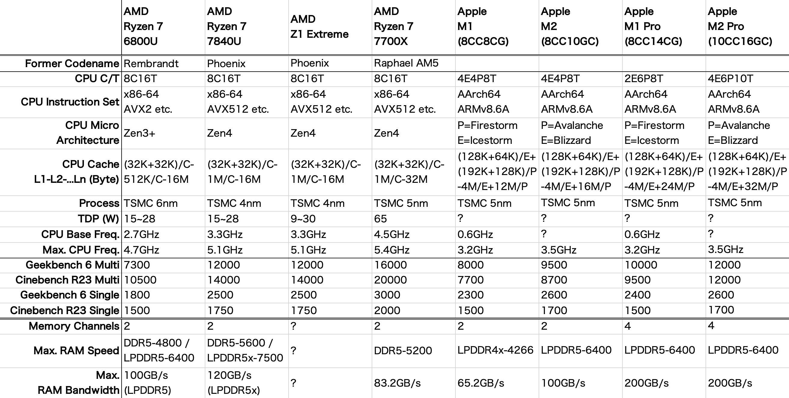

# AOKZOE A1Pro #0 座学と購入編
自称世界初のRyzen 7 7840U搭載ゲーミングハンドヘルド機であるAOKZOE A1ProをIndiegogoで出資しました。この記事では、実機を手に取る前に、Ryzen 7040シリーズの特徴、他の機種との比較、そしてFedExの追跡をします。

## Windowsゲーミングハンドヘルドについて
Windowsを搭載するUMPC（Ultra Mobile PC, 画面サイズが10インチ未満程度のモバイルPC）でゲーム入力が付いたものとして、世（多分秋葉原とかだけな気がしますが）にその存在が知れ渡ったのはGPD社の2015年10月に発表された**GPD WIN**かと思われます。  
当時UMPCに搭載できるCPUは、Pentiamまでが限界でした。2019年のGPD WIN2では[GTA5がHDで38fpsで動いていました](https://gpd-direct.jp/pages/gpd-win2)。

ゲーム向けのUMPCは絶え間ない進化を続けていましたが、2022年、AMDはZen3+ CPUとRDNA2 GPUを組み合わせた**Ryzen 6000シリーズ**をリリースしました。  
多くのWindowsゲーミングハンドヘルドに採用された**Ryzen 7 6800U**は、2019年の技術からは考え難い、素晴らしい性能と省電力性を持ったAPUでした（AMDはCPUとGPUを組み合わせたプロセッサをAPUと呼称します）。

Windowsも[（10が最後のWindowsだと言われていたにもかかわらず）](https://www.itmedia.co.jp/pcuser/articles/2107/14/news074.html)11になり、[タッチキーボードが進化](https://ascii.jp/elem/000/004/073/4073497/)されてキーボードがない場合に困ることが少なくなりました。

## AOKZOEと前世代A1について
**AOKZOE**は、[2022年7月13日にKickstartarで**AOKZOE A1**のクラウドファンディングを開始](https://www.kickstarter.com/projects/aokzoeofficial/aokzoe-worlds-first-amd-6800u-powered-game-console)し、わずか2分で目標額を達成しました。  
AOKZOE A1はRyzen 7 6800Uを搭載しています。GTA5がHDで90-120fpsで動作し、最新のAAAゲームを1080Pで40～60FPSで遊べると謳っています（本体のディスプレイは60Hzまで、FHDにも対応）。

AOKZOEは上海を拠点とする企業です。内蔵ソフトにOneXConsoleを使うなどOne-Netbookと深い関わりを持っており、製造は深圳のOne-Netbook関連の工場で行っている模様です。

クラウドファンディングから製品発売に至るまで、AOKZOEは色々やらかしたらしいのですが、私はその時のことはよく知りません。  
とにかく、常日頃AOKZOE A1を使うユーザーの中でも誰一人としてAOKZOE社に良いイメージを持つ人はいないでしょう。

でも日本の皆さんは安心してください。日本での正規販売を行う代理店は、UMPCなどのニッチなガジェットを手広く扱う[**HIGH-BEAM（ハイビーム）**](https://h-beam.co.jp/)社となっています。ここの評判はさほど悪くなく、情報は正確です。

企業のイメージが最悪でも、製品の性能は侮れないため、AOKZOEのユーザーは少なくありません。

AOKZOE A1は、他社に比べると、画面は8インチと比較的大型で、16:10 FHD+のIPS液晶です。筐体を大きくしたため、電池容量も65Whと比較的大きいものとなっています。  
ドリフト問題が少ないホール効果式ジョイスティック、振動モーターとジャイロなど、近年のゲーミングハンドヘルドで必要なものは全て揃っています。

## AOKZOE A1Proの進化点
AOKZOE A1Proは、AOKZOE A1の筐体は変えず、APUが**Ryzen 7 7840U**に進化しました。

他にも細かな変更があるようですが、基本的なシルエットは同一です。

### A1 → A1Proの進化点

- APUが新世代に 6800U → 7840U
- メモリ速度が向上 LPDDR5-6400 → LPDDR5X-7500
- SSD速度が向上 PCIe3.0 → PCIe4.0  
  （規格だけではなく実際の速度も向上）
- 画面の明るさが向上？（公称値の変化なし）
- Dpad,ABXY,スティックの押し心地が向上したらしい？  
  （マーケティング上で特に説明なし）

## Ryzen 7040シリーズAPUについて
まず大きな変更点であるRyzen 7 7840Uについて紐解いていきたいところですが、Ryzen 7000シリーズ、Zen4やモバイルのAPU型番・アーキテクチャについて理解する必要があります。複雑でありここにあえて書く必要もないため、[PC Watchの解説記事](https://pc.watch.impress.co.jp/docs/news/event/1467965.html)などをお読みください。  
[AMD、Zen 4になったモバイルRyzen 7000。RDNA 3 GPUとNPUも内蔵](https://pc.watch.impress.co.jp/docs/news/event/1467965.html)

7840Uは、最強APUだった6800Uから、CPUとGPUともに1世代進化し、さらにXDNAアーキテクチャのNPUが付きました。

## AOKZOE A1の欠点
AOKZOE A1でよく言われている欠点は、**底面のUSB-Cポートが陥没しており付属ケーブル以外の接続が難しい**点です。  
Dpadが最悪であるとも言われていますが、A1Proでは改良された模様。

### AOKZOE、またやらかす 今度はUSBで
そして、AOKZOE A1及びA1Proの底面のUSB-Cポートについて、最初はUSB4と謳われていましたが、ここ最近になって**USB3.2である**と言うようになりました。

AOKZOEは*クラウドファンディングの説明ページに誤りがあった*などと言っていますが、私の想像では、おそらくハードウェア設計上USB4の性能を発揮できないことが発覚して慌てて修正したのではないかと思っています。

https://twitter.com/aqz_tmin/status/1668907245353181184

（底面USB-Cは純正ドックのONEXDOCKING用という感じなんでしょうね。ONEXDOCKINGはかなり故障が多いようですが……）
