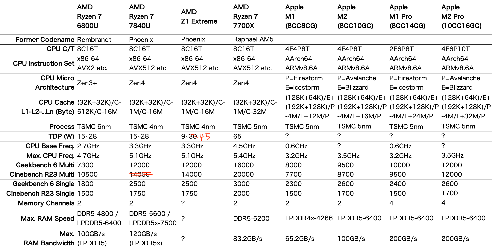
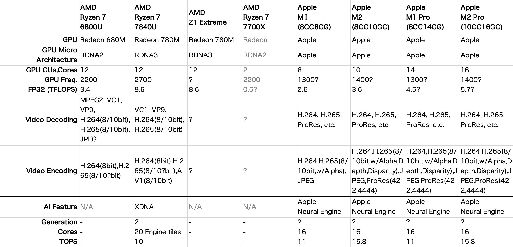
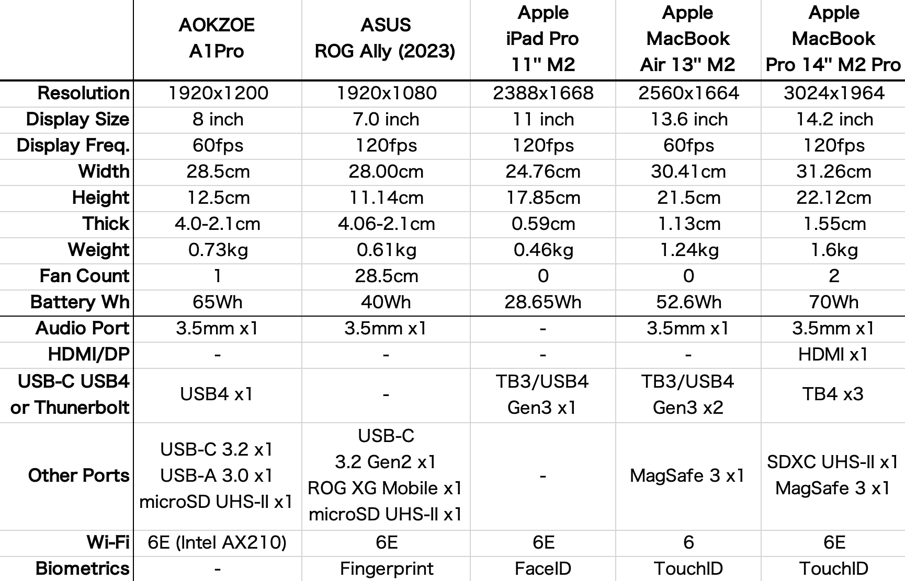
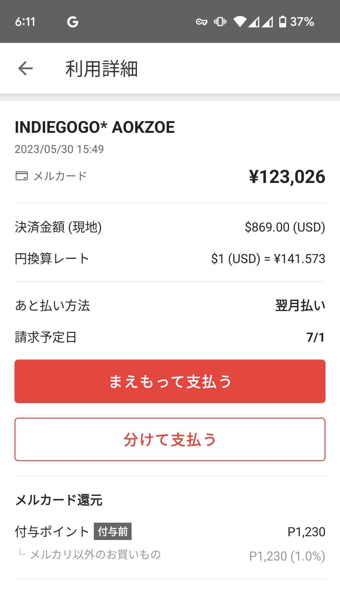
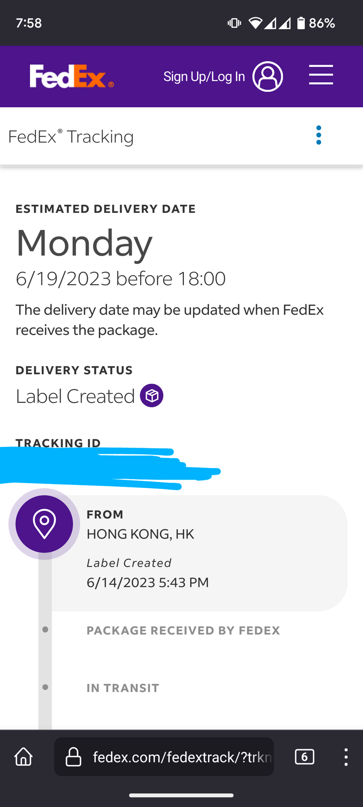
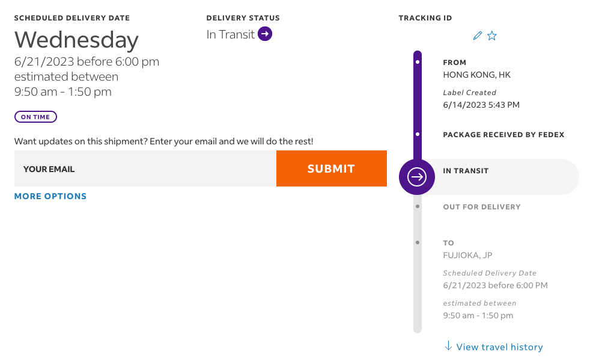
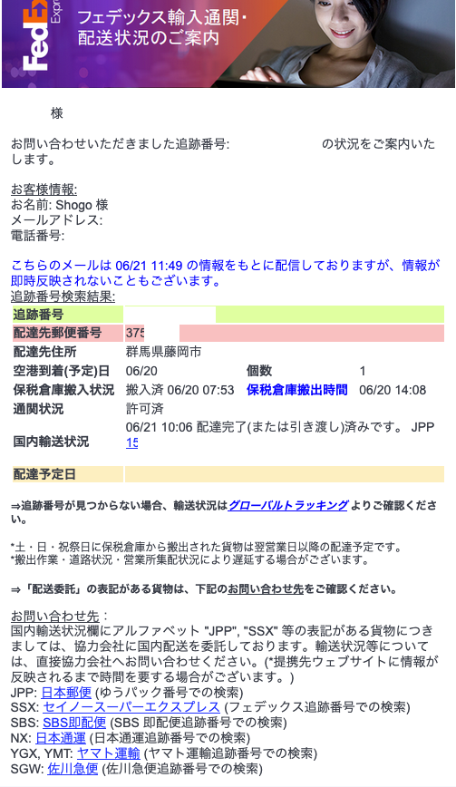
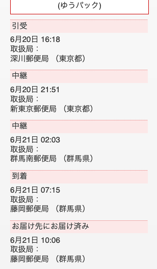

# AOKZOE A1Proレビュー #0 座学と購入編
自称世界初のRyzen 7 7840U搭載ゲーミングハンドヘルド機「AOKZOE A1Pro」をIndiegogoで出資しました。この記事では、実機を手に取る前に、ゲーミングハンドヘルドAOKZOEについての解説、Ryzen 7040シリーズの特徴紹介、他の機種との比較、そしてFedExの追跡をします。

## 座学

### WindowsゲーミングハンドヘルドPCについて
Windowsを搭載するUMPC(*1)でゲーム入力が付いたものとして、世(*2)にその存在が知れ渡ったのはGPD社が2015年10月に発表した**GPD WIN**でしょう。  
当時UMPCに搭載できるCPUは貧弱でした。2019年のGPD WIN2では[Core m3が搭載され、GTA5がHDで38fpsで動いていました](https://gpd-direct.jp/pages/gpd-win2)。

*1: Ultra Mobile PC, 画面サイズが10インチ未満程度のモバイルPC  
*2: 多分秋葉原とかだけな気がしますが

ゲーム向けのUMPCは絶え間ない進化を続けていましたが、2022年、AMDはZen3+ CPUとRDNA2 GPUを組み合わせた**Ryzen 6000 APU**をリリースしました。  
多くのWindowsゲーミングハンドヘルドに採用された**Ryzen 7 6800U**は、201X年の技術からは考え難い、素晴らしい性能と省電力性を持ったAPUでした（AMDはCPUとGPUを組み合わせたプロセッサをAPUと呼称します）。  

Windowsも[（10が最後のWindowsだと言われていたにもかかわらず）](https://www.itmedia.co.jp/pcuser/articles/2107/14/news074.html)11になり、[タッチキーボードが進化](https://ascii.jp/elem/000/004/073/4073497/)しよりタッチ画面への親和性が高くなりました。

さらに**FSR**といった高解像度・フレーム補完技術といった性能をかさ増しする技術の開発が進んできました。

こうした流れで、今年に入って大企業ASUSが**ROG Ally**を発表・発売するなど、Windowsゲーミングハンドヘルドはますます市民権を得つつあります。  
本物のWindowsではありませんが、ゲーミングハンドヘルドを語る上では2021年に米国で発表・発売された**Steam Deck**にも言及する必要があります（アジア地区での発売は2022年）。スペックが低いぶん10万円を切る低価格を実現しています。

### AOKZOEと前世代A1について
**AOKZOE**は、[2022年7月13日にKickstartarで**AOKZOE A1**のクラウドファンディングを開始](https://www.kickstarter.com/projects/aokzoeofficial/aokzoe-worlds-first-amd-6800u-powered-game-console)し、わずか2分で目標額を達成しました。  
AOKZOE A1はRyzen 7 6800Uを搭載。GTA5がHDで90-120fpsで動作し、最新のAAAゲームを1080Pで40～60FPSで遊べると謳っていました（本体のディスプレイは60Hzまで、FHDにも対応）。

AOKZOEは上海を拠点とする企業です。内蔵ソフトにOneXConsoleを使うなどOne-Netbookと深い関わりを持っており、製造は深圳のOne-Netbook関連の工場で行っている模様です。

A1のクラウドファンディングでは色々と"やらかした"らしいのですが、私はそれらについてはよく知りません。  
AOKZOE A1を日常的に使うユーザーであっても誰一人としてAOKZOE社に良いイメージを持っている人はいないのではないかとすら思います。  
企業のイメージが最悪でも、製品の性能は侮れないため、AOKZOEのユーザーは少なくありません。

日本の皆さんは安心してください。日本での正規販売を行う代理店は、UMPCなどのニッチなガジェットを手広く扱う[**HIGH-BEAM（ハイビーム）**](https://h-beam.co.jp/)社となっています。ここの評判はさほど悪くなく、情報は正確です。

AOKZOE A1は他社に比べ、画面が8インチと比較的大型の16:10 FHD+ IPS液晶であることが特徴です。筐体を大きくしたため、電池容量も65Whとだいぶ大きくなっています。  
ドリフト問題が少ないホール効果式ジョイスティック、振動モーターやジャイロセンサーといった、近年のゲーミングハンドヘルドで必須とされる装備は全て揃っています。

#### AOKZOE A1の欠点
AOKZOE A1の欠点を挙げるとすると…

- 底面のUSB-Cポートが深く付属ケーブル以外の接続が難しい
- Dpadが最悪？（A1Proでは改良された模様）
- 画面が若干暗い（A1Proでは改良されたがまだ足りない）

##### AOKZOE、またやらかす 今度はUSBで
AOKZOE A1及びA1Proの底面のUSB-Cポートについて、最初はUSB4と謳われていましたが、ここ最近になって**USB3.2である**と言うようになりました。

AOKZOEは*クラウドファンディングの説明ページに誤りがあった*などと言っていますが、私の想像（いや妄想かも）では、おそらくハードウェア設計上USB4の性能を発揮できないことが発覚して慌てて修正したのではないかと思っています。

https://twitter.com/aqz_tmin/status/1668907245353181184

（底面USB-Cは純正ドックのONEXDOCKING用という感じなんでしょうね。ONEXDOCKINGはかなり故障が多いようですが……）

### AOKZOE A1Proの進化点
AOKZOE A1Proは、AOKZOE A1の基本的なシルエットを変えず、APUが**Ryzen 7 7840U**に進化しました。  
変更点を挙げると…  

- APUが新世代に 6800U → 7840U
- メモリ速度が向上 LPDDR5-6400 → LPDDR5X-7500
- SSD速度が向上 PCIe3.0 → PCIe4.0  
  （規格だけではなく実際の速度も向上）
- 画面の明るさが向上？（公称値350nitの変化なし、Steam Deckよりは暗い）
- Dpad,ABXY,スティックの押し心地が向上したらしい？（特に説明なし）

### ROG Allyについて
Windowsゲーミングハンドヘルドと言えば、あのASUSが最近発売した「ROG Ally」が話題です。  
**Z1 Extreme**とかいうAPUを搭載していますが、基本的に**7840UからAI機能を取り除いたもの**です。AI機能については後ほど解説します。

ASUSという大企業だから信用できるから買うという意見もありますが、私は個人向けにマザーボードを製造している企業はどこもあまり信用していません。  
コンピューター製造企業で信用して良いのはAppleぐらいだと思っています。

なお**ROG Allyの下位モデルは絶対に買わないでください**。「〇〇円から！」と安く見せるためだけに存在するバリエーションだと思っています。  
ただ私は上位モデルであってもROG Allyをお勧めできません。理由は２つほどあります。  

#### メモリが16GB
ROG Allyはメモリが16GBしかないため、はっきり言ってゲームには向いていません。32GBは必要です。 

APUで本格的にゲームをする場合、GPUの専有メモリにメインメモリから数GB確保する必要があるため、CPUから利用できるメモリは結構減ります。  
近年のAAAゲームはGPUもCPUもメモリをガッツリ使うため、16GBでは実行不可能なゲームも出てくるかと思います。16GBでは必ず後悔するでしょう。

とはいえメモリ消費量はゲームによってまちまちですし、APEX Legendsなど動いているものも多いのも事実です。 
やりたいゲームが動くのであればROG Allyは良い選択肢と言えます。

#### SSDが2230
ゲームにはSSD速度も重要と言われているのに、ROG AllyはNVMe SSDが小さい2230サイズです。2230では速度が出ません。  
AOKZOEやAYANEOはデスクトップPCと同じ2280で、AOKZOE A1Proは特に高速に作られています。

容量も512GBしか選べず不足気味です。かと言ってSSDを差し替えれば保証が効かなくなります。

とは言いつつSteam Deckに比べればSSD性能はマシです。Steam Deckが最悪とも言えますが。

### AOKZOE A1シリーズの買い方
AOKZOE A1シリーズは[ハイビーム公式オンラインストア](https://high-beam-online.com/collections/aokzoe)から買えます。

A1Proは現在予約段階で、8月上旬に出荷予定となっています。  
**2023年6月26日11:59までにA1Pro 32GB版を予約すると1万円割引**となるそうです。

日本で販売されているA1シリーズのバリエーションと価格は現在次の通りです:

|メモリ/SSD|価格（税込）|
|:--|:--|
|A1 16GB/512GB|99,800|
|A1 16GB/1TB|109,800|
|A1 32GB/2TB|139,800|
|A1Pro 16GB/1TB|119,800|
|A1Pro 32GB/1TB|139,800 ~~149,800~~|
|A1Pro 32GB/2TB|149,800 ~~159,800~~|

A1の価格はA1Proの日本国内発表と同時に値下げされ、A1 16GB/512GBはROG Allyと似た構成でAllyより安くなりました。APUは前世代の6800Uですが、パワーはそこそこあるので、選択肢に入れてもいいと思います。

私がお勧めするのはA1Pro 32GBです。14万円が相当高額な買い物なのはわかっていますが、メモリは32GBが絶対に必要だと思います。

Indiegogoやaokzoestore.comに存在したA1Pro 64GB/2TBは日本では売っていません。64GBが欲しい場合はaokzoestore.comから買う必要があります。あまりいないとは思いますが……。

代理店がぼったくりだという人がいますが、今回のA1Proは相当頑張ったと思います。A1の初期の価格は確かに高すぎましたが、それは本家の価格も同じように高額でした。ROG Allyの出現でAOKZOEとHIGH-BEAM両者とも尻に火が付いたようです。

### Ryzen 7040シリーズAPUについて
Ryzen 7 7840Uがすごい……と言い続けて……いるわけではありませんが、これからとにかくすごいことを伝えたいと思います。でも期待しすぎるのも良くない。でもすごい。

どうしてすごいのかを理解するためにはRyzenモバイルのAPU型番、AMDのCPUとGPUのアーキテクチャについて理解する必要がありますが、めちゃくちゃ面倒なので[PC Watchの解説記事](https://pc.watch.impress.co.jp/docs/news/event/1467965.html)などをお読みください。  
[AMD、Zen 4になったモバイルRyzen 7000。RDNA 3 GPUとNPUも内蔵](https://pc.watch.impress.co.jp/docs/news/event/1467965.html)

結論を言うと、7840Uは、
- 最強APUだった6800Uから、CPUとGPUがともに1世代進化して、AppleみたいにAIエンジンが付いた
- AV1エンコードが嬉しい
- 素の性能については過度に期待しすぎるな、FSR3に期待

という感じです。

しかし待ってください、最強のGPU内蔵CPUにはAppleのM1/M2シリーズもあります（ゲームソフトはなかなか揃いませんが）。

Apple Siliconにデスクトップ版Zen4の7700Xを加えた比較表を作ってみました。  
ただしAppleチップは公式の情報が少ないため、情報が不正確である可能性があります。

色々ごちゃごちゃ書いていますが、**Geekbench 6やCinebench R23のスコア**で強さを比較できます。表に書いてベンチマーク結果はインターネットから拾ったおおよその値です。  
だいたいの雰囲気はつかめますが、実ゲーム性能とは必ずしも一致しないことには留意してください。  
Single（シングルコア）性能の方がゲーム性能により影響が強いと言われています。  
APUのマルチ性能はTDPを最大に設定した時の値です。TDPを下げた場合はかなりスコアが下振れします（シングル性能はあまり変わりません）。  

7700XのL3キャッシュは32MBですが、7840UのL3キャッシュは16MBとなっており、ここでの性能低下があるか気になります。

7840Uのメモリ帯域幅（RAM Bandwidth/RAM Speedの規格値×チャンネル数）は120GB/sで6800Uよりは向上していますが、PS5は448GB/sなので全く歯が立ちません。  
GPU性能においてはメモリ帯域幅も重要な要素です。GDDRを搭載した単体のグラフィックボードは200GB/sをゆうに越えていますから、メモリ帯域幅の面でもAPUに過度に期待しすぎるのは良くありません。

GPUの性能はFP32性能値で測られることが多いですが、RDNA3のFP32はやたら盛られています。  
クロック（Freq./周波数）が高くなったこともありますが、RDNA3ではFP32性能に直結する演算器（SIMD）の数を2倍にしたとのことです。他の処理能力は2倍ほどにはなっていないため、FP32性能でゲーム性能を測ることは困難です。

ROG Allyの資料ではFP32性能をPS5なんかと比べてしまっていますが、メモリ帯域幅の面で言ってもPS5と同じ性能が出るはずがありません。

7840U（と多分Z1E）には**AV1ハードウェアエンコーダ**が載ってます。個人的にこれはかなりアツい。  
Windowsハンドヘルドだけでゲーム配信ができるのではないかと期待していますが、実際に検証しないとわかりません。  
（RyzenのH.265 10bitエンコードについては仕様表には書いていないものの実際にはできるらしい？）

7840UあってZ1Eにはない **AI機能(XDNA)** ですが、私はAIについて無限おかず生成機に使えるとか使えないとかぐらいの知識しかありません（もっとも私は2次元は食べないしAI生成も食べませんが）。  
XDNAはRDNA3 GPUのAI Acceleratorとは別の回路です（後者は今月発表されるであろう**FSR3**で使うらしい）。7840UにはAI関連回路が2種類もあるということです。

[ASCIIのRyzen AIについての記事](https://ascii.jp/elem/000/004/141/4141420/2/)によれば、XDNAはWindows MLで利用できるらしく、

> Windows MLで思い出したのだが、「Windows MLがRyzen AIで動作するということは、つまりRyzen AIを使ってXeSSが実行できるということか？」と確認したところ「技術的には可能なはずだが、実際にゲームでそれが可能かどうかはゲーム側の実装による」という返事が返ってきた。一度試してみたいものである。

ということで、できれば私も検証してみたいですね。

チップの外の機能についてもMacやAllyと比較してみます。

8インチや7インチの小さい画面で120fpsが必要なのかは疑問に思っています。  
（個人的な妄想としては、120Hz対応7インチディスプレイが*そこら辺に安く転がっていた*から使ったのではと思ったり。ディスプレイの世界では往々にしてそういうことが起きると聞いたことがあります。）

iPad（25cm）よりA1やAllyの方が横幅がある（28cm）わけですが、私の26cm制限のバックパックだとこれはとても都合が悪いことになります。  
しかし横幅で言えばSteam Deckは30cmにもなります。

A1シリーズだけ生体認証がありませんが、コストカットのためならそのくらいは我慢します。

## 購入編（出資とFedEx配送）
さて買い物編です。決済してから届くまで首を長くして待ち続けていたため、現在の私の精神はろくろ首状態です。

### 出資
今回はIndiegogoで出資しました。  
ちょっと張り切って32GB+1TBにしました。色はクォンタムブルーです。

1ドル140円のところ何故か141.5円とちょっと多めに請求され、結果的に数千円高くなりました。まあクレカ直接なので仕方ない。Revolutで両替するとレートが良いのですが、クレカチャージに手数料がかかるようになってしまいました。

### AOKZOEの言動
https://www.indiegogo.com/projects/aokzoe-a1pro-world-s-1st-7840u-gaming-handheld/x/33943402#/updates/all

(それ以前)  
6月出荷予定です！

5/29  
6/15に出荷を開始します、6/30に出荷を完了する予定です。

5/30  
キャンペーンを7日間延長します！6/15出荷は変わりません。

6/1  
メモリ速度を6400から7500にできるかやってみます！  
VRAMは32GBは6GB、64GBは12GBにする。出荷後に変更できるBIOSを提供予定。

6/14
ワイ「あれ？底面のUSB-Cって3.2なの？？？？？？」
HIGH-BEAM「Indiegogoの表記間違えちゃったらしいね〜」
AOKZOE(Discord)「エンジニアにダブルチェックして…4…いや3.2ですね（これについて特に公式発表なし）」

6/15  
最初のバッチ（330注文）を出荷しました！  
なお64GBはテストと性能調整が済んでいないので7/15ぐらいまで出荷を延長します。

7500MHzできました！出荷BIOSに適用されています！

*ということで、AOKZOEは珍しく約束を守ることができました。*

### 配送
幸運にもファーストバッチに入っていたため、6/15 21:30に発送通知が来ました。  
ちなみにIndiegogoへの伝票番号の入力は手作業とのことです。  
（なお、子供のようにうるさい支援者たちに向けて、AKOZOEは出荷が完了したIndiegogoの注文番号についてのスプレッドシートを公開しました。）

FedExは6/19に配送予定と言っていましたが、5日間ほど`Label Created/ラベルを作成しました`のまま動きがなく不安になりました。

6/19になると荷物が動き始め、水曜日午前中に到着すると言い始めました。  
香港からの出荷には土日祝を除く3営業日程度かかるようです。

FedExの輸送履歴は次の通りとなりました。

|日本時間|                                     ステータス|Status|場所|
|--:|:--|:--|:--|
|2023/6/15 7:43|貨物情報がフェデックスに送信されました|Shipment information sent to FedEx|-|
|2023/6/19 20:54|出荷地のフェデックス営業所を出発|Left FedEx origin facility|KWUN TONG HK|
|2023/6/19 23:14|輸送中/処理中|In transit|LANTAU ISLAND HK|
|2023/6/20 5:09|輸送中/処理中|In transit|SENNAN-SHI JP|
|2023/6/20 6:36|仕向地の仕分け施設|At destination sort facility|NARITA-SHI JP|
|2023/6/20 7:53|輸送中/処理中 通関中|In transit  Package available for clearance |NARITA-SHI JP|
|2023/6/20 8:02|国際輸送許可 - 輸入|International shipment release - Import|NARITA-SHI JP|
|2023/6/20 2:08|輸送中/処理中 最終的な配達を行なう認可済み業者に委託|In transit  Tendered to authorized agent for final delivery |TOKYO-KOTO-KU JP|
|2023/6/21 10:06|配達完了|Delivered|FUJIOKA JP|

観塘(KWUN TONG)の営業所を出発した後は超高速で移動しています。日本の通関では、通関中から許可まで9分でした。

`最終的な配達を行なう認可済み業者に委託`となった場合、日本郵便などに委託されています。  
[**FedEx 通関サービスセンター**](https://www.fedex.com/ja-jp/customs-tools/clearance/customs-services.html)の「通関状況と配送状況を確認」で情報を入力すると、「国内輸送状況」欄で委託先と伝票番号を確認できます。  
（私はこの情報を知らずFedExカスタマーサポートに電話をしましたが……）

今回はゆうパックに委託されました。  
深川郵便局扱いのなんの変哲もない荷物として登録されています。

FedExも配達後即座に配達完了になりました。

今回はここまでです。次の記事はもちろん開封の儀から始めます。
