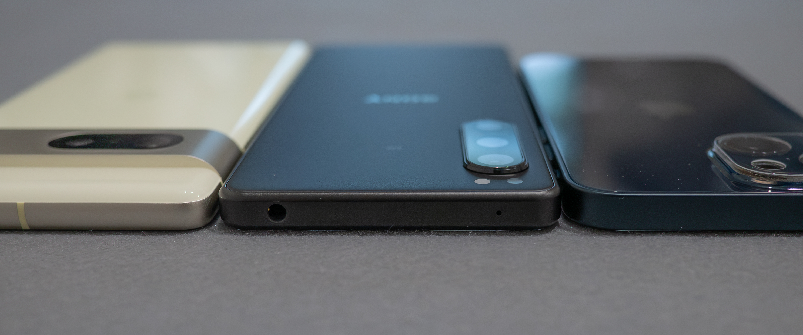

# Xperia 5 IV 超適当ハンズオンレビュー #1 開封・外装・サイズ比較編

例によって家電量販店のSoftbank契約でXperia 5 IVが9800円となっていたため、買ってみました。

[Xperia 10 IV](../../2022/10-14%20Xperia%2010%20IV)や[Leitz Phone 1](../../2022/09-26%20Leitz%20Phone%201%200/)も使ったことがありますので、そちらの記事もぜひご覧ください。

[**次の記事(諸々の使い勝手編)**](../11-29-2%20xperia-5-iv-2)

## 開封

[Leitz Phone 1](../../2022/09-26%20Leitz%20Phone%201%200)でも容赦無く質素だったのでそんなもんなんですよね……

## 外装

## サイズ比較

Pixel 7及びiPhone 13 miniとサイズを比較してみます。

幅がiPhone 13 mini、高さがPixel 7と同じくらいですね。  
厚みも比較してみましたが、写真ではあまりお伝えできませんね。普通に薄いと思います。

## アプデ地獄
起動したらアップデートが6回程度降ってきました。Android 13へのアップデートも含まれていますね。  
購入された方へのアドバイスとしては、まずアップデートを全部終えてからデータの移行を始めるのがお勧めです。

https://p1.a9z.dev/notes/9lryxy4x66

##　使い勝手については次の記事へ
[**→ 次の記事(諸々の使い勝手編)**](../11-29-2%20xperia-5-iv-2)
