# Blackview Tab 18 超適当ハンズオンレビュー #1 開封・外装編
12インチ中華タブ「Blackview Tab 18」をAliExpressにて購入しました。本当に全部入りなのでお勧めです。スタイラスペン「Blackview S Pen Gen 2」も買いました。

なお11インチiPad Pro（第3世代）（M1搭載モデル）は売却しました。

今回は開封と外装チェックですので諸々の使い勝手は[**次の記事**](../12-01-2%20bv-tab-18-2)で書きます。

## Blackview Tab 18　公式購入先
amazon.co.jpでの購入がお勧めです。

* [amazon.co.jp 本体](https://amzn.asia/d/bH4PPhg)
* [Blackview公式ストア（香港発送） 本体](https://jp.blackview.hk/products/tab-18-price) / [公式ストア ペン](https://jp.blackview.hk/products/magnetic-s-pen-gen-2-for-blackview-tab-18)
* [AliExpress 本体](https://ja.aliexpress.com/item/1005006181047675.html) / [AliExpress ペン](https://ja.aliexpress.com/item/1005006211779860.html)

Amazonの商品写真はベゼルをちょっと詐欺してますね……？（修正される可能性はあります）

定価は6万円ですが、クーポン適用等で3万円台で売られるのではないでしょうか。

## 開封

### 本体
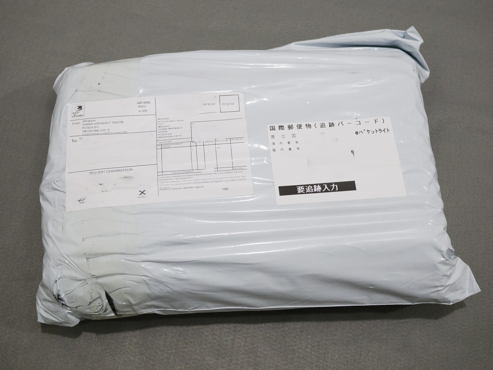

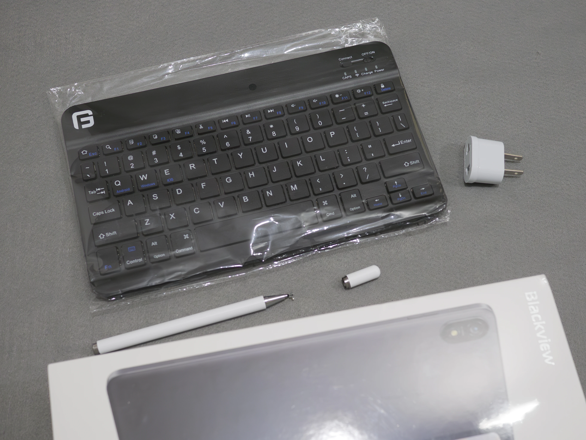

実はスタイラスペンと勘違いしてAliExpressで「ペン付属」のバリエーションを選んだのですが、よく見ると付属するのはディスク型タッチペンでした。  
ワイヤレスキーボードはなぜ付いてきたかよくわからないのですが、技適もついていませんしサイズも合わないので使用はやめておきます。

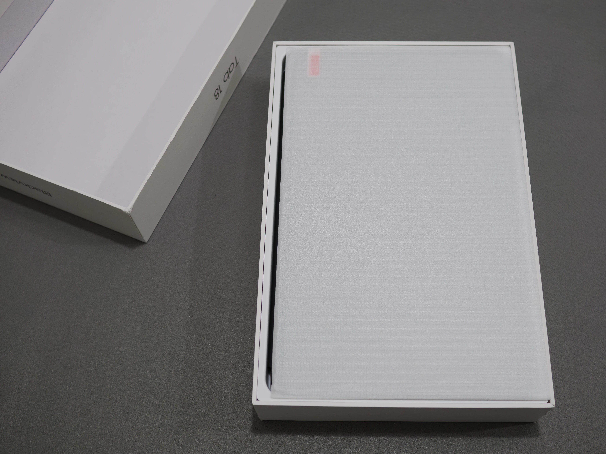

最近の中華タブレットらしく、本体にはあらかじめフィルムが貼ってあります。ガラスフィルムを使う機会はあるでしょうか……？

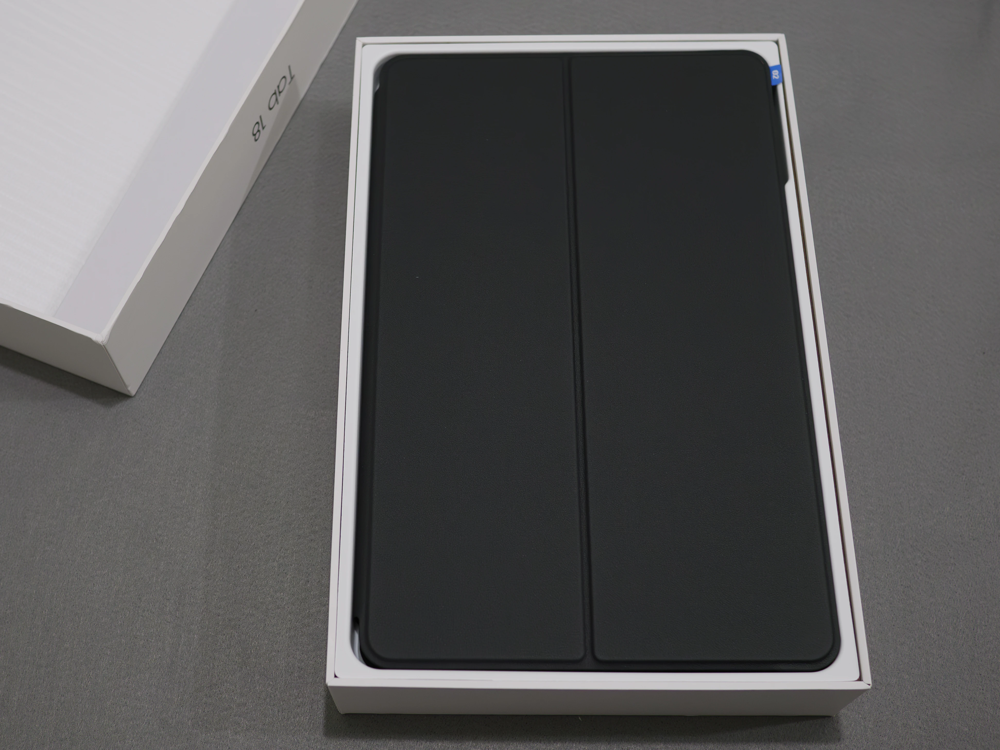

カバーに収まった状態で入っています。

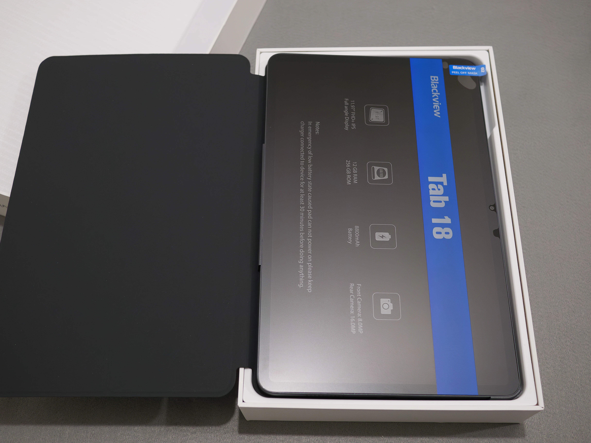

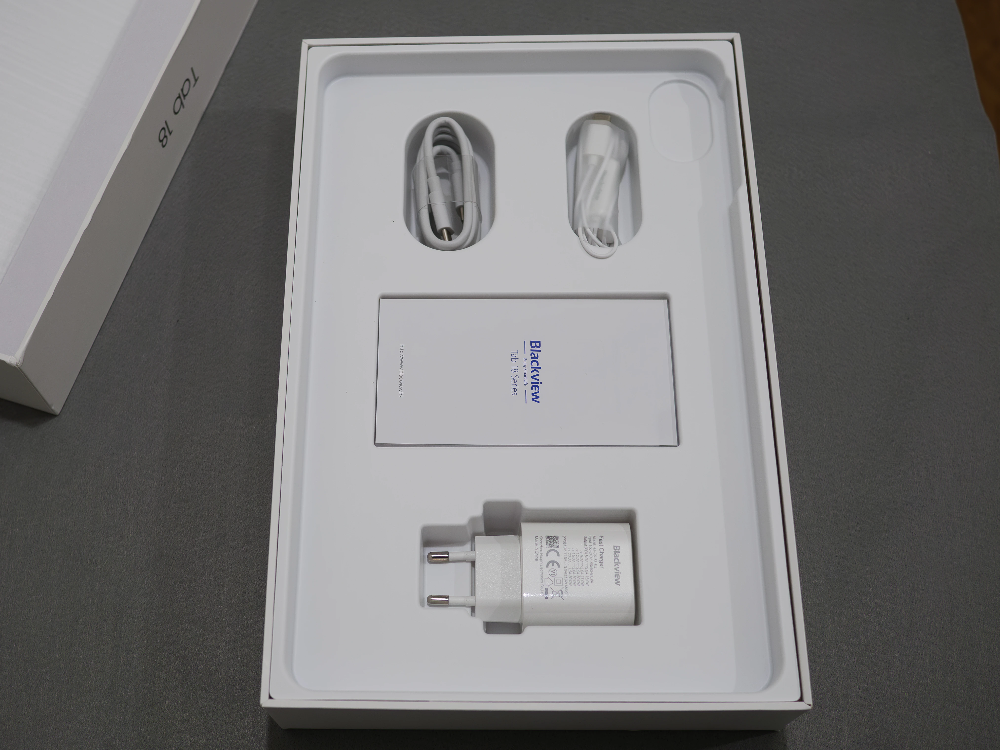

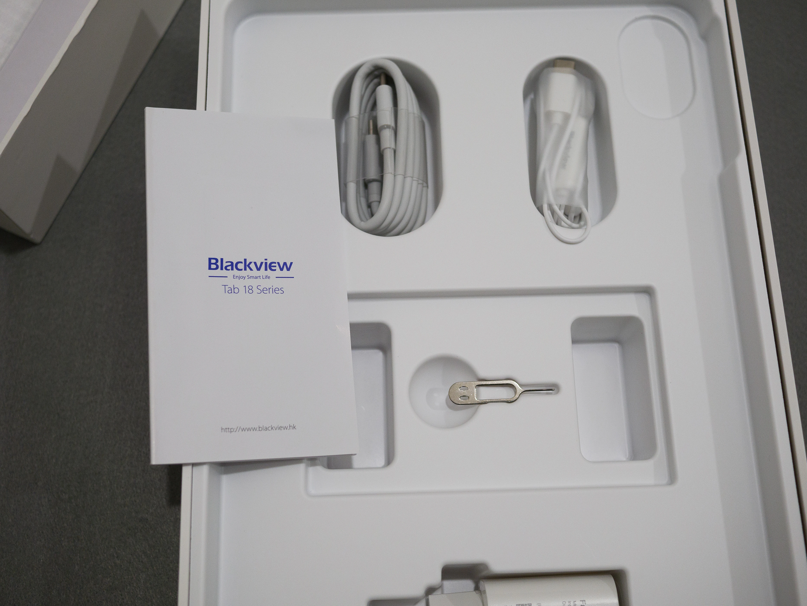

付属品は、USB-C to Cケーブル、カナル型イヤホン（USB-C接続）、USB-C電源、SIMピンが入っています。

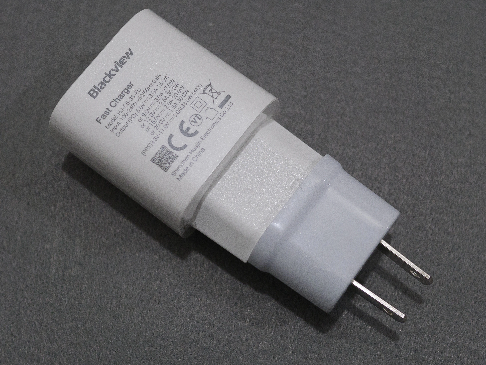

USB-C電源のコンセントは中国用のものが入っていましたが、日本のAmazonで販売されているものは分かりません。  
そもそも電源も変換アダプタもPSEマークが見当たらないため使用はやめておきます。

### スタイラスペン
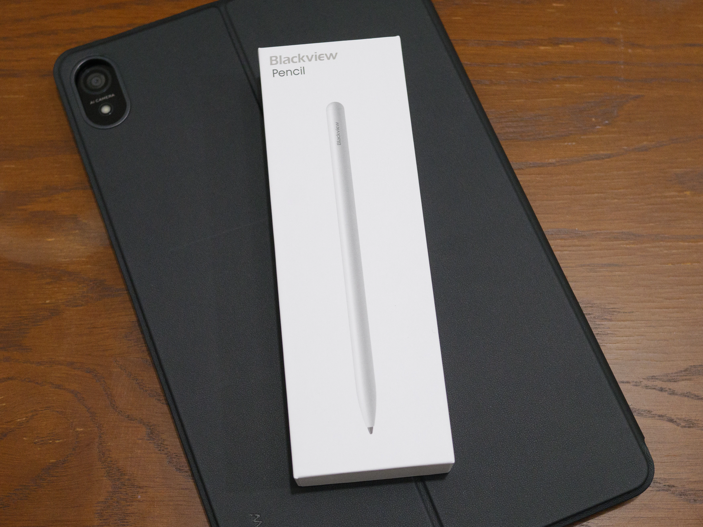

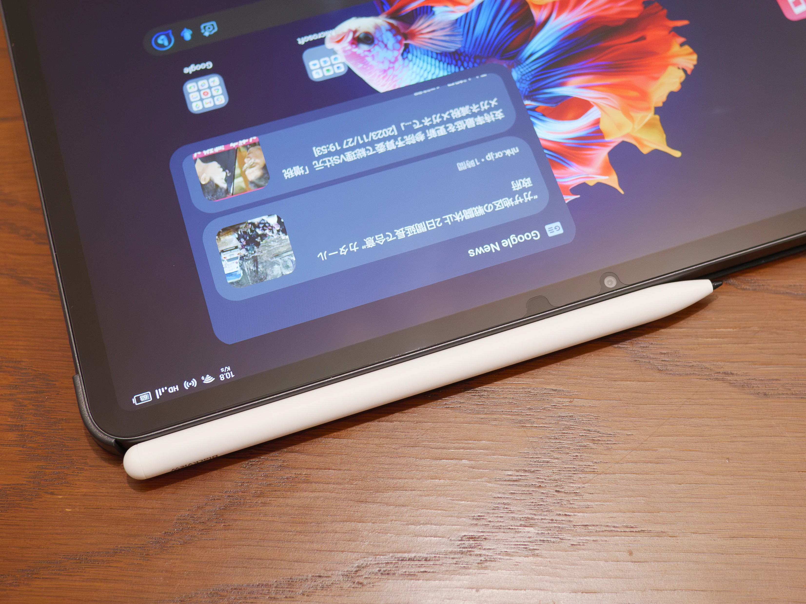

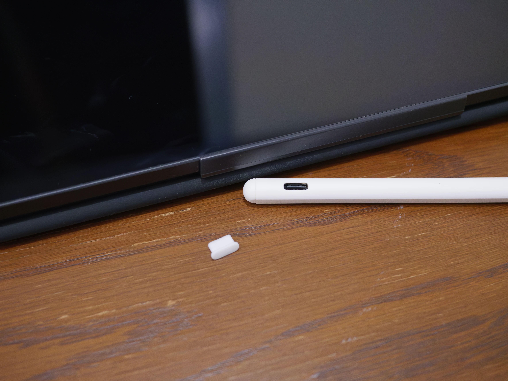

## 本体外装

## 起動

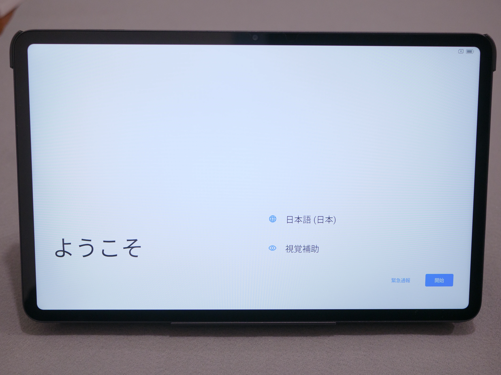

## 使い勝手については次の記事へ

[**次の記事(諸々の使い勝手編)**](../12-01-2%20bv-tab-18-2)