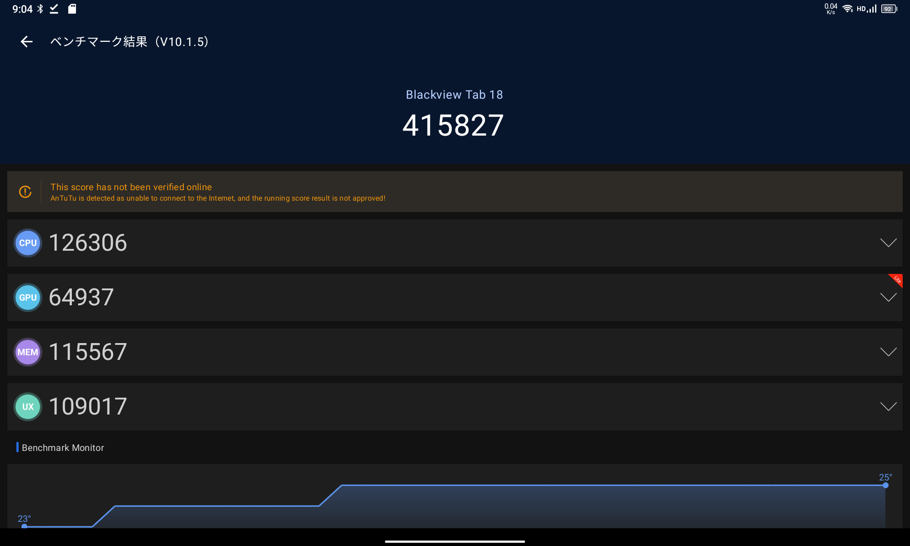
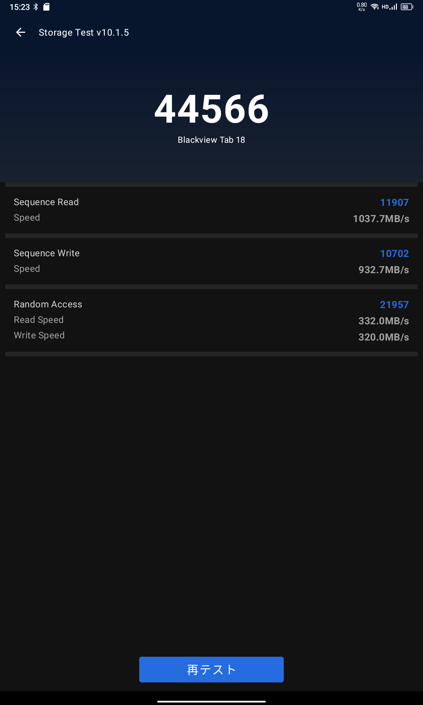
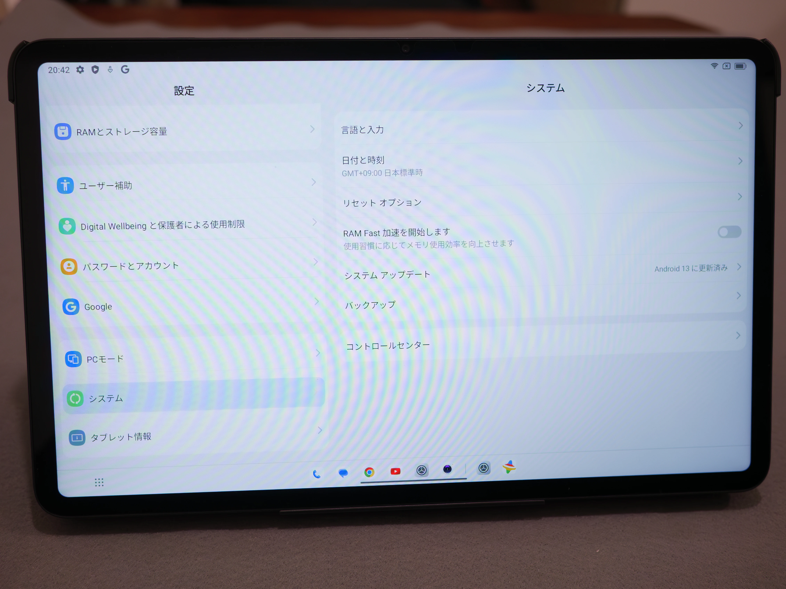
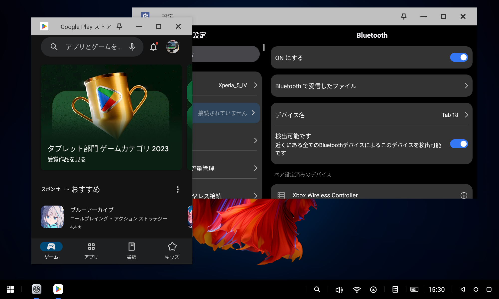
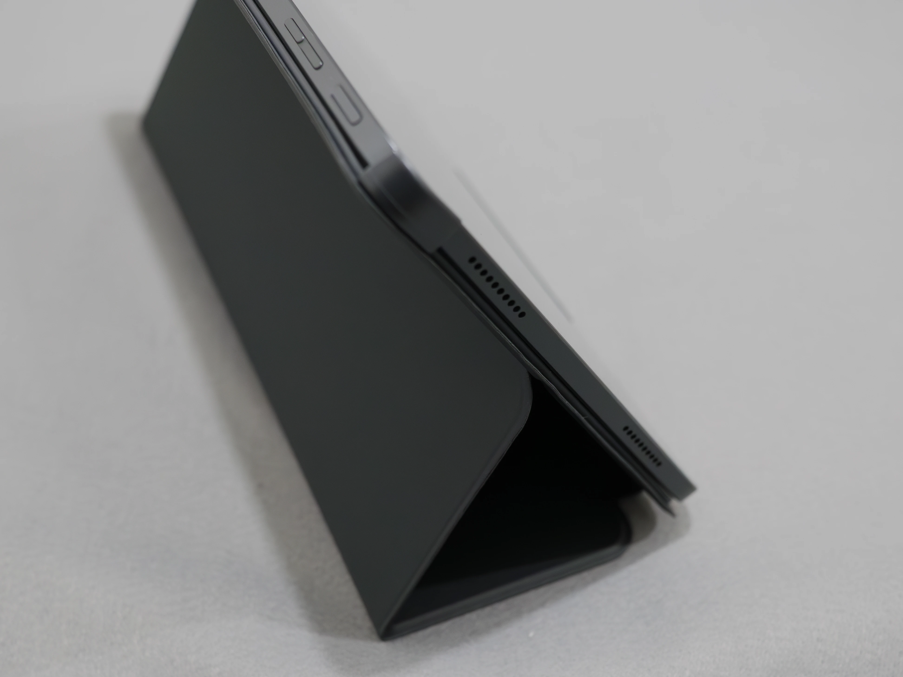

# Blackview Tab 18 超適当ハンズオンレビュー #2 諸々の使い勝手編
Blackview Tab 18の機能を軽く紹介します。11インチiPad Pro（第3世代）と比べても結構いい感じだと思います。

[**前の記事(開封・外装編)**](../12-01-1%20bv-tab-18-1)

## 要約
### 良い点
- サイズ
- 画面
- スピーカー音質
- RAM12GB搭載で意外とサクサク
- スタイラスペン対応（ホバーもOK）

### 悪い点
- Wi-Fi 5 (ac)止まり
- 付属カバーの使い勝手が良くない

## ディスプレイ・画質
ディスプレイは筐体側面からはみ出していません（Redmi Pad SEなど格安タブレットでははみ出していることがあります）。

| | |
|--:|--:|
|サイズ|11.95インチ|
|アスペクト比|5:3=15:9|
|解像度|FHD+ 2000x1200|
|マルチタッチ|10点対応 (AnTuTuで確認)|
|Widevine|L1|
|リフレッシュレート|60Hz|

一部の方がWidevineがL3になってしまう問題を報告されているようですが、私の端末ではAmazon Prime Videoで最高画質(1.82GB/時)を選択できました。

安い端末のディスプレイは最低輝度が低いことが多々ありますが、この機種は暗すぎるぐらいきちんと暗くなります。  
最大輝度の数値はスペックシートに書いてありませんが、直射日光下では難しい程度です。

色味も良好だと感じます。

## スタイラスペン
専用の「Blackview S Pen Gen 2」を用いてスタイラスペン入力を行えます。4096段階の筆圧検知とホバーに対応しています。  
方式はスペックシートに書かれていないため不明です（USIペンを購入してUSIで動くのか検証してみたいと思っています）。

遅延は少々ありますが、3万円台のタブレットと考えれば全く問題ないと思います。ズレも特には気になりません。書き出しの検知がやや遅い感じがあります。

ホバーに対応していることに地味に感動しています（11インチiPad Pro(第3世代)では対応していなかったため）。しかし、今回私がいくつかの無料アプリを使った限りでは、あまりペンのホバーに対応していないようでした。ブラシによっては対応しているものがあったり、Microsoft Whiteboardでは消しゴムだけホバーに対応していたりという感じです。

パームリジェクションも割と優秀です。ジッターはよく分かりませんが、Surfaceほど酷くはない気がします。

少なくともMicrosoft WhiteboardはSurface Pro 7 4GBモデルと比べるとサクサク動いています。

## 指紋認証・顔認証
指紋認証は側面指紋認証で、感度はそこそこです。

顔認証は単純に前面カメラで検出するタイプのようですが、パスワードマネージャの閲覧などロック解除が必要な場面でも顔認証を用いることができます。

## バイブレーター
タブレットなのにバイブレーターがあります。振動は安っぽい感じではあります。あったら便利……？

## 音質
### スピーカー
スピーカーはHarman Kardonボックススピーカーが4機搭載されており、Harman AudioEFX 2.0により調整されています。  
Apple製品に引けを取らない音質を有していると感じました。3万円台でこれが買えてしまうのは価格破壊でしょう。

14インチMacBook Proに比べると低音が弱く、ただこれは好みの問題かとも思います。音楽アプリのイコライザで調整してみてください。
最大音量も相当大きめですが、音割れしてしまいます。

### Bluetoothコーデック
開発者ツールが正常に表示されないため対応コーデックは確認できませんでしたが、AACでは接続できました。

LHDCのオプションが見えるのでもしかするとLHDCには対応していそうです。

## モバイル通信 (LTE)
### 4G LTE 対応バンド
4G LTE通信に対応しています。マジでなんでもありますね。nanoSIMのデュアルSIM対応に対応しています。nanoSIM1枚はmicroSDとの排他使用です。

対応バンドは次の通りです。

- **4G: 1/3/7/8/20/19/40**

docomoのプラチナバンド（B19）およびSoftbankのプラチナバンド（B8）に対応していますが、auのプラチナバンドは対応していません。  
楽天モバイルのB3には対応はしていますが、使えるかどうかは不明です。

docomo irumo(0.5GB)のnanoSIMを入れましたが、VoLTEを含め問題なく発着信およびインターネット通信ができました。

## Wi-Fi
Wi-FiはWi-Fi 5止まりで、少々おしいポイントです。SoC(Helio G99)の制約のようです。

### Wi-Fiテザリング
- **WPA3-Personal**に**対応**
- **中継**に**対応**
- モバイル通信時はWi-Fi 5 (5GHz対応)・中継時はWi-Fi 4(2.4GHzのみ)

## ベンチマーク・性能
Blackview Tab 18は、SoCがHelio G99、RAMは12GBを搭載しており、スワップを12GB指定可能です。  
スワップ4GB設定時のAnTuTu v10ベンチマークスコアは41万点でした。

Dimensity 700(=Dimensity 6020)と同等程度で、Snapdragon 695 5Gのやや下ぐらいといったところでしょうか。

個人的な体感としては、これらを搭載する端末に抱いた感覚と比べると結構サクサク動く印象があります。大容量の搭載メモリがかなり効いているのでしょうね。

Microsoft WhiteboardはSurface Pro 7 4GBモデルと比べても相当サクサク動きました。

原神も割と動きました（Androidでは内部解像度の関係上あまりパッキリとした画は得られませんが）。

大きな筐体に小さなチップを収めているため、発熱は相当少ないです。

ちなみに、M1搭載iPad Proのスコアは188万点でした。

## バッテリー・充電
バッテリーについては、無限に使えるわけではありませんが、すぐなくなるという印象もありません。画面が大きな液晶なので、やはり明るいと電力を消費します。

充電はPD33W対応です。

## カメラ
全く期待はできませんが、緊急用としてはまあ撮影はできます。

HDR合成が下手くそです。Lightroom CameraではDNGで保存できません。

## ストレージ
256GBのUFS2.1ストレージを搭載しています。

microSDカードは1TBまでの容量に対応しており、内蔵ストレージの拡張が可能です。

## OS/UI
Android 13ベースのDokeOS_P 4.0を搭載しています。

DokeOSには次のような機能があります。

- コントロールセンターの動作切り替え（AndroidのようにひとまとめにするかiOSのように左上と右上で分けるか）
- スマートウィンドウ（サイドセンスのようなもの）

また、タブレット用にカスタマイズされたDokeOS_PではタスクバーとPCモードが特徴です。

タスクバーはMicrosoft Launcherを使っていると変な挙動になります。実質的には標準ランチャーしか使えないかと思います。自分好みのランチャーを使いたい方はご注意ください。

PCモードは、UIがあまり洗練されていない感じで、複数アプリを開くともたつきいてきます。マルチタスクについてはiPad Proの方が秀でていると思います……が、そもそもマルチタスクをしたいならノートPCを買った方がいいのではないでしょうか。  
標準モードでもSplitView相当の分割画面にできますが、これもアプリによってはもたつきを感じます。

ちなみにUSB-Cからのディスプレイ出力はできません。

（こういう機能よりもWindowsの画面をMiracast等で拡張する機能が欲しい）

### iPadと比較して…
Androidでは**完全版のGboardが使えます**。iPadOS/iOSのIMEは私には使いにくいしカスタマイズの範囲が狭く、それと比べるとGboardは好きです。

先ほども述べましたが、マルチタスクはiPadの方が快適です。

「AndroidはiOS/iPadOSに比べてタブレットに最適化されたアプリが少ない」という言説が（一昔前？）ありましたが、個人的にはタブレットに最適化されていないアプリの割合は同程度だと感じています。

## 付属のカバーが使いにくい
付属のカバーが使いにくいです。安定して立てることができませんし、樹脂製の本体把持部分の精度も悪いです。

ただ、本体に近接センサーはついているので、カバーを閉じるとロックするようにはなっています。

## いかがでしたか？
個人的には「タブレットならこれを買っておけば正解」と言い切れる端末だと思います。

iPadに追従した11インチ帯の製品はもう少し選択肢はあるのですが、個人的には12インチの方がおすすめです。

……本当は8インチのペン対応タブレットが欲しかったのですが、選択肢がiPad miniしかなく断念しました。
