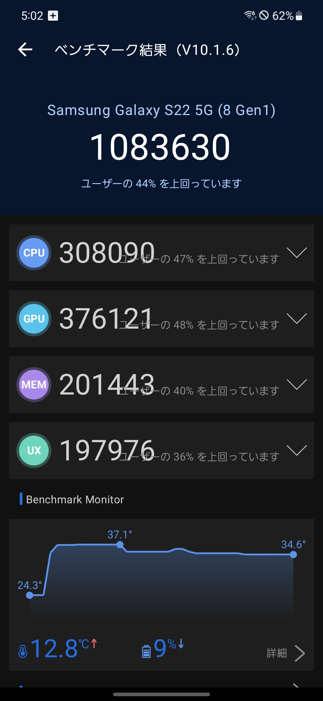

# Galaxy S22 本当に適当レビュー #2 諸々の使い勝手編
Galaxy S22を軽く触った感想です。少々辛口になりました。

[**前の記事(開封・外装編)**](../12-23-1%20galaxy-s22-1)

## 要約
### 良い点
- 軽い
- アップデート提供期間が長い
- ベゼルレス
- 望遠カメラが寄れる…が？
- フォントに太字がある
- DeX

### 悪い点
- 発熱、電池持ち（聞くところによると）
- キャリア版はバンド縛りが残っている
- Galaxy独自OS(One UI)やサービスはあまり好きではない

## ディスプレイ・画質
画面はOLEDでリフレッシュレートは120Hzに設定可能で、最適化（アダプティブリフレッシュレート）にも対応しています。

初期設定の画面の色味は少々鮮やかすぎる気がします。画面モードをナチュラルに変更すると良くなります。

## 生体認証
画面内指紋認証と顔認証（カメラ式）があります。

画面内指紋認証はまあまあサクサクですが、ダイソー等で販売されている専用のガラスフィルムでは反応しませんでした。

## バイブレーター
バイブレーションはハイエンドらしく高級感のある感触です。

## 音質
### スピーカー
スピーカーはステレオかつDolby Sound対応ですが、Dolby Soundは設定でオンにする必要があります。

ただ、サラサラした重厚感のない感じで、個人的には好みではありません。

### Bluetoothコーデック
ハイエンド端末なんだから心配ないだろうと思いきや、aptX LL/aptX Adaptiveには対応していないようです。LDACには対応しています。

## おサイフケータイ・FeliCa
おサイフケータイは当然ついています。右側についています。

## モバイル通信 (LTE/NR)
### 4G LTE 対応バンド
キャリア版にはバンド縛りがあるため、そのキャリアでしか使うことはできません。  
ただ、楽天モバイルはBand3（全てのキャリアで搭載かつメジャーなバンド）なのでおそらく使うことができるかと思います。UQ版を楽天モバイルで使ったところ、正常に通信できました。

Galaxy S23ではバンド縛りが解消されています。

### ５G NR対応バンド
Xperia 5 IVとは異なりミリ波にも対応していますが、高崎や前橋等ではauはミリ波を飛ばしていないため恩恵を受けることはできませんでした。

### 5G SA
au 5G SAに対応していますが、試していません。

## Wi-Fi
Wi-FiはWi-Fi 6対応です。

### Wi-Fiテザリング
- **WPA3-Personal**に**対応**
- **中継**に**対応**
- **Wi-Fi 6**に対応  
  2.4GHz帯のみとなります。

## ベンチマーク・性能
Galaxy S22は、SoCがSnapdragon 8 Gen 1、RAMは8GBを搭載しています。  
AnTuTu v10ベンチマークスコアは108万点でした。

AnTuTu v10スコアは今までのAnTuTu v9スコアとは比較できないためご注意ください。

AnTuTu v10の他の機種の実測結果を参考として示します。

|機種|SoC|AnTuTu v10スコア|
|--:|--:|--:|
|Blackview Tab 18|Helio G99|41万|
|Pixel 7|Tensor G2|89万|
|iPhone 13 mini|A15 Bionic|123万|
|11インチiPad Pro(第3世代)|M1|188万|

同一スペックのXperia 5 IVは103万点でしたが、Galaxy S22が5万点高い結果となりましたが、そう差はありません。

## バッテリー・充電
バッテリー持ちはすこぶる悪いようですが、1日何時間も触っていないようであれば気にならないかもしれません。

## カメラ
たまにAIによる補完がきつく出るため微妙に感じますが、概ねiPhoneと同等程度のスペックといえます。

「プロ」モードのDNGはセンサーからの情報がそのまま記録されているようですが、「Expert RAW」が吐き出すDNGはプロセッサで処理された情報が記録されるようです。

（夜景を綺麗に撮りたいならそこそこの手ぶれ補正が付いた中古のミラーレスと単焦点レンズがおすすめではありますが、超広角(35mm換算13mm)はそうもいきませんね…）

### 望遠レンズ(3倍)
Xperia 5 IVと比較すると、特に望遠レンズが接写に対応していることがアドバンテージとなります。

しかし、次の写真ように四隅に歪みが出ることがあるようです。

## OS/UI (One UI)
One UI 5.1 (Android 13)がインストールされています。

Galaxy S22を含む近年のGalaxyは[発売から4世代のOSアップデートと5年間のセキュリティアップデート](https://www.samsung.com/jp/explore/news/os-version-up-202209/)が約束されています。

個人的にはAndroid 12以降のMaterial Youが今のところ一番好みなので、One UIはあまり好きになれませんでした。

「GoogleのAndroid」からは相当逸脱しており、次のような機能がSamsung独自のものになっています。

- データバックアップ (Samsungクラウド, Googleクラウドにもバックアップ可能)
- パスワード保存 (Samsung Pass, Googleや他パスワード管理ソフトに切り替え可能)
- オンスクリーンキーボード(IME) (Samsungキーボード, GboardやSimejiも一応使える)
- アプリストア (Galaxy Store, Google Playと併用)

壁紙等のテーマを有償で購入できるテーマストア「Galaxy Themes」もあります。

また、次の2点が気になりました。

- 日本語フォントに太字ウェイトが用意されている
  * のはいいがM+フォントはあまり好みではない
  * ストアでMonotypeがフォントを有料で提供しているが太字はあるのか不明
- Android → Galaxy / Galaxy → Android双方でアプリが移行できなかった（詳細不明）
  * 前者はSmart Switchを使って欲しいということらしいが、後者は不可能なのかも？

### GoodLock
Galaxy StoreからGoodLockを導入し、各種モジュールを導入すると、Root化に片足を突っ込んだ程度にカスタマイズができます。最近日本でも正式に使えるようになったようです。

### Samsung DeX
USB-C経由でディスプレイに接続すれば、デスクトップモード「Sasung DeX」を利用できます。結構出来がいいです。  
標準的なUSB-CハブやUSBハブ機能付きのUSB-Cディスプレイでキーボードやマウスを接続しましょう。

初期状態では21:9のワイドディスプレイには対応していませんが、GoodLockのMultiStarで設定できます。  
IME周りが少々独特なので、文章を多く書くならWindowsやMacがお勧めですね。私はMacBookを持ち歩いているのでDeXを使うことはないと思います。

あと、8 Gen 1でも複数アプリを動かすにはまだ動作が辛いかもしれません。

### GalaxyだけのWindowsとの連携
他のAndroid端末とは違い、Windowsのスマートフォン連携アプリから次のようなことが行えます。

- Galaxyのアプリを遠隔で起動・操作
- Galaxyのテザリング機能を遠隔で起動
- デバイス間のコピーと貼り付け

（便利っちゃ便利だけどこれ目的で積極的にGalaxyを選ぶかというと……？）

## 最終的な感想
外装のデザイン面では、特にカメラ部分の意匠が好きな一方、側面が丸くなっているのは持ちにくさを感じました。

スピーカー音質は期待はずれ、ディスプレイやカメラは価格相応といった印象でした。

UIの好みは人それぞれなので、Googleに近い方がいいならPixel, Motorola, Xperia, AQUOSを、遠い方がいいならGalaxy, Xiaomi, OPPOを選べばいいかと思います。  
私個人的な好みは前者です。
