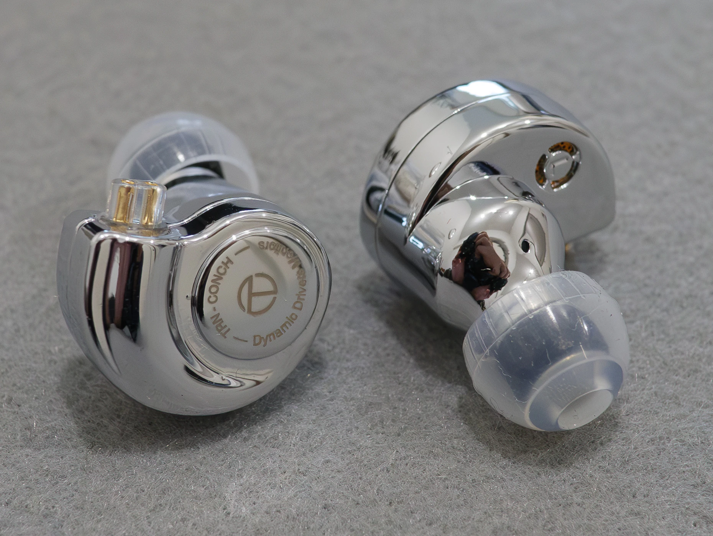
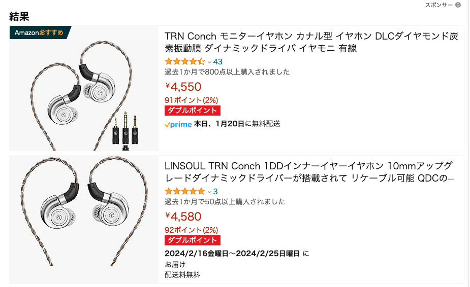
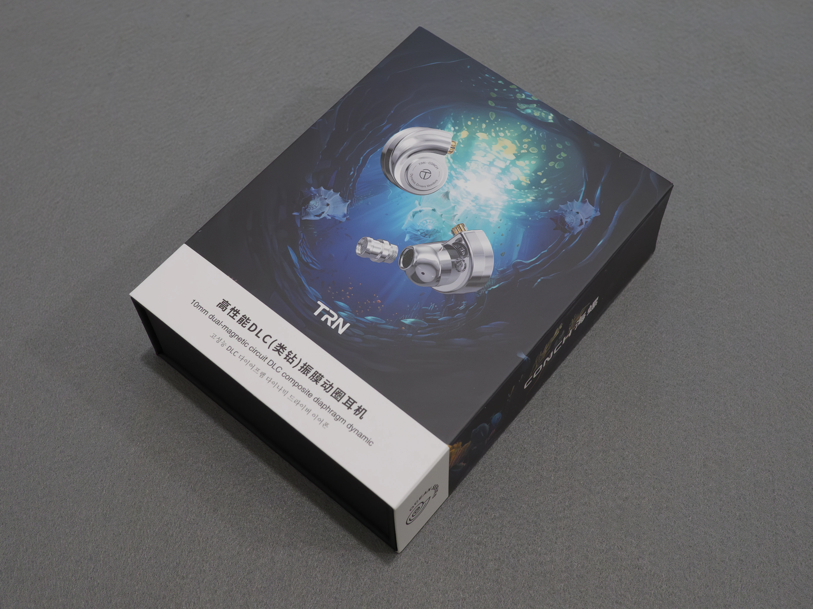
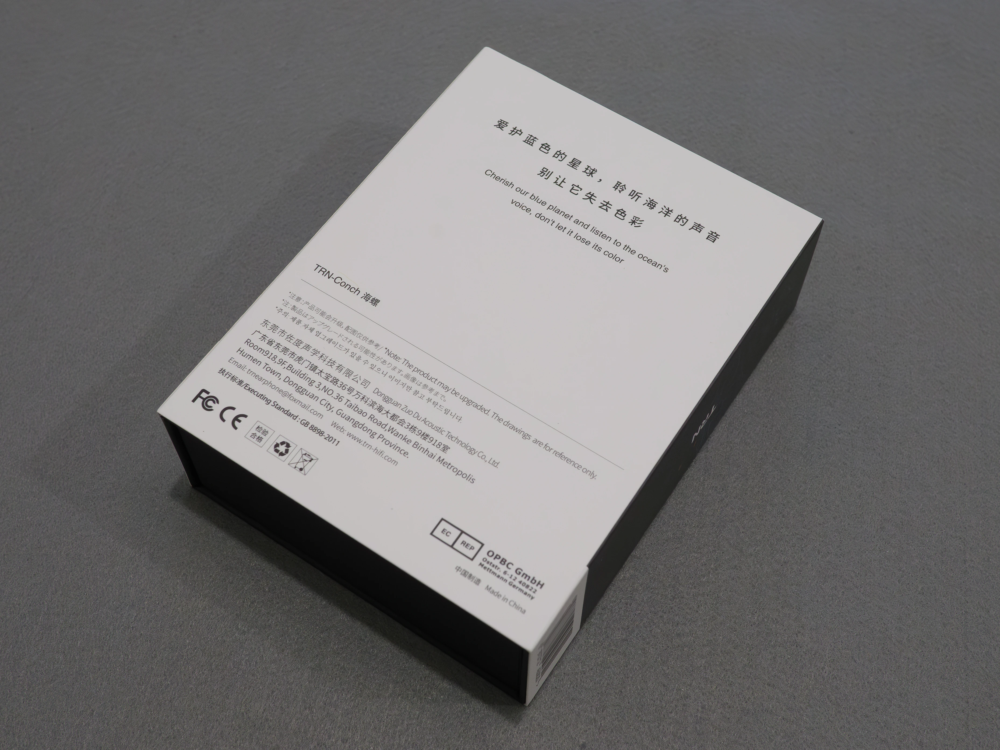
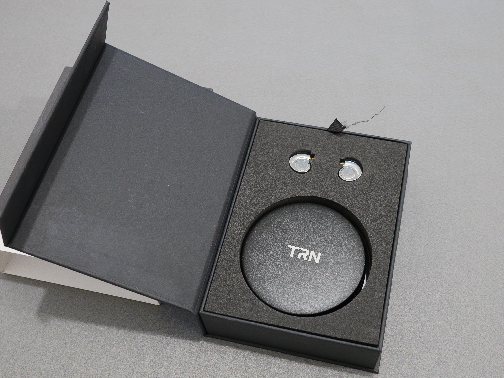
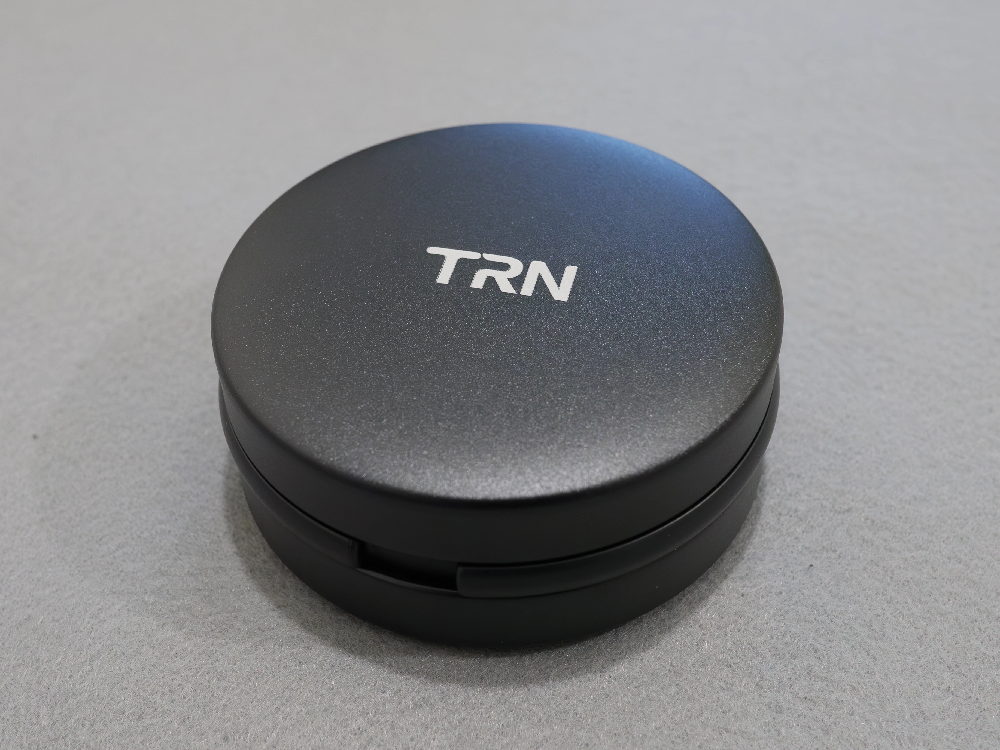
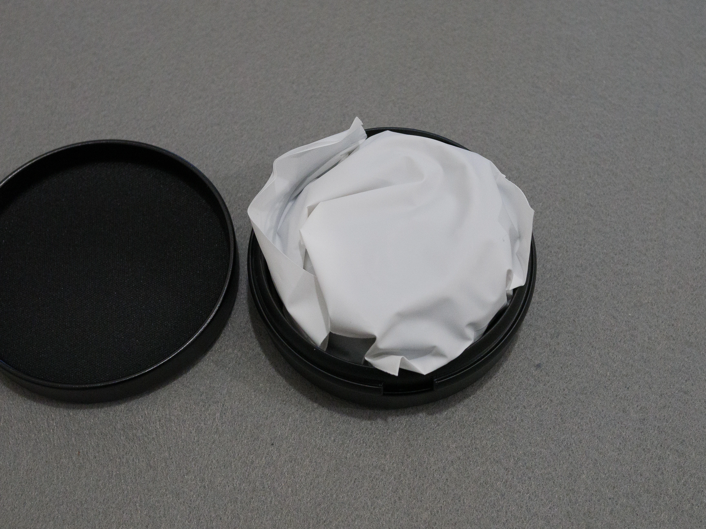
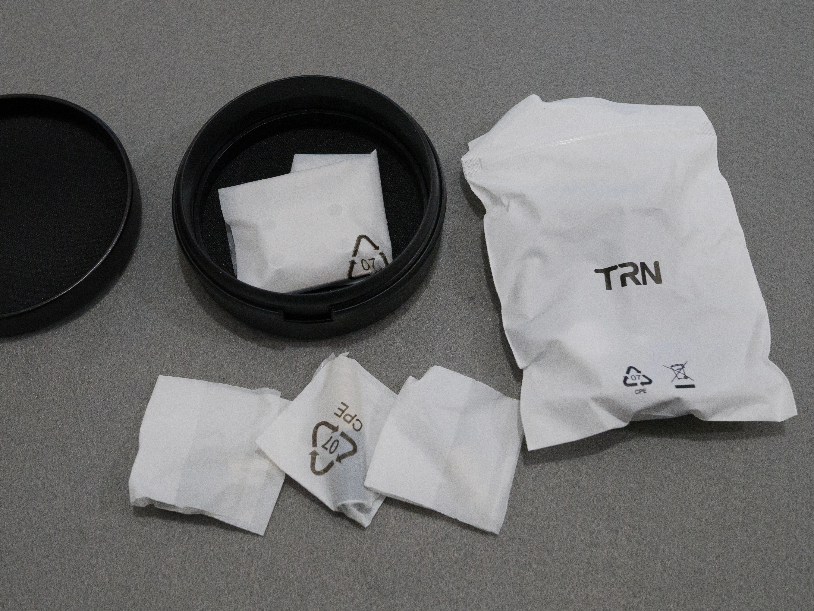
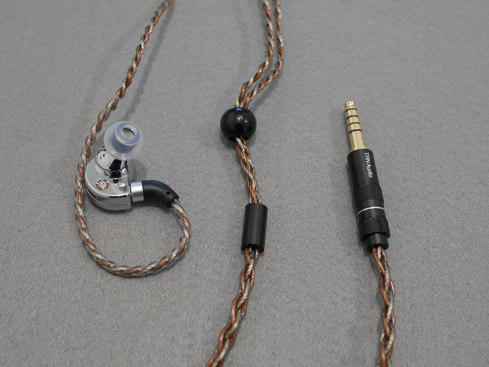

# TRN Conchふんわりレビュー
前回のイヤホンはじめました記事で予告？した通り、TRN Conchを買いました。TRN Conchは、5000円未満で1万円の製品と同等なのではないかと話題の製品です。

[前回のイヤホンはじめました記事](../01-12%20earphone-1)

## 価格・購入方法
Amazonで、[TRN直営店](https://amzn.asia/d/79ud7s9)もしくは[LINSOUL (代理店)](https://amzn.asia/d/4Mdekqs)で購入できます。

私が購入した時点ではTRN直営店版は3950円でしたが、値上げして4550円になっていますね。安い方を選ぶのは当然として、Amazon発送のものを選ぶのが良いです。Amazon発送でない場合はどちらも中国発送になってしまい、時間がかかる上にトラブルが発生する確率も上がります。

## 開封・同梱品

## 付属品
### ケーブル
[TRN-Redchain](https://amzn.asia/d/7tHZR2w)が付属しています。  
[TRIPOWIN Zonie](https://amzn.asia/d/5AQGdJ8)も持っているため音質を比較してみましたが、違いは全くわかりませんでした。

TRN-Redchainは編み込み線数が少ないため、触るとゴツゴツしています。個人的にはTRIPOWIN Zonieを使いたいと感じました。

### ノズル（フィルタ）・イヤーピース
ノズル（フィルタ違い）は、初期装備の「Reference（黒）」に加え、「Translucent（青）」「Atmospheric Immersion（赤）」の3種類のノズル（フィルタ）が付属しています。

イヤーピースは、初期装備の[「TRN T-Ear Tips」](https://amzn.asia/d/f7kkSiZ)と「バランス型（黒）」がそれぞれS/M/Lサイズ、フォームタイプのMサイズの7セットが付属しています。

どちらの変更も多少味付けは変わりますが、そこまで大きく変わるわけではありません（フォームタイプイヤーチップは試していません）。

### ケース

[アルミケース](https://amzn.asia/d/1ZAiJZP)が付属していますが、とても開けにくいです。

## デザイン、質感
金属シェルとなっています。デザインは個人的には好みです。ただ、表面にいくつか小さな凹みがありました。

## 音質
全体的に情報量は多くて良い感じです。低音域は少し物足りないと感じます。

Sennheiser IE 100 PROと比べると低音域が弱い感じです。IE 100 PROは元々ドンシャリなのでなんとも比較できませんが、中音域がしっかりバランスよく聞けるためTRN Conchの方が好みです。情報量の差はドンシャリとバランス型では比較しづらいためよくわかりませんでした。  
NICEHCK DB1に似たバランスかと思いますが、それよりも情報量はとても多いです。
Kiwi Ears Dolceより1000円高い価格ですが、明らかにConchの方が情報量が多くなっています。

#### スペック比較表
前回の表に付け足しただけですが、スペックを見てみましょう。インピーダンスが30Ωと大きくなっています。

| | IE 100 PRO | Dolce | ZSTX | DB1 | Conch |
|:-:|:-:|:-:|:-:|:-:|:-:|
|タイプ|IEM|IEM|IEM|IEM|IEM|
|DD|1x10mm|1x10mm|1x10mm|1x10mm|1x10mm|
|BA|-|-|1x30095|-|-|
|インピーダンス|20Ω|16Ω±10%|12Ω|16Ω|30Ω|
|帯域Hz|20〜18k|20〜20k|20〜40k|20〜20k|20~20k|
|感度 /mW|115dB|102±3dB|107dB|106dB|114dB|
|コネクタ|Pentaconn Ear 異形|qdc (0.78mm 2pin)|KZ Type B (0.75mm 2pin)|TFZ (2pin 0.75mm)|qdc (0.78mm 2pin)|
|シェル|樹脂|樹脂|樹脂|樹脂|金属|
|ノズル|樹脂|樹脂|樹脂|金属|金属|

## 感想
本当によくわからなくなってきました。他に色々と手を出すとさらにわからなくなることは必至でしょう。TRN ConchをEQで調整して使うことにします。

しかし、一度情報量の多いイヤホンを使うと情報量の少ないものには戻れなくなってしまいますね。やはりイヤホンには手を出すべきではありませんでした。
