# Xiaomi Smart Band 9 発売即日購入＆開封
Xiaomi Smart Band 9が日本で発売されました。午前中Amazonで注文したら夜届いたため、即日で開封してXiaomi Smart Band 7と少しだけ比べてみます。購入した色はグレイシャーシルバーです。

**購入リンク**  
Amazon: https://amzn.asia/d/9Kzc986  
楽天: https://item.rakuten.co.jp/xiaomiofficial/m55453/

発売時の価格は5,480円でした。これは先代のXiaomi Smart Band 8と同等です。

## 開封
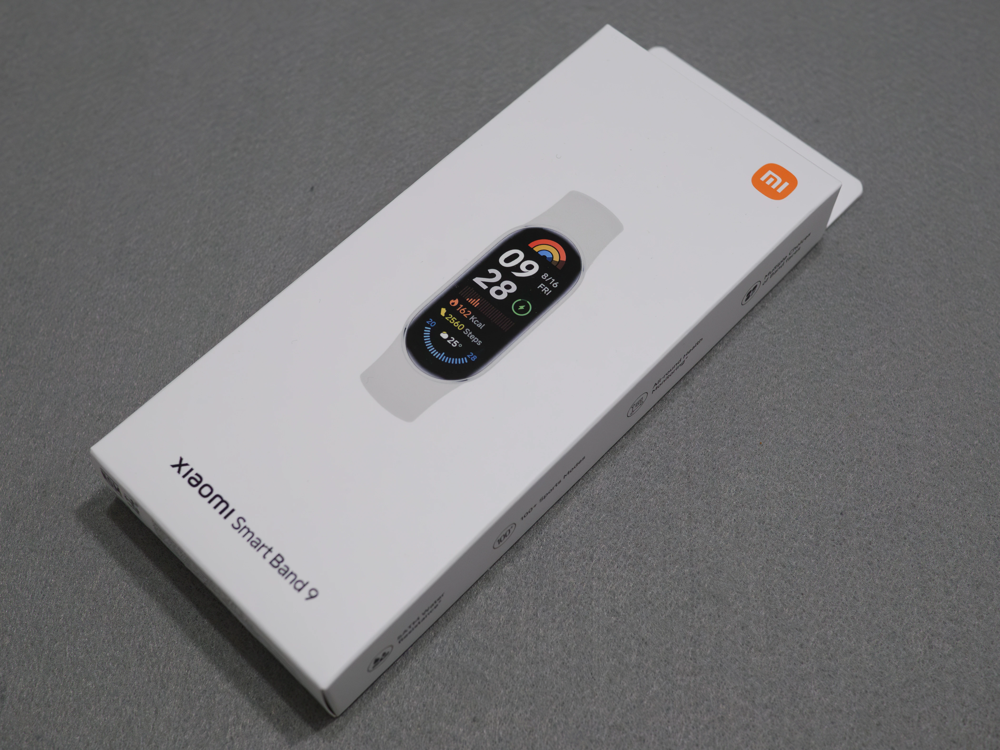

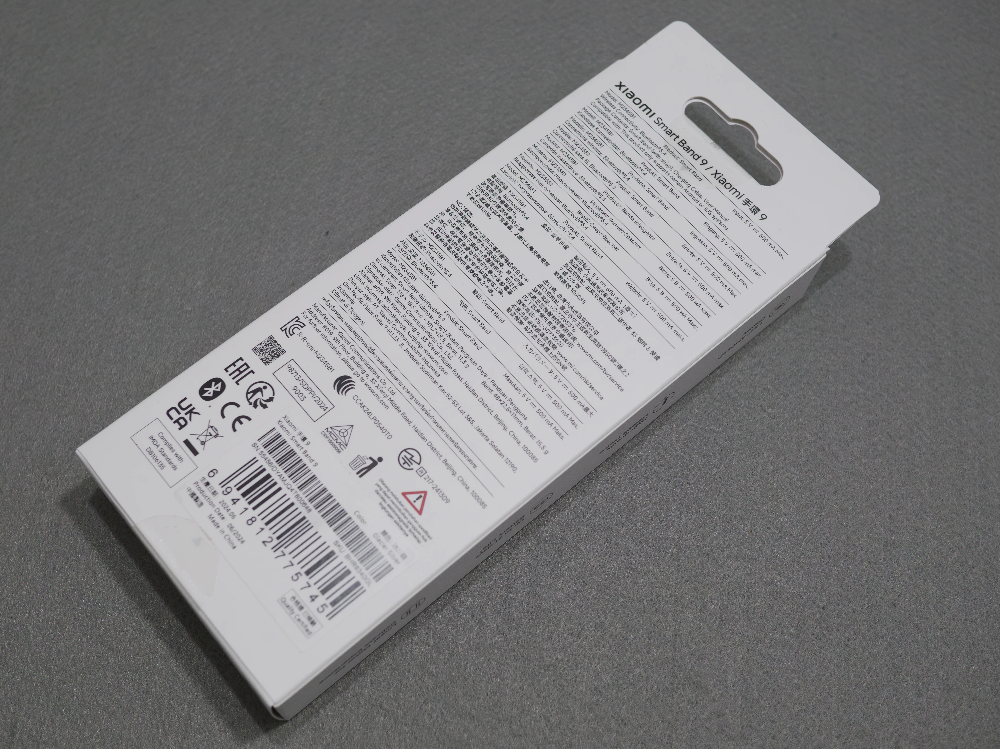

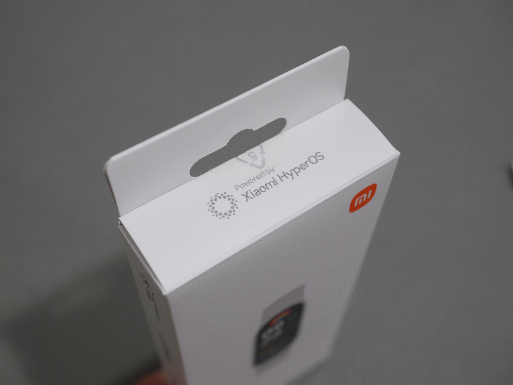

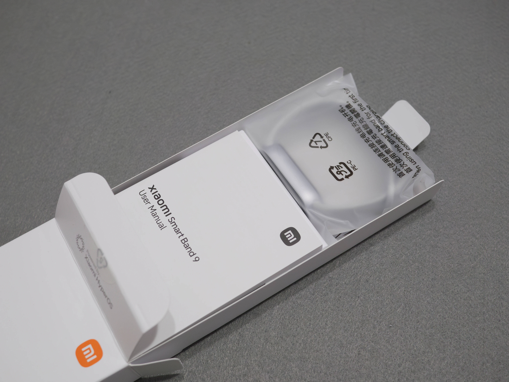

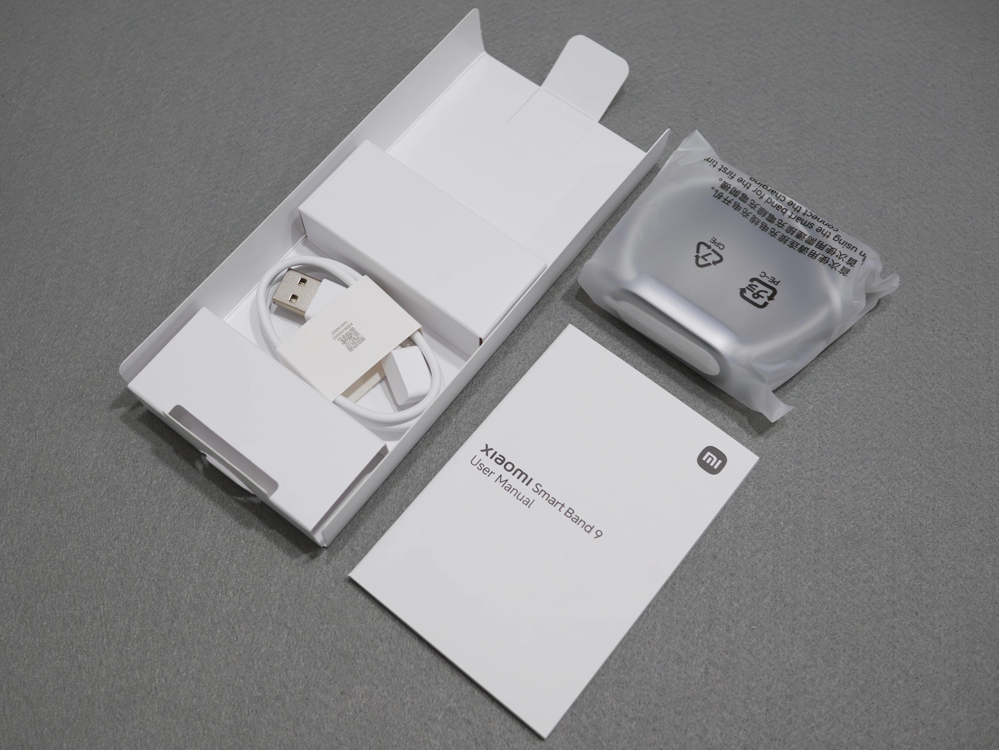

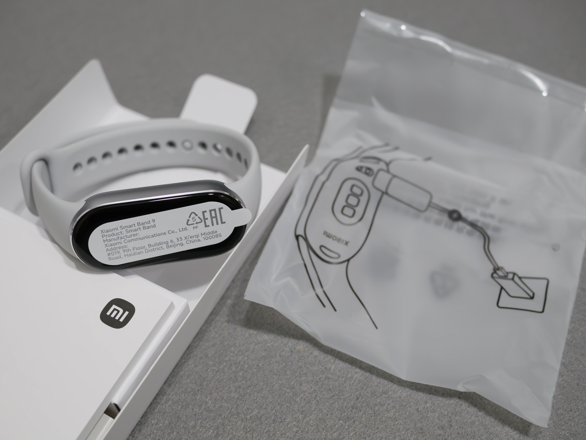

## 外観
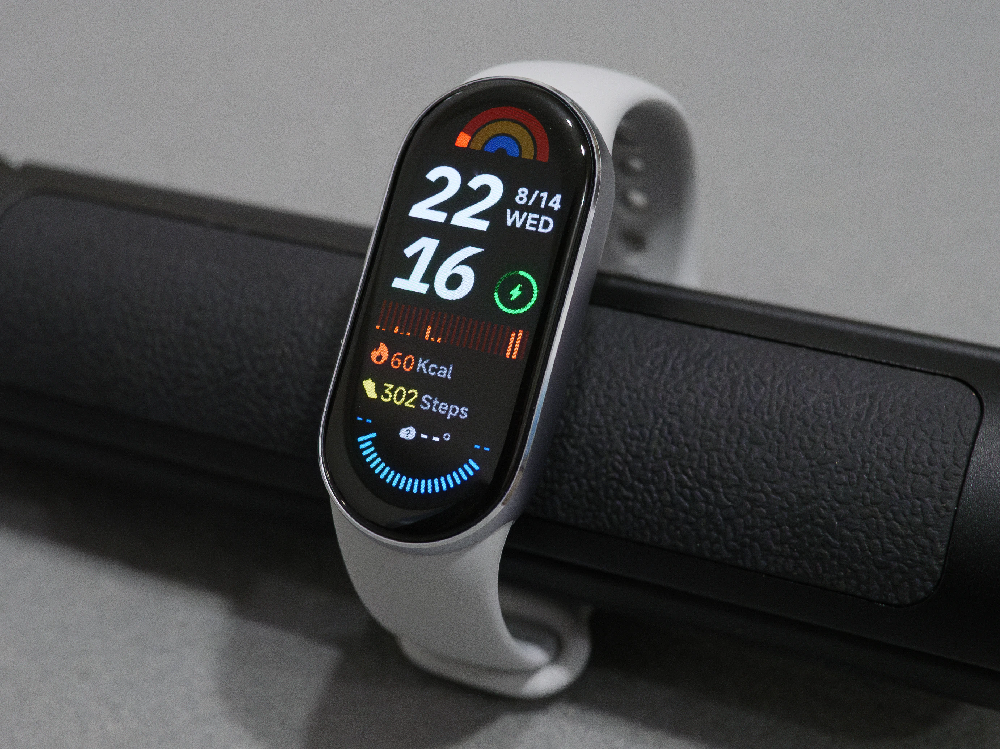

本体の外装が**アルミニウム**になりました。画面との境界が糸目取りされておりきらりと輝くため、思っていた以上に高級感があります。

なお、Apple Watchのようにバンドがクイックリリース構造に変わったのはXiaomi Smart Band 8からです。  
8は筐体がTPUでゴールドとグラファイトブラックの2色でしたが、9は側面がアルミ製で、色がアークティックブルー・グレイシャーシルバー・ミスティックローズ・ミッドナイトブラックの4色から選べるようになりました。

バンドは、Amazonの商品ページで見たほど真っ白ではなく、ちょうど私が持っているApple Watch Series 4のストーンスポーツバンドに近い明るさでした。ただしストーンスポーツバンドの方がより暖色です（劣化もあるかもしれませんが……）。

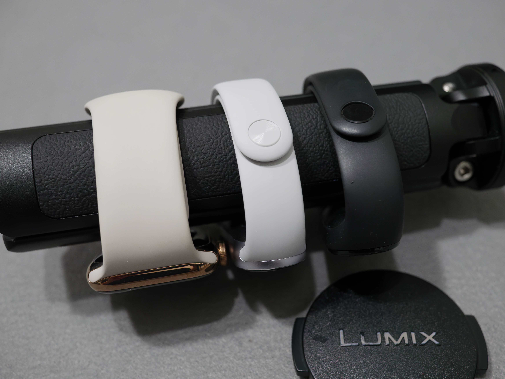

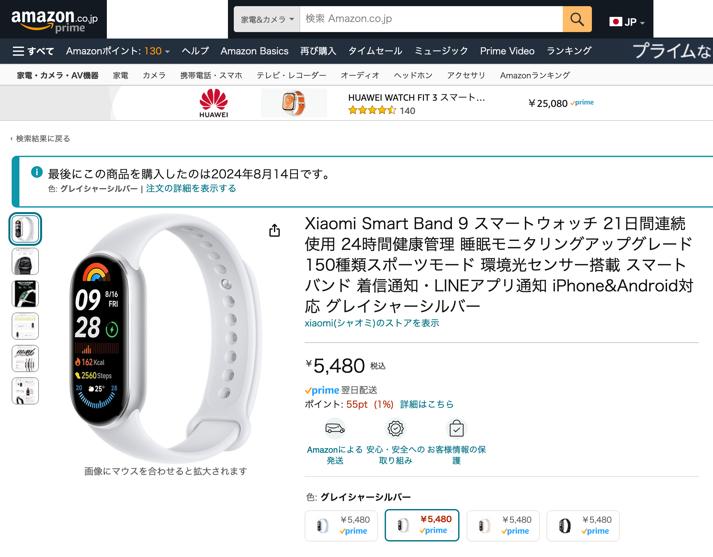

## なぜ買った？
今回の購入の経緯として、使っていた7のバンドが裂けたことに昨日気づき、バンドを700円ぐらいで買うか迷っていたことがあります。この時期は新しいXiaomi Smart Bandの発表時期だなぁと思い出していたのですが、運よくXiaomi Smart Band 9の発売発表がされたため、5400円の新世代の本体を買う方が得と思い購入を決断しました。

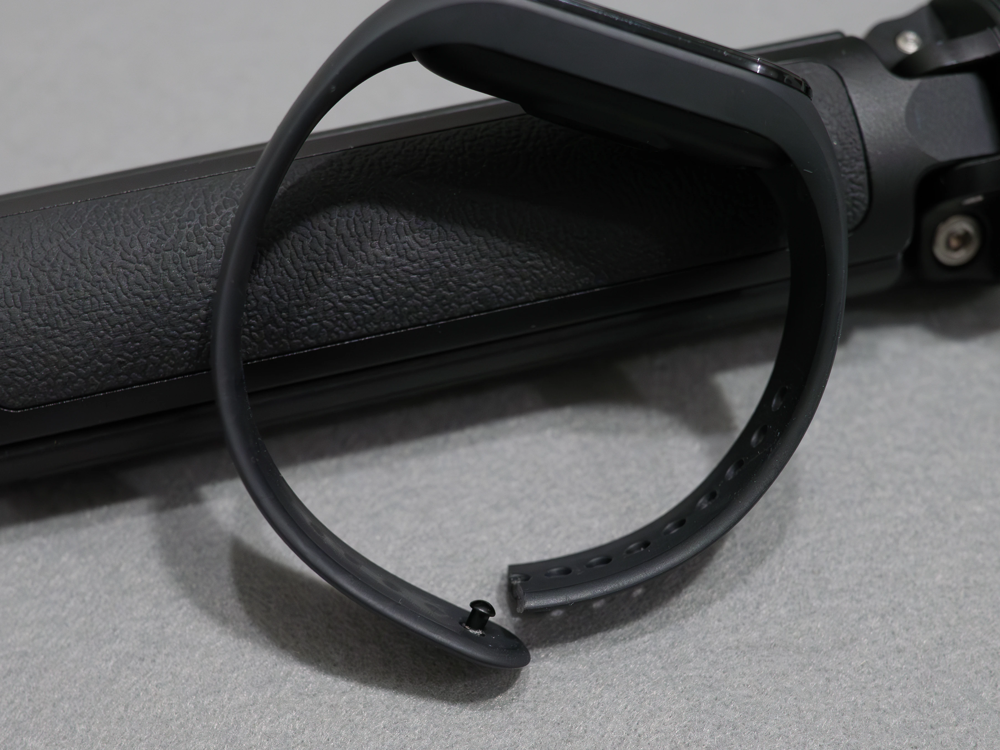

## 機能・性能
機能や性能をXiaomi Smart Band 7やApple Watch Series 4と、今わかる範囲でお伝えしてみます。  

なお、私はXiaomi Smart Band 7を睡眠計測と時刻確認にしか使っておらず、ワークアウトなどの機能は評価と紹介ができません。ご了承ください。

### とにかく動作がヌルヌルサクサク！
9のアップデートを終えて下からスワイプしてメニューを開いた瞬間、UIのアニメーション動作がとても滑らかで感動しました。なんならApple Watch Series 4より動作が最適化されている印象です（これは旧世代のチップで新しいバージョンのwatchOSを動かしているので仕方ないのですが）。

### 充電ケーブルの違い
充電ケーブルは、7より9の方が長くなりました。しかし、使い勝手的には7の方がケーブルの取り回す方向を選ばずに装着できるため楽に感じました。

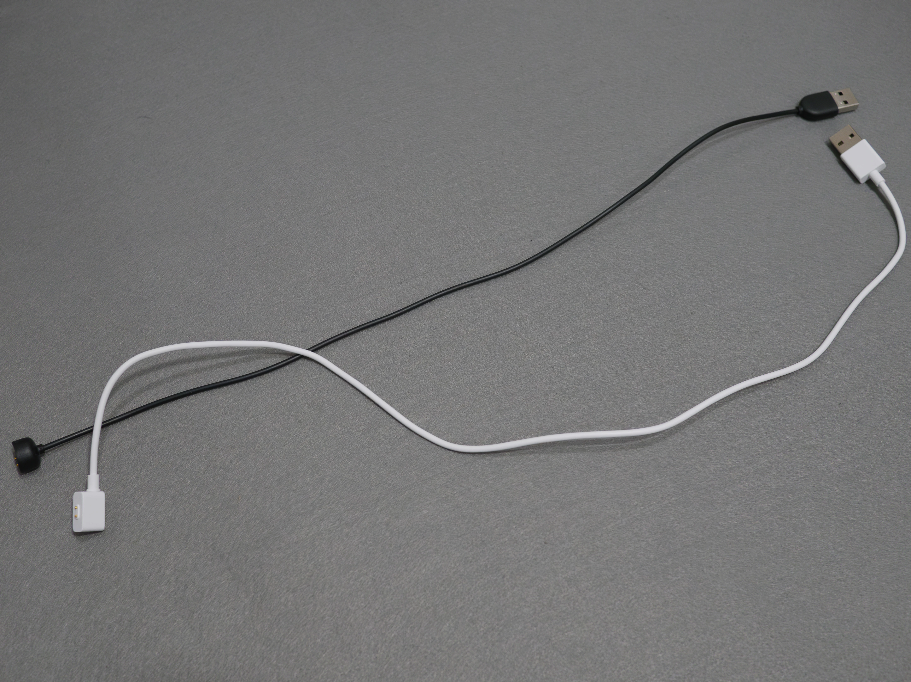

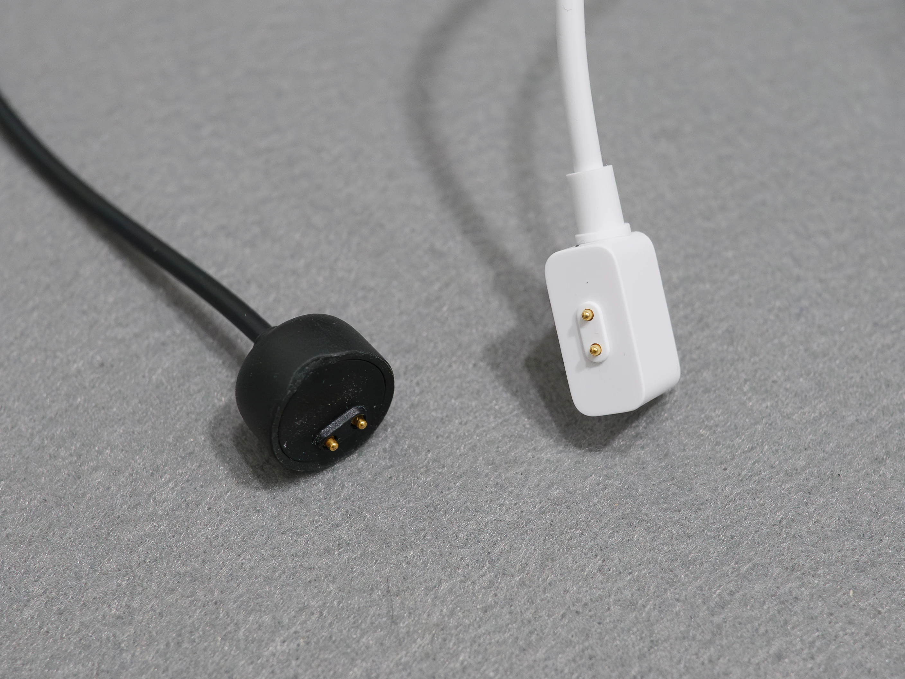

### ディスプレイの進化が嬉しい
7→9では、ディスプレイの進化点として

- 環境光センサー搭載で周囲の明るさに応じて画面輝度を自動で調整できるように
- 最大輝度が500nits→1200nitsに
- 最低輝度がより暗くなった

ことが挙げられ、画面輝度の面では全面的に改良されています、一方で、解像度は192x490のままで、ベゼルのバランス（下側が太め）も変化はありません。

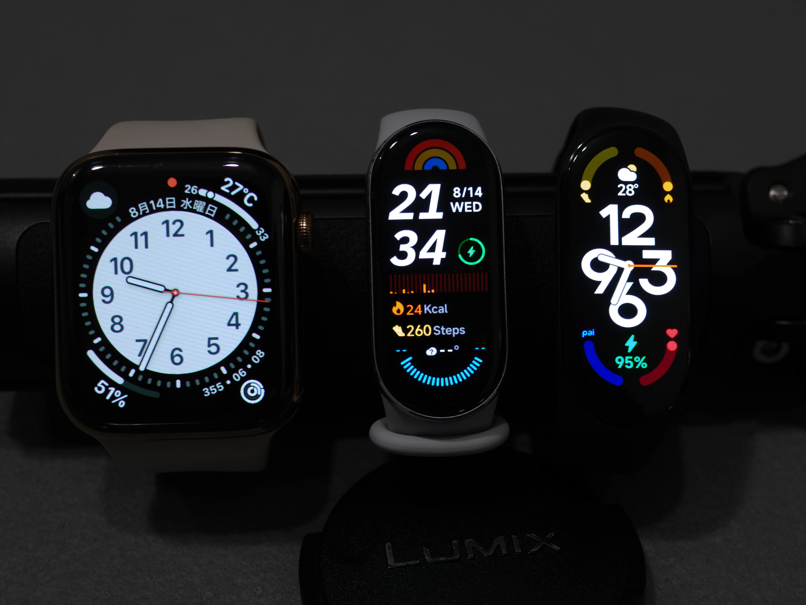

### バイブレーション
Xiaomi Smart Band 9は、バイブレーションがリニアモーターになったことが謳われています。しかし、個人的にこれは失敗だと感じました。

Apple WatchのTaptic Engineのような重厚感はなく、軽くチープな感じです。これは本体重量や搭載できるエンジンの大きさが違うので仕方がないのかもしれません。  
AppleのHaptic Touchのような短い振動を起こす機能はOSで搭載されていないため、そのような制御が搭載されるのであれば評価は変わるかもしれません。

7に比べても振動量が小さくなっているため、目覚ましで使う方はBand 9を選ばない方がいいと言って差し支えないでしょう。

## いかがでしたか？
Xiaomi Smart Band 9は、8と比べて筐体がかなり進化しました。にも関わらず価格据え置きというのは素晴らしいと思います。  
ただ、数少ないアップデート要素のうちもう一方のバイブレーションが微妙なことは残念でした。

Xiaomi Smart Band 7以前のユーザーで、機能が十分であると感じている方には買い替えを95%お勧めできます。Smart Bandの機能に不満を感じている（GPSが欲しい等）とか、バイブレーションの性能を求めるような方は他の製品を買った方が幸せだと思います。
