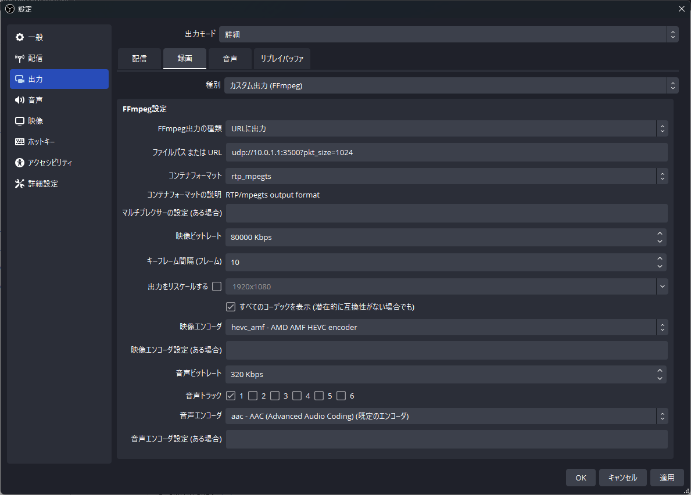

# LAN経由でOBSから別のPCのOBSへ映像を伝送する

ネットワーク経由で、あるPCのOBSから別のPCのOBSへ映像を伝送する方法のメモです。

## 前提

ローカルIPアドレスは各自で調べてください。今回は次のような構成で構築します。  
使用ポートは適当な数字で構いませんが、普通は4桁以上を使います。受信側で他のアプリが使用している場合は使えません。

| コンピュータ | ローカルIPアドレス | 使用ポート |
|:-:|:-:|:-:|
| 送信側（ゲーム用） | 10.0.1.2 | - |
| 受信側（配信用） | 10.0.1.1 | 3500 |

安定性のために、余っているLANポート同士を繋いでも良いです。この場合、両方のコンピュータでネットワーク設定でIPアドレスを手動で設定する必要があります（DHCPサーバーなんてないため）。

（ローカルIPアドレスは一般家庭であれば192.168から始まることが多いですが、今回は10.0.1.0にしています。）

## 受信側OBSの設定
ソースへメディアソースを追加し、以下のように設定します。

1. `ローカルファイル`のチェックを外します。
2. `入力`に`udp://10.0.1.1:3500`と設定します。
3. `YUV色範囲`は`リミテッド`を選択します。
   * もし明るさがおかしければ`フル`にしてください。
   * （フルレンジで送る方法募集中）
4. `FFmpegオプション`に`codec:a=aac`を設定します。

OSによってローカルネットワーク関連の許可の確認が入る場合があります。

## 送信側OBSの設定
### 1.プロファイルの作成
OBSを一からインストールする場合、録画として設定してください。

OBSがインストールされていて、もし使っているなら、プロファイルを新規に作成してわかりやすい名前をつけてください。  
プロファイルを新規に作成すると出力解像度がリセットされるので、お好みの設定に変更してください。

### 2. 録画設定
1. 設定 - `出力`を開き、出力モードを`詳細`にします。
2. `録画`タブを開き、`種別`を`カスタム出力 (FFmpeg)`に設定します。
3. `FFmpeg出力の種類`を`URLに出力`に設定します。
4. `ファイルパスまたはURL`を`udp://10.0.1.1:3500?pkt_size=1024`のように設定します。
5. `コンテナフォーマット`は`rtp_mpegts`または`mpegts`にします。
6. `映像ビットレート`は結構大きめにします。有線LANなら`80000 Kbps`とかでいいと思います。
7. `キーフレーム間隔 (フレーム)`は小さい方が画質がよくデータ量が大きくなり、遅延も小さくなります。`10`とかにしてもいいと思います。
8. `すべてのコーデックを表示`にチェックを入れます。
9. `映像エンコーダ`は、GPUがAMD製チップなら`h264_amf`または`hevc_amf`、NVIDIA製チップなら`h264_nvenc`または`hevc_nvenc`を指定します。Intelは…どういうわけかQSVの選択肢がありませんでした。
10. `音声ビットレート`は`320 Kbps`、`音声エンコーダ`は`aac`にします。

### 3. 録画開始
録画開始します。

受信側に映像が表示されれば完了です。

## コメント
よく紹介される2PC配信の手法としては、これと同様にゲーム用PCでOBSを立ち上げておき、HDMIキャプチャに対して全画面プロジェクターを行うというものもあります。これにはHDMIキャプチャの導入が必要です。

映像伝送をネットワーク経由で行ってしまえばHDMIキャプチャは不要です。ただしネットワークが耐えられる必要があります。少なくとも1Gbpsの有線LANは必要でしょうし、対戦ゲームの配信であれば対戦ゲームと映像伝送を同時に行っても耐えられるだけのルーターが必要です。

OBSの起動が必要なのはHDMIキャプチャを使用した方法でも同様であるものの、OBS自体が一定程度のGPUリソースを持っていったり、伝送のためのエンコードやネットワーク負荷はPCが不安定となる要因であるため、2PC配信のメリットである安定性は薄れることとなります。  
複雑な画面処理や音声処理を外部でできるとか、ゲーム側のOBSやPCが落ちても配信が止まらないというのはメリットではあります。

## 参考文献
- [OBSで簡単画面ミラーリング！ / Qiita, @ZOI_dayo](https://qiita.com/ZOI_dayo/items/7123d2dc08ae0dea34cf)

